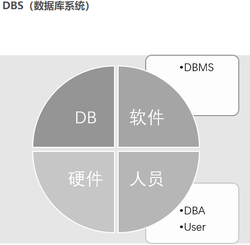
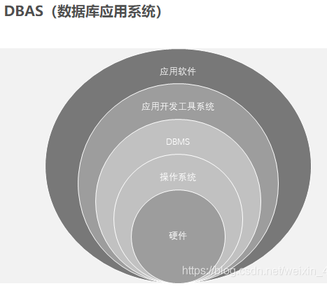

# **导言**

## 0. 数据库历史分析和离散数学内容

### 1.数据库中的基本定义

* **DB**
&emsp;&emsp;是数据库的**英文简称**,对于目前而言,没有明确的定义,下面是部分人认为的定义:
*1.* **长期存储在计算机内的**,**有组织的**,**可共享的**数据集合
*2.* **相互关联**的数据存储体
*3.* 有组织的数据集合,**其结构能反映数据间的自然关系**,能够满足多种应用
 

* **DBMS**
&emsp;&emsp;数据库管理系统是一个操控和管理数据库的大型系统,它由一组计算机程序组成,是位于用户和操作系统之间的一层数据库管理软件
 

* **DBS**
&emsp;&emsp;是数据库系统的**英文简称**,一般由硬件,软件,数据库和用户4部分组成
*1.* 硬件:是数据库依赖的**物理设备**,包括输入输出设备,运算器,控制器和存储器
*2.* 软件:基本的软件**操作系统**,所有软件都需要在操作系统的支持下运作,除此之外,还有**数据库管理系统**,**如果没有的话**,**也不能称作数据库系统**,同时为了开发数据库管理系统,还需要有各种语言及其**编译系统**
*3.* 数据库:是需要管理的信息的集合,包括两部分内容:**一类是所有应用需要的工作数据的集合**,存放在物理数据库中,是数据库的主体;**另一类是存放数据字典中各级模式的描述信息**,主要包括所有数据的结构名,意义,描述定义,存储格式,完整性约束和使用权限等信息,因此也被称为"描述数据库",可理解为存储数据库中表格的定义和用户的权限等内容
*4.* 用户:主要包括**管理和开发人员**,**终端用户**  
**管理和开发人员**:具体包括**数据库管理人员**,**系统分析员**和**应用程序员**
  * 数据库管理人员负责管理整个数据库的建立,管理,维护和协调工作,高水平的数据库管理小组通常需要许多方面的专家
  * 系统分析员负责应用系统的需求分析和规范说明，需与用户和DBA结合确定系统设计
  * 应用程序员负责应用系统的程序设计

&emsp;&emsp;**终端用户**:各种操作人员，可以不懂程序，但必须懂业务，会操作
&emsp;&emsp;&emsp;&emsp;

* **DBAS**
&emsp;&emsp;是指数据库应用程序,由数据库系统及其应用程序组成的即在数据库系统环境下建立起来的为某种应用服务的软硬件的集合
&emsp;&emsp;

### 2. 实体-联系数据模型(E-R模型)

* 将现实世界中,客观存在的可区分的个体转化为**实体**,描述每个实体的主要特征,将具有相同特征的实体放一起,称为实体集;将**实体集**之间的联系(依赖关系)寻找出来,作为联系,不仅要关心实体集间联系,还要关心实体集内实体的联系。
* 根据联系的实体的数目可分为**二元联系和多元联系**。二元联系为**两个实体集间的联系**，主要有一对一联系、一对多联系和多对多联系,另存在一种自反联系即实体集自己和自己联系；多元联系为**联系的实体集个数大于3的联系**

* E-R图:数据库设计的中间步骤,易于向数据模型转换
  * 方形框：实体集的名字,表示一个实体集
  * 菱形框：联系,两段箭头上写数目表示联系的实体集的数目(1个为1,两个为n,即一对多表示为1个箭头菱形两个箭头)
  * 椭圆框：实体集的属性。属性为本问题下仅与该实体集有关的**需要描述**的**不可再分**的性质
  * 绘制步骤:1.对问题分析抽象,寻找需提取的实体集及属性;2.找出实体集间的联系;3.找到关联实体集的属性;4.绘制E-R图,由局部到全局将图画完；

* 历史上常用的结构模型:
  * 层次模型:最早的模型,以树状(层次)结构表示实体集和实体集之间的联系,一个结点只能有0个或1个双亲结点存在.联系通过指针实现,一般使用邻接法和连接法物理实现,邻接法是在连续的物理空间中存储记录,由根记录开始自上而下,自左到右存储记录;连接法是通过指针实现记录间的联系.
  * 网状模型:与层次模型不同的是,允许结点有0个或两个以上的双亲结点的存在
  * 关系模型:目前主要采用的模型,关系模型把每一张表称作一个关系,每个表中的每一个列都被称为一个属性,每一行被称作元组,每个元组用关键字标识.因此关系模式可表述为:
  $$  R(U,D,DOM,I,\sum)  $$ R为关系名(表名),U为组成关系的全部属性(列)集合,D为U属性的取值值域,DOM为属性列到域的映射即:$DOM:U ->D$,每个属性所有可能取值的集合构成D.
  * 面向对象模型:新兴模型,通过计算机语言的设计思维,设计数据库,将一个对象的属性和方法封装成一个实体,使对象封装起来,这种使数据与操作封装在一起的建模方法,有利于程序的模块化,可以提高系统的可维护性和易修改性.

### 3. 泛关系模型的设计思路

* 设计方式:通过将关系模型各表转化成泛式，来消除依赖造成的影响。
* 理论依据
  * 依赖
  * 码的定义
  * 泛式

## 1. SQL命令行基础语句与基本类型

## 2. create table语句

## 3. select语句

## 4. alter语句

## 5. drop语句

## 6. 视图

## 7. 索引

## 8. 安全性

## 9. SQL函数

## 10. 触发器

## 与其它语言内容
