# java笔记

## JDK和JRE

* [博客](https://blog.csdn.net/qq_21808961/article/details/80647551)
* **JDK**:程序员使用的软件,是java开发工具包
  * 包括了**Java的运行时环境**（Java Runtime Environment）、**一堆Java工具**（javac、java、jdb等）和**Java基础的类库**（即Java API包括rt.jar）
* **JRE**:运行程序的用户使用的软件,是java运行时环境,包括JVM和JAVA核心类库与支持文件。
  * JRE包括**JVM**和**JAVA核心类库与支持文件**。与JDK不同,它不包含开发工具—-编译器、调试器和其它工具
&nbsp;
* **JVM**:java虚拟机 用来解释执行字节码文件(class文件)的,是**JRE的一部分**,它是一个虚拟出来的计算机,是通过在实际的计算机上仿真模拟各种计算机功能来实现的。
  * JVM有自己完善的硬件架构,如处理器、堆栈、寄存器等,还具有相应的指令系统。
  * JVM是Java实现跨平台最核心的部分,所有的Java程序会首先被编译为.class的类文件,JVM的主要工作是解释自己的指令集（即字节码）并映射到本地的CPU的指令集或OS的系统调用。
  * Java面对不同操作系统使用不同的虚拟机,依次实现了跨平台。JVM对上层的Java源文件是不关心的,它关心的只是由源文件生成的类文件。
&nbsp;
* **总结**：
  * 有JVM就可以解释执行字节码文件(.class)
  * JVM解释执行这些字节码文件的时候需要调用类库,如果没有这些类库JVM就不能正确的执行字节码文件,JVM+类库=JRE
  * 有了JRE就可以正确的执行java程序了,但是光有JRE不能开放Java程序,所以JRE+开发工具=JDK,有了JDK,就可同时开发,执行JRE

## 命名规范

命名规范

1  **项目名全部小写**

2  **包名全部小写**

3  **类名首字母大写,如果类名由多个单词组成,每个单词的首字母都要大写。** 如：```public class MyFirstClass{}```

4  **变量名、方法名首字母小写,如果名称由多个单词组成,每个单词的首字母都要大写。** 如：```int index=0;   public void toString(){}```

5  **常量名全部大写** 如：```public static final String GAME_COLOR=”RED”;```

6 所有命名规则必须遵循以下规则：

1、**名称只能由字母、数字、下划线、$符号组成**

2、**不能以数字开头**

3、**坚决不允许出现中文及拼音命名**

## java基本设计结构

### 一、注释

java提供三种注释方式,即:

```java{.line-numbers}
//这是一个注释

/*这是一个注释*/

/**
*   这是一个注释
*/
```

### 二、数据类型

#### 1.基本数据类型

* **整型**:表示无小数部分的数,允许是负数
  * 未定义的数字**默认为int**,想要转化为其他类型需在数字前**使用 (其他类型) 转化**,例:`byte a = (byte) 1;`
  * 另外,对于长数字,java现在允许在数字字面量中使用`_`分隔,例:`1_000_000_000`
  * 如果想要快速生成或说明长整型可以在数字后**添加L**(大小写均可)声明
  * java中**没有无符号**数,但可以将有符号数当成无符号数,使用对应整型类的.toUnsignedInt()函数当成无符号数处理,再转换回来,极不常用

| 类型 | 存储需求(字节) | 取值范围 |
|:-:|:-:|:-:|:-:|
|int|4|-21.475亿左右,21.475亿左右|
|short|2|-32768,32767|
|long|8|-9e+15,9e+15|
|byte|1|-128,127|

* **浮点类型**:表示有小数点的数据类型
  * java中浮点数**精度不高**,很可能无法用来进行==判断,更无法进行不接受舍入的运算
  * 含小数的数默认为double,可以在后面加f进行转换
  * 存在三种特殊的小数,**正无穷**、**负无穷**、**NaN**(不是一个数字),例如:正数/0得到正无穷,0/0得到NaN,常量`Double.POSITIVE_INFINITY`, `Double.NEGATIVE_INFINITY` 和 `Double.NaN`（与相应的Float类型的常量一样）分别表示这三个特殊的值
  * 特别要说明的是,不能这样检测一个特定的值是否等于`Double.NaN`:

```java{.line-numbers}
if(x == Double.NaN) //is never true

//所有“非数值”的值都认为是不同的。
//然而,可以使用Double.isNaN方法：

if(Double.isNaN(x)) //check whether x is "not a number"
```

| 类型 | 存储需求(字节) | 取值范围 |
|:-:|:-:|:-:|
|float|4|±3.4e+38F(有效位数6~7位)|
|double|8|±1.79e+308(有效位数15位)|

* `char类型`:表示单个字符(一个char值),一些Unicode字符(两个char值)
  * 无论是一个还是两个值存储的字符,都是一个**代码单元**,除非必要不建议使用char处理字符串的代码单元
  * Unicode值可以是使用\u000到\ufff转义得到的字符,这些字符会在运行前进行转义(无论在哪),**慎重使用**转义\u字符
&nbsp;
* **数据类型转换**:可自动转换,也可以使用强制类型转换(其他类型) 数值转换成其他基本类型数值
  * 自动转换:**从低级到高级自动转换**,整数类型可以自动转化为浮点类型,可能会产生舍入误差
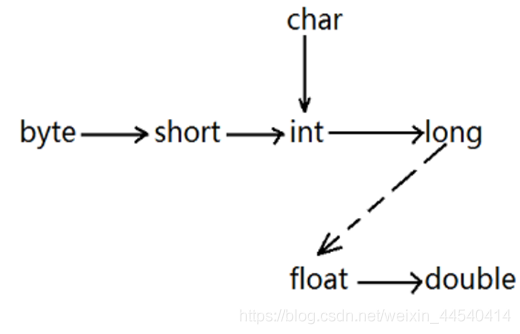
  * 强制转换:格式为(要转成类型)变量名,可能会溢出
&nbsp;
* **boolen类型**:有两个值:`false`和`true`,**整数和布尔类型不能转换**,不会遇到布尔类型与0比较的情况出现

#### 2.常量

使用`final`声明的数据类型被称为常量,只能被赋值一次

#### 3.自定义枚举类型

* 对于需要存放特定有限数据的类型可设定为枚举类型`enum`,例如:

```java{.line-numbers}
enum Size { SMALL,MEDIUM,LARGE,EXTRA_LARGE};
/*使用方法,声明该类型的变量,只能存储以上类型值或不存值为null*/
Size s = Size.SMALL;
```

#### 4.字符串

* 字符串是标准java类库提供的一个预定义类,叫做`String`,每个用双引号括起来的字符串都是String的一个实例
* 由于String是**不可变(immmutable)字符串**,java没有提供修改字符串中某个字符的方法
* String类型有50多种方法,通过变量名.方法名调用
* String字符串不能通过`==`判断是否相同,`==`只能判断存放地址是否一致,要通过`.equals(String other)`判断,如果相等,返回`true`,否则返回`false`
* **补充Unicode内容**:[unicode内容](https://blog.csdn.net/hyongilfmmm/article/details/112037596)
  * Unicode标准中,码点与字符并不一定总是一一对应的,在Unicode标准中,一个字符有可能有多个码点,比如U+51C9与U+F977都是同一个字符“凉”,这主要是为了兼容韩国字符集的标准。
  * 也有可能由多个码点来表示一个字符,最常见的就是组合字符,字符`g̈`是由基本字符U+0067和U+0308(这个字符称为组合字符)组合而成,虽然以上字符是由两个Unicode码点组成,但现实中,人们会认为这是一个字符。以上由两个码点组合而成的字符称为“用户感知字符”(这是Unicode对字符的一种理解方法)。
  * 也就是说,一个可视的代码单元可能由两个码点构成,因此尽量**不要调用**码点(.codePointAt方法),它的总长度和字符串的总长度可能不一致
  * 在这种表示法中,补充字符表示为一对字符值,第一个字符来自高代理项范围（\uD800-\uDBFF）,第二个字符来自低代理项范围（\uDC00-\uDFFF）
* 下面提供**部分String中的方法**:

```java{.line-numbers}
String a = "123";
//String a = new String(char[])使用字符数组转换
//转换类
char[] b = a.toCharArray();//将字符串转化为字符(代码单元)数组
//相关信息类
a.charAt(0);//获得一个代码单元,相当于a[0]
a.codePointAt(0);//获得对应码点的值(尽量不要用,得到的是对应的十进制数字,例ASCII码)
a.length();//返回字符串长度
a.substring(0,2);//同python:a[0:2]
String newStr = a.substring(0,1) + "new";//通过+号连接字符串进行拼接修改字符串
//判断类
a.blank();//由空格组成返回true
a.empty();//为空返回true
a.equals(newStr);//两串相等返回true
a.equalsIgnoreCase(newStr);//忽略大小写是否相等,相等返回true
a.startsWith("1");a.endsWith("3");//a以1开头、以3结尾分别返回true
//实用类
a.indexOf(newStr,1);//查找从第1个位置开始出现的第一个newStr子串的位置(第一个字母下标),不存在返回-1
a.lastIndexOf(newStr,1);//查找最后出现的位置,其余同indexOf(string,int)
a.replace("1",newStr);//用newStr(可为StringBulider类的变量)代替a字符串中的所有"1"返回一个新的字符串
a.join(",", "12", new StringBuilder("C"), new StringBuffer("D"), a);//用","分隔连接所有元素,返回一个新字符串
a.strip();//删除a两端的空格
a.trim();//删除a两端小于(U+0020)的字符
a.repeat(2);//返回一个字符串,该字符串重复a字符串2次
a.toLowerCase();//返回一个新字符串,将a中大写改小写
a.toUpperCase();//返回一个新字符串,将a中小写改大写
```

* **StringBuffer类**:
如果需要用许多小段的字符串构建一个字符串, 那么应该按照下列步骤进行。 首先, 构
建一个空的字符串构建器：
`StringBuilder builder = new StringBuilder();`
&nbsp;
当每次需要添加一部分内容时, 就调用 append 方法。
`builder.append(ch); // appends a single character`
`bui1der.append(str); // appends a string`
&nbsp;
在需要构建字符串时就凋用 toString 方法, 将可以得到一个 String 对象, 其中包含了构建器中的字符序列。
`String completedString = builder.toString();`
&nbsp;
**其他方法**:
  * void setCharAt(int i ,char c)
将第 i 个代码单元设置为 c。
&nbsp;
  * StringBuilder insert(int offset,String str)
在 offset 位置插入一个字符串并返回 this。
&nbsp;
  * StringBuilder insert(int offset,Char c)
在 offset 位置插入一个代码单元并返回 this。
&nbsp;
  * StringBui 1 der delete(1 nt startindex,int endlndex)
删除偏移量从 startindex 到 -endlndex-1 的代码单元并返回 this。

### 三、运算

#### 1.基本运算

* `+` `-` `*` `/` 符合数学,参与`/`运算的数都是整数时为整数除法(同C++**向下取整**),存在浮点数时为浮点除法,取余也与C++相同,+-得到的结果为**取值范围较大的类型**
&nbsp;
* 特殊数学运算和科学中数值在Math类中
&nbsp;
* **结合运算**`+=` `-=` `*=` `/=` `%=`,**无+、-直接使用会发生类型转换的问题**
&nbsp;
* **关系运算**`!=` `==`等,与C++基本相同
&nbsp;
* **逻辑运算**`&&` `||` `!`与或非沿用了C++的短路方式,如果最后结果已知,第二个操作就不必进行了,可通过这种机制避免越界等错误(先判断是否可能触发错误,再执行操作),如果希望所有操作全部执行可以使用`&` `|`(非短路)
&nbsp;
* **自增自减**`++` `--`,同C++,相当于`+=1` `-=1`
&nbsp;
* **三元运算**`condition ? expression1 : expression2`当`condition`为真时,返回`expression1`,否则返回`expression2`
&nbsp;
* **位运算**`&`("and") `|`("or") `^`("xor") `~`("not")使用二进制对数字运算,另外还有`<<` `>>`将**二进制数的补码的数字**左移右移填充,**其余没有数字填充的空缺补0**,而另一种`>>>`与`>>`也不同,**用符号位填补高位**,会使数字发生巨大变化,没有`<<<`符,**位运算优先级比加减乘除低**
&nbsp;
  * [计算机补码机制](https://blog.csdn.net/zl10086111/article/details/80907428)(浅谈):在计算机中数字以二进制字节存在,**一个字节(byte)由8个位(bit)组成**,每个数字在计算机中都以补码形式存在,正数补码就是原码本身,负数的补码是对应正数原码每位取反`~`后+1,例:`-5`的补码为`1111 1111 1111 1111 1111 1111 1111 1011`

```java{.line-numbers}
System.out.println(5<<2);//运行结果是20

System.out.println(5>>2);//运行结果是1

System.out.println(5>>3);//结果是0
System.out.println(-5>>3);//结果是-1
System.out.println(-5>>>3);//结果是536870911
```

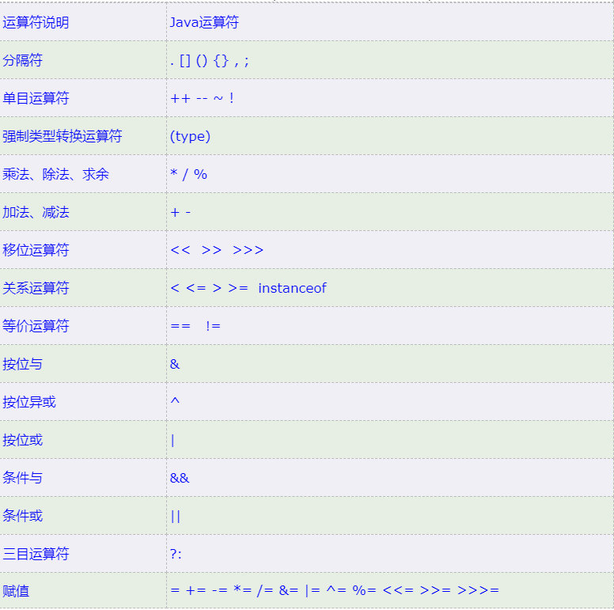

### 四、基本结构(循环、判断)

* 判断
`if(condition1) statement1 else if(condition2) statement2 else statement3`
`switch(i){ case 1:...;break;case 2:...;break;default:...;break;}`
判断与C++等其他语言差不多

* 循环
  * 标准`do{ ...}while()`和`while(){...}`与`C++`相同
  * `for(int i = 0;i < n;i++)`基本循环与`C++`相同
  * `foreach`循环是java中的泛型循环,`java5`增加的内容,类似`python`的`for i in iterable` 或`C++11`的`for(Type VarName : Array)`
  * **循环的中断**:使用break;和continue;可以实现循环退出和开始下一次循环,如果是多重循环,要对其它外层循环执行退出或开始下一次的话,许多语言要通过goto语句实现,java有goto关键字但是没有goto语句,但可通过标签指定中断的循环

```java{.line-numbers}
//这里有一个示例说明了 break 语句的工作状态。请注意,标签必须放在希望跳出的最外
//层循环之前, 并且必须紧跟一个冒号。
Scanner in = new Scanner(System.in);
int n;
read_data:
while (. . .) // this loop statement is tagged with the label
for (. . .) // this inner loop is not labeled
{
Systen.out.print(
"Enter a number >= 0: ")；
n = in.nextlntO；
if (n < 0) // should never happen-can’t go on
break read.data;
// break out of readjata loop
}
// this statement is executed immediately after the labeled break
if (n < 0) // check for bad situation
{
// deal with bad situation
}
else
{
// carry out normal processing
}
//如果输入有误,通过执行带标签的 break 跳转到带标签的语句块末尾。对于任何使用
//break语句的代码都需要检测循环是正常结束, 还是由 break 跳出。
```

### 五、输入输出

* 在java中,打印输出到“ 标准输出流”（即控制台窗口）是一件非常容易的事情,只要
调用 System.out.println 即可。然而,读取“ 标准输人流”System.in就没有那么简单了。要想通过控制台进行输入,首先需要构造一个 Scanner 对象,并与“ 标准输人流”System.in关联。
`Scanner in = new Scanner(System.in);`
&nbsp;
现在,就可以使用 Scanner 类的各种方法实现输入操作了。例如, nextLine 方法将**输入
一行**。
`System.out.print("What is your name? ");`
`String name = in.nextLine();`
&nbsp;
在这里,使用 nextLine 方法是因为在输入行中有可能包含空格。要想**读取一个单词**(以空白符作为分隔符,) 就调用`String firstName = in.next()；`
要想**读取一个整数**, 就调用 nextlnt 方法。
`System.out.print("How old are you? ")；`
`int age = in.nextlnt();`
与此类似,要想读取下一个浮点数, 就调用 nextDouble 方法。

  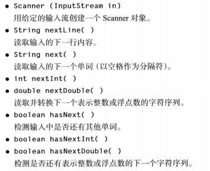

* **注意**:Scanner 类定义在java.util 包中。 当使用的类不是定义在基本java.lang 包中时,一定要使用import 指示字将相应的包加载进来。在程序的最开始添加上一行：
`import java.util.*;`
* 使用控制台命令输入:因为输入是可见的, 所以 Scanner 类不适用于从控制台读取密码。Java SE 6 特别引入了 Console 类实现这个目的。要想读取一个密码, 可以采用下列代码：
`Console cons = System.console();`
`String username = cons.readLine("User name: ")；`
`cha [] passwd = cons.readPassword("Password:");`
&nbsp;
  * 为了安全起见, 返回的密码存放在一维字符数组中, 而不是字符串中。在对密码进行处理之后,应该马上用一个填充值覆盖数组元素
采用 Console 对象处理输入不如采用 Scanner 方便。每次只能读取一行输入, 而没有能够读取一个单词或一个数值的方法。
&nbsp;
  * 在java.Iang.System中,有static Console console()实现创建Console类,如果有可能进行交互操作, 就通过控制台窗口为交互的用户返回一个 Console 对象,否则返回 null。对于任何一个通过控制台窗口启动的程序, 都可使用 Console 对象, 否则, 其可用性将与所使用的系统有关
&nbsp;
  * 在java.io.Console中有
`static char[] readPassword(String prompt, Object...args)`
`static String readLine(String prompt, Object...args)`
显示字符串 prompt 并且读取用户输入,直到输入行结束。args 参数可以用来提供输人
格式。
&nbsp;
* **格式化输出**:Java SE 5.0 沿用了 C语言库函数中的 printf方法。例如,调用
System.out.printf("%8.2f",10000.0 / 3.0);
可以用 8 个字符的宽度和小数点后两个字符的精度打印数字。也就是说,打印输出一个空格和7 个字符, 如下所示：
`3333.33`
  * 在 printf中,**可以使用多个参数**, 例如：
`System.out.printf("Hello, %s. Next year, you'll be SSd", name, age);`
每一个以 ％ 字符开始的格式说明符都用相应的参数替换
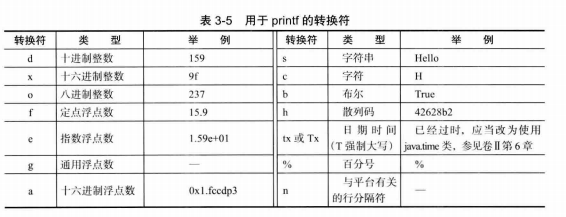
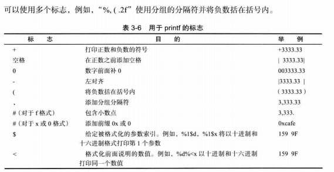
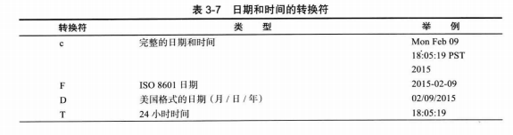
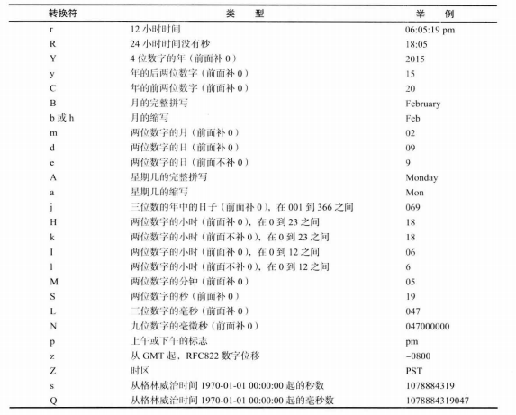

* 文件输入输出:
  * 要想对文件进行读取,就需要一个用 File 对象构造一个 Scanner 对象,如下所示：
`Scanner in = new Scanner(Paths.get("niyflle.txt"), "UTF-8");`
如果文件名中包含反斜杠符号,就要记住在每个反斜杠之前再加一个**额外的反斜杠**：
`“ c:\\mydirectory\\myfile.txt ”`,在这里指定了 UTF-8 **字符编码**,如果省略字符编码, 则会使用运行这个 Java 程序的机器的“ 默认编码”。这不是一个好主意,如果在不同的机器上运行这个程序,可能会有不同的表现。
创建完毕,就可以利用前面介绍的任何一个 Scanner 方法对文件进行读取。
&nbsp;
  * 要想写入文件, 就需要构造一个 PrintWriter 对象。在构造器中,只需要提供文件名：
`PrintWriter out = new Printlulriter('myfile.txt", "UTF-8");`
如果文件不存在,创建该文件。 可以像输出到 System.out—样使用 print、 println 以及 printf命令。

### 六、大数

* 如果基本的整数和浮点数精度不能够满足需求, 那么可以使用java.math 包中的两个
很有用的类：Biglnteger 和 BigDecimaL 这两个类可以处理包含任意长度数字序列的数值。
&nbsp;
  * Biglnteger 类实现了任意精度的整数运算, BigDecimal 实现了任意精度的浮点数运算。
  * 使用静态的 valueOf方法可以将普通的数值转换为大数值：
`Biglnteger a = Biglnteger.valueOf(100);`
遗憾的是,不能使用人们熟悉的算术运算符(如：+ 和 *) 处理大数值。 而需要使用大数值类中的 add 和 multiply 方法。
`Biglnteger c = a.add(b); // c = a + b`
`Biglnteger d = c.multiply(b.add(Biglnteger.valueOf(2))); // d = c* (b + 2)`

>与 C++ 不同, Java 没有提供运算符重载功能。 程序员无法重定义+和\*运算符

### 七、数组

* 类似其他语言的数组,在C++中这种定义方式类似于数组指针,`int[] a = new int[100];`,通过a.length可访问数组的大小,允许定义长度为0的数组(不是null)
&nbsp;
  * 创建一个数字数组时, 所有元素都初始化为 0。boolean 数组的元素会初始化为 false 对象数组的元素则初始化为一个特殊值 null, 这表示这些元素（还）未存放任何对象。
&nbsp;
  * 一旦创建了数组,就不能再改变它的大小（尽管可以改变每一个数组元素。如果经常需要在运行过程中扩展数组的大小,就应该使用另一种数据结构—数组列表(array list)

* 数组的初始化:
在 Java中, 提供了一种创建数组对象并同时赋予初始值的简化书写形式。下面是一例子：
`int[] small Primes = { 2, 3, 5, 7, 11, 13 };`
请注意, 在使用这种语句时,不需要调用 new。但是还可以初始化一个匿名的数组：
`new int[] { 17, 19, 23, 29, 31, 37 }`
这种表示法将创建一个新数组并利用括号中提供的值进行初始化,数组的大小就是初始值的
个数。 使用这种语法形式可以在不创建新变量的情况下重新初始化一个数组。例如：
`small Primes = new int[] { 17, 19, 23, 29, 31, 37 };`
这是下列语句的简写形式：

```java{.line-numbers}
int[] anonymous = { 17, 19, 23, 29, 31, 37 };
smallPrimes = anonymous;
```

* **数组的拷贝**
在 Java 中,允许将一个数组变量拷贝给另一个数组变量。这时, 两个变量将引用同一个数组：
`int[] luckyNumbers = smallPrimes;`
`1uckyNumbers[5] = 12; // now smallPrimes[5] is also 12`
&nbsp;
  * 如果希望将一个数组的所有值拷贝到一个新的数组中去,就要使用 Arrays 类的 copyOf方法：
`int[] copiedLuckyNumbers = Arrays.copyOf(luckyNumbers , luckyNumbers .length);`
第 2 个参数是**新数组的长度**。这个方法通常用来增加数组的大小：
`luckyNumbers = Arrays.copyOf(luckyNumbers , 2 * luckyNumbers.length);`
  * 如果数组元素是数值型,那么多余的元素将被赋值为 0 ; 如果数组元素是布尔型,则将赋值为 false。相反,如果长度小于原始数组的长度,则只拷贝最前面的数据元素。
* 数组的方法:在Arrays类中有大量的方法,包括快速排序,二分查找等
* 多维数组与一维数组类似,同C++数组初始化或使用new初始化变量就可
* main方法的String args[]参数(命令行参数):在命令行使用java class文件 -g cruel world时,后面的参数-g、cruel、world就作为命令行参数传递给args[0],args[1],args[2]
* **不规则数组**:`int[][] adds = new int[NMAX + 1][];`java中没有定义上的多维数组,每一行数组长度可以在使用的时候单独指定,`odds[n] = new int[n + 1];`

>java.util.Arrays储存了数组有用的函数,详情可以看官方文档
>给数组赋值：通过 fill 方法。
>对数组排序：通过 sort 方法,按升序。
>比较数组：通过 equals 方法比较数组中元素值是否相等。
>查找数组元素：通过 binarySearch 方法能对排序好的数组进行二分查找法操作。

## java面向对象设计

### 一、面向对象设计

* 面向对象设计也称**oop**,通过先定义数据再考虑操作数据的算法解决规模较大的问题
* 通过使用对象来存储数据,oop设计要先弄清楚对象的行为(要完成的操作),状态(进行操作时,对象如何响应),标识(如何区分不同状态的对象)
* 在创建类的时候,确定其中哪些名词重要,通过经验识别类
* 类之间的关系:**依赖**(uses-a),**聚合**(has-a),**继承**(is-a)
  * 依赖:如果一个类方法使用或操作另一个类,称该类依赖另一个类(尽量降低)
  * 聚合:意味着包含另一个类的对象(类中有另一个类的变量)
  * 继承:由类继承得来
* **面向对象的特点:封装、继承、多态**
  * 封装:类可以把自己的数据和方法只让可信的类或者对象操作,对不可信的进行信息隐藏
  * 继承:继承类可以使用基类的所有功能,并在无需重新编写原来的类的情况下对这些功能进行扩展
  * 多态:允许不同继承类对基类的方法有不同的运作方式(允许将子类类型的指针赋值给父类类型的指针,使用父类中的方法得到不同效果)实现多态,有二种方式,覆盖,重载。覆盖,是指子类重新定义父类的虚函数的做法;重载,是指允许存在多个同名函数,而这些函数的参数表不同(或许参数个数不同,或许参数类型不同,或许两者都不同)

### 二、类的定义和导入

* **类的定义**:使用`class`语句

```java{.line-numbers}
class ClassName
{
  field1
  field2
  ...
  constructor1
  constructor2
  ...
  method1
  method2
  ...
}
```

* 这些类可以在多个源文件中,在运行时,只需要使用`javac main.java`就可以完成多文件的编译,它会自动寻找要使用其他类的源文件,编译或更新,java中类都放入了包中
* **类的导入**:使用`import 包名;`可导入类(需给出完全限定名),例:java.util.ArrayList;或java.util.*;(这样java在编译时会寻找要加载的类,不会将所有类都加载),但是为了方便了解使用了哪些包,建议写全名
  * 当出现多个包内都有同名类,可以在之后再使用import 类解决,如果两个类都要用,使用时使用完整的包名

* **静态导入**:使用`import static 包名;`可导入该包中类的所有静态方法,使用时就不用在方法前使用`类名.`
* **在包中增加类**(创建包):使用`package 子目录路径;`就可以将类方入包中,在使用时,直接切换到基目录,编译主文件即可,如果路径有问题,能编译不能运行,使用package命令，说明运行cmd的目录下应该有该子目录，在基目录运行子目录的包时，应该使用文件夹.文件名运行,且只能在基目录运行它

>一般命名包方法是互联网连接命名,PackTest.test.com等,反过来就是根目录/com/test/PackTest.java,而添加类时,使用package com.test;

* 无名包:如果没有在java源文件中使用package语句,默认将所有的方法放入无名包中
* 可执行JAR文件:可以通过jar命令在命令行生成jar包,在java9以后允许对不同版本的java使用多版本jar包,在这里不展示,[详情点这里](https://blog.csdn.net/mashaokang1314/article/details/83624454)

---

### 三、类中的属性和方法

* java中类属性和方法不像C++中一样分为`private/public/protected`,java不止使用这些,还有不带修饰符,`强烈建议所有类属性不使用public,封装类`,修饰符作用如下:

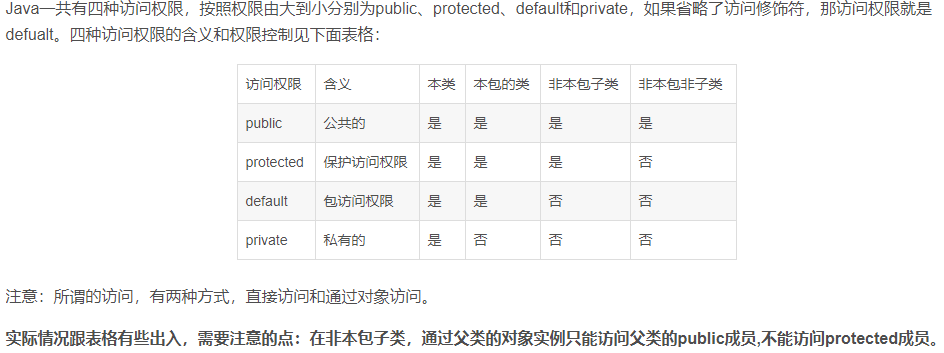

---
**修饰符**:

1. **static**:将属性或方法设置为静态,可设默认值,可以使public方法或属性可以不用使用对象访问,可以使用类名访问,例如Math.pi得到π,使用Math.pow(2,2)得到$2^2$,静态属性和方法为所有的对象公有,只有一份
2. **final**:同前面的final,声明一个常量,必须在构造时初始化,之后无法修改

* **构造函数**:和C++一样需要使用和类同名的方法定义,**可重载**,**仅**当未定义构造函数时,默认给出无参构造函数,且不像C++,java无参数列表赋值,但同样具有隐式参数(类属性,也可以使用`this.`访问),java允许在定义时给参数赋值
  * 默认无参构造函数会把数字设置为0,boolean为false,其它对象为null,自定义构造函数中没有定义的初始值也将设置如此(但建议写出)
  * 在java中在构造器的定义中允许使用this(参数)调用其它构造器,C++不能如此
  * **初始化块**:使用构造器构造对象时,会触发初始化块,**调用顺序**如下:如果构造器第一行调用了另一个构造器,则先执行第二个构造器,否则先初始化默认值,再执行初始化块,最后执行该构造器代码,初始化块就是**仅用大括号包裹**的函数
  * **静态初始化块**:如果使用`static`修饰初始化块,就可以得到静态初始化块,只会在第一个对象初始化时使用,用于对需复杂初始化的静态字段初始化
  * **工厂方法**:如果需要生成不同风格的初始化对象,可以使用工厂方法,一般工厂方法由多个静态方法组成,例如LocalDate和NumberFormat类使用静态工厂方法构造对象,通过工厂方法和继承配合使用,就可以得到不同的效果,有关为什么不使用构造器:1️⃣由于构造器命名必须与类名一致,这里希望有两个不同的名字加以区分,2️⃣使用构造器不能改变构造的类型,这里实际上是通过继承,将其变成了不同功能的子类

```java{.line-numbers}
//工厂方法构造不同风格的对象
NumberFormat currencyFormatter = NumberFormat.getCurrencyInstance();
NumberFormat percentFormatter = NumberFormat.getPercentInstance();
double x = 0.1;
System.out.println(currencyFormatter.format(x)); //print $0.10
System.out.println(percentFormatter.format(x)); //print 10%
```

* 析构函数和finalize方法
  * 不同于C++,在java中**不支持**析构器,java会自动进行垃圾回收
  * 如果使用了除内存以外的资源,如:打开了文件或连接等,使用完成需要立刻关闭,需要定义一个close方法完成必要的清理工作
  * finalize方法在目前版本**已废弃**,在之前会在回收之前自动调用,**不要使用**

```java{.line-numbers}
class Employee{
  //类中属性和方法演示
  public static int nextId = 1;

  /*如果使用随机初始值,写法
  private static int nextId;
  //静态初始化块,,只会执行一次
  static
  {
    //使用var如果根据根据后方构造函数辨别该类,可以使用var定义,java10特性
    var generator = new Random();
    nextId = generator.nextInt(10000);
  }
  */

  private int id;
  private String name;
  private double salary;
  //初始化块,不写也可以,虽然可以出现在任何地方,但建议写在定义变量之后
  {
    //初始化时自动执行
    id = nextId++;
  }
  //构造函数
  public Employee(){
    //可直接访问,但注意不要定义同名变量
    name = "";
    salary = 5000;
  }
  public Employee(String n,int s){
    //使用this访问
    //调用其它构造器
    this();
    this.salary += 1000;
  }

}
```

### 四、类的设计思路

* 一般情况下,如果想要得到或修改字段的值,类需要提供:
  * 一个私有数据字段
  * 一个对应的访问器方法
  * 一个对应的修改器方法

>一般情况下,C++会使用const声明函数不会修改类属性,只会访问类属性,而java没有这种声明

* **字段**:一般情况下,将有相同作用的字段合成成另一个类,使用时定义这个类以降低耦合度
* **访问器方法**:一般设计为公有,一般的基本类型,这个可以直接`return 值;`一句话结束,而对于其他类对象而言,不能直接返回,因为他们相当于C++指针,会指向一片区域(==但是在传递给局部变量时,局部变量指向的修改不会影响本身==),会导致出现外界访问修改字段,影响类的封装,因此,需要`return 类对象.clone();`
* **修改器方法**:在没提继承前,修改器方法和普通函数一样,存储算法,另外要注意java无友元函数

>c++中使用friend定义的函数就是友元函数,定义时不用使用类名::函数,而是像普通函数使用函数名定义,但是在java中没有,但java可以模拟出来
1️⃣**友元类**:在类内定义内部类可访问外部类的所有成员域和成员方法。注意这个内部类应该是非静态的（没有static关键字）
2️⃣**友元函数**:Java中我们也可以通过把某个成员域或者成员方法的访问权限设置为default类型（即不加任何访问修饰符）,这时该成员域或者成员方法只能被当前package下的类访问,连子类都不能访问(子类需要得话,使用protected,但这种保护性差)

---

* **设计技巧**:
1️⃣一定要保证数据私有,绝对不要破坏类的封装性
2️⃣一定要对数据进行初始化,最好不要使用系统默认值,且显式初始化所有数据
3️⃣不要在类中使用过多的基本类型,用其他类代替多个相关的基本类型,便于修改理解
4️⃣不是所有字段都需要单独的访问器和修改器,有些对象常包含不希望被获得的字段
5️⃣分解有过多职能的类,但不要走极端

### 五、java类文档的注释编写

* 在jdk中包含很有用的工具,叫做javadoc,它可以由源文件生成一个html文档
* 读取的注释:javadoc从下面几项抽取信息,这里主要介绍类的部分即后三个,剩下的在[点击跳转](images/#javadoc补充)
  * 模块
  * 包
  * 公共类和接口
  * 公共和受保护的字段
  * 公共和受保护的构造器及方法
* 类注释:写于import语句之后,类定义之前使用文档注释/** 注释内容 */,其他行的\*可不写,大部分编辑器也会给出

```java{.line-numbers}
/**
* A {@code Card} object represents a playing card , such
* as "Queen of Hearts". A card has a suit (Diamond , Heart ,
* Spade or Club) and a value (1 = Ace , 2 . . . 10, 11 = Jack,
* 12 = Queen , 13 = King).
*/
public class Card{
  ...
}
```

* 方法注释:必须放于被描述的方法前,可以使用通用标记和下方标记
  * @param *variable description*:给当前方法的参数(parameters)添加条目,可占多行,可使用html标记
  * @return *description*:给当前方法添加返回(return)部分,可占多行,可使用html标记
  * @throws *class description*:给方法添加注释,表名方法可能抛出异常

```java{.line-numbers}
/**
* Raises the salary of an employee.
* @param byPercent the percentage by which to raise the salary (e.g. 10 means 10%)
* @return the amount of the raise
*/
public double raiseSalry ary(double byPercent)
{
double raise = salary * byPercent / 100;
salary += raise;
return raise;
}
```

* 字段注释:只需对公共字段(通常指的是静态常量)建立文档

```java{.lin-numbers}
/**
* The "Hearts" card suit
*/
public static final int HEARTS = 1;
```

* 通用注释:
  * @since *text*:建立一个始于(since)条目,text可以是引入这个特性的版本的任何描述
  * @author *name*:产生作者(author)条目,可有多个,对应多个作者
  * @version *text*:产生版本(version)条目,text可以是对版本的任何描述
  * @see 和 @link标记,链接到javadoc文档的相关部分或外部文档,标记@see *reference*将在“ see also” 部分增加一个超级链接。它可以用于类中,也可以用于方法中。这里的引用可以选择下列情形之一：
`package.class#feature label`
`<a href="...">label</a>`
`"text"`
而@link可以在任何位置添加指向其他方法和类的超链接,方法规则和@see标记相同
  * {@index entry}语法在java9中能被使用,可以为搜索增加一个条目

```java{.line-numbers}
//@since用法
@since 1.7.1

//@author用法
@author James Gosling

//@version用法
@version This version is a beta version

//@see用法
//第一种情况是最常见的,只要提供类、方法或变量的名字,javadoc就在文档中插入一个超链接。例如
@see com.horstraann.corejava.Employee#raiseSalary(double)
/*建立一个链接到 com.horstmann.corejava.Employee 类的
 raiseSalary(double) 方法的超链接。
可以省略包名, 甚至把包名和类名都省去,此时,链接将定位于当前包或当前类
需要注意,一定要使用井号（#) 而不要使用句号（.）分隔类名与方法名,或类
名与变量名。Java 编译器本身可以熟练地断定句点在分隔包、子包、类、内部类与方
法和变量时的不同含义。但是 javadoc 实用程序就没有这么聪明了,因此必须对它提
供帮助*/
//如果 @see 标记后面有一个<字符,就需要指定一个超链接。可以超链接到任何URL,例如：
@see <a href="m«w.horstmann.com/corejava.html ">The Core Java home page</a>
/*在上述各种情况下, 都可以指定一个可选的标签（ label ) 作为链接锚（link
anchor)如果省略了 label , 用户看到的锚就是目标代码名或 URL。
如果@see 标记后面有一个双引号（"）字符,文本就会显示在 “see also” 部分,例如,*/
@see "Core Java 2 volume 2"
//可以为一个特性添加多个 @see 标记,但必须将它们放在一起

//@link用法
{@link package.class#feature label} 
```

* 包注释
  * 直接将类、方法、变量的注释写在java源文件中,只要用/** */注释界定就可以了,想要产生包注释,需要在每一个包目录中添加一个单独文件
  * 添加方法有以下两种:
1️⃣ 提供一个`package-info.java`文件,该文件必须包含一个初始的以/** */界定的javadoc注释,后面是一个package语句,它不能包含更多的代码或注释
2️⃣ 提供一个名为`package.html`的文件,会抽取标记`<body></body>`之间的所有文本
* 注释抽取的方法
假设你希望html文件将放在docDirectory的目录下,执行以下步骤:
1️⃣ 切换到想要生成文档的源文档的目录。如果有嵌套的包要生成文档,例如,com.hostmann.corejava,就必须切换到包含子目录com的目录(回到最外层的目录,如果提供了overview.html的话,就是这个文件所在的目录)
2️⃣ 如果是一个包,运行**javadoc -d docDirectory nameOfPackage**
或者,如果是多个包,运行**javadoc -d docDirectory nameOfPackage~1~ nameOfPackage~2~ ...**
如果是无名包,运行**javadoc -d docDirectory \*.java**

>如果省略了-d docDirectory选项,那么HTML文件将会被提取到当前目录下,有可能带来混乱,因此不提倡这种做法

* javadoc其它选项:
  * -author和-version可以使用来在文档中包含@author和@version标记(默认会忽略)
  * -link可以连接其他超链接的标准类注释文档`javadoc -link http://docs.oracle.com/javase/16/docs/api *.java`使所有的标准类库自动连接到oracle官网
  * -linksource可以使每个源文件转化为HTML(不代码着色,但包含行号),并且每个类和方法名将变为指向源代码的超链接

### 六、类的继承

* 定义子类:定义子类使用**exends**关键字
  * java不支持多继承,即 一次继承extends后面只能跟一个类,如果实在需要多重继承.,需继承多次,而且[接口](images/#接口)有类似多重继承的功能

```java{.line-numbers}
//B类与A类为继承(is-a)关系
//A是B的基类、超类、父类
//B是A的派生类、子类、孩子类
class B extends A{

}
```

>在C++中,存在public、private等多种继承方法,但在java中只有public继承,C++的继承方式会把基类的公有属性和方法变成public、private等,因此,java为了阻止部分公有方法的继承,可以重写或隐藏这些方法

* **super**关键字
  * 有的时候新定义的方法需要访问基类的公有方法,java不存在基类名::方法名调用基类方法,这时,就需要和this对应的super了。如果需要覆盖超类的方法完成对超类数据和新增数据的修改,就可以使用这种方法
  * 子类构造器:对于初始化基类的字段,由于派生类没有访问修改的基类字段的方法,也必须使用基类的初始化器super()

```java{.line-numbers}
//使用super的方法重写覆盖
public double getSalary(){
  return super.getSalary() + bonus;
}

//使用super的构造器
public Manager(String name,double salary,int year,int month,int day){
  super(name,salary,year,month,day);
  bonus = 0;
}
```

* 将对象放入基类的数组中
  * 例如,将Manager类的对象赋值给Employee类对象中,没问题,使用`Employee对象名.getSalary()`时,得到的是`Manager的getSalary()`方法的结果
  * 这种能指示多种实例类型的现象称为多态,在运行时能够自动地选择适当的方法这称为**动态绑定**(dynamic binding)

>在C++中,如果希望实现动态绑定,需要将成员函数声明为virtual(虚)。在java中,动态绑定是默认行为。如果不希望动态绑定,可以使用final标记

### 七、多态

* 引入:有一个简单的规则来判断是否应该设计继承关系,那就是"is-a"规则,它指出子类的每一个对象都是超类的对象(或者说,子类对象出现的地方可以在逻辑上使用超类对象替换)。在java中,继承不仅限于一次,例如:Employee类可以引用Employee类型的对象,也可以引用一个子类的对象(例如:Manager、Executive、Secretary等),这样,超类只能访问自身拥有的方法和字段,如果使用超类的方法,对于不同的类型产生了不同的效果,就是多态的一种体现

>==警告==:如果使用超类的数组存储子类的变量,这是合法的,但是如果未被记录存放的是子类的变量,被修改为存放超类对象之后,使用子类独有的方法会出错,调用一个不存在的字段,进而**搅乱相邻的存储内容**,不建议这样存储;且一定要注意,仅将兼容的数据存放在一起,不然会引发**ArrayStoreEception异常**

* final阻止继承:使用final标记的方法和类将不允许被扩展,将类声明为final,其中有方法也自动成为final方法

```java{.line-numbers}
//不允许扩展(这里指无法继承)的类
public final class Excutive extends Manager{
  ...
}

//不允许扩展(这里指无法重写)的方法
public final String getName(){
  ...
}
```

* **强制类型转换**:对继承链上的类进行类型转换时,需要先进行判断,再进行操作,查看能否进行转换,否则如果承诺过多(谎报对象包含的内容,承诺它为...类型),程序将产生ClassCastException异常,终止
  * 判断方法:instanceof关键字,如果可以转换返回true,否则返回false
  * 综上所述,只能在继承层次内进行强转换,在将超类转换为子类时,应该使用instanceof检查
  * **尽量不要使用**强制类型转换,如果一定要使用基类的对象调用派生类特有的方法请思考这种设计是否合理

>java使用强制类型转换语法来自于C++以往糟糕的日子,但处理过程却有些像 C++的`dynamic_cast`操作。例如,`Manager boss = (Manager) staff[1]; // Java`等价于`Manager* boss = dynamic_cast<Manager*>(staff[1]); // C++`它们之间只有一点重要的区别： 当类型转换失败时,Java不会生成一个null对象,而是抛出一个异常。从这个意义上讲,有点像 C++ 中的引用(reference)转换。真是令人生厌。在 C++ 中, 可以在一个操作中完成类型测试和类型转换。`Manager* boss = dynainic_ca.st<Manager*>(staff[1]).; // C++if (boss != NULL)...`而在 Java 中, 需要将 instanceof 运算符和类型转换组合起来使用：`if(staff[1] instanceof Manager){ Manager boss = (Manager) staff[1];}`

* **方法调用理解**(假设要调用x.f(args),隐式参数x声明为c类的一个对象):
1️⃣ 编译器首先会查看对象的声明类型和方法名,在c类寻找与需要的方法名相同的方法(**已知所有候选方法**)
2️⃣ 接下来,确定方法调用提供的参数类型(被称为重载解析),如果存在完全匹配就选那个方法,不然会继续类型转换(int可转换为double,子类可以转换为基类),如果没有匹配或有多个匹配,报告错误(**已知需要调用的方法和参数类型**)
3️⃣ 如果有特殊修饰符,编译器将可以更准确知道应该调用哪个方法(被称为静态绑定),如果要调用的方法依赖于隐式参数的实际类型,编译器会动态绑定生成调用f(String)的指令
4️⃣ 在运行并且使用动态绑定时,虚拟机必须调用与x所引用对象的实际类型对应的方法,假设x的实际类型是D,它是c类的子类,如果类D定义了这个方法,就会调用这个方法,否则会在D的超类寻找这个方法,以此类推

>java中,方法的名字和参数列表被称为方法的签名,而返回值不是,不过在覆盖一个基类方法时,允许使用子类,将返回值修改为返回值的子类,且覆盖方法时,新方法不能低于超类方法的可见性,超类声明为public覆盖时也必须声明为public

* 如果已知的后续方法只有一个,将不在进行下一步
* 每次调用要如此寻找时间开销相当大,因此虚拟机预先为每一个类计算了一个方法表,其中列出了所有方法的签名和要调用的实际方法,真正在调用时,虚拟机只要查这张表就可以

---

* **抽象类**
  * 如果自下而上在类的继承层次结构中上移,位于上层的类更具有通用性,甚至可能更加抽象。从某种角度看,祖先类更加通用,人们只将它作为派生其他类的基类,而不作为想使用的特定的实例类。例如,考虑一下对Employee类层次的扩展。一名雇员是一个人,一名学生也是一个人
  * 每一个人都有一些属性,例如:姓名,因此通过引入一个公共的超类,把`getName()`方法放在继承层次更高的一层,这样可以更好地实现多态,使用超类指向任何子类对象
  * **abstract关键字**:在person类中有许多方法已知在派生类中会出现并重写,如果在person中定义,可以不用实现这些方法,这时,可以直接返回一个结果,更好地方法是使用abstract修饰,`public abstract getDescription();`,为了提高代码的清晰度,**包括一个或多个抽象方法的类也必须用abstract修饰**
  * 抽象方法充当着占位的角色,它们的具体实现在子类中。扩展抽象类可以有两种选择。一种是在抽象类中定义部分抽象类方法或不定义抽象类方法,这样就必须将子类也标记为抽象类；另一种是定义全部的抽象方法,这样一来,子类就不是抽象的了
  * 需要注意,**可以定义**一个抽象类的对象变量,但是它**只能引用**非抽象子类的对象

>在C++中,有一种在尾部用= 0标记的抽象方法,称为纯虚函数,例如：class Person {public:virtual string getDescriptionO = 0;}// C++只要有一个纯虚函数,这个类就是抽象类。在C++中,没有提供用于表示抽象类的特殊关键字

* **受保护访问**(谨慎使用):
  * 如果想要在子类使用超类的字段,就可以使用protected允许本包和所有子类访问
  * 谨慎使用,你不知道其他程序员是否会定义新的派生类,从而泄露字段
  * 受保护的方法反而更常用,这个修饰表明子类能很好得使用祖先类的这个方法,得到了信任,例如:object的clone方法(但是,受保护访问比较微妙,类只能调用它来克隆自己的对象,在java中,保护字段只能由同一个类访问,保护方法只能对同类对象使用,对超类无用)
  * [修饰符总结在这里](images/#类中的属性和方法)

### 七、所有类的超类Object类

* 和python一样,在java中有所有类的超类,java中所有类都扩展了object,但不要特别写:extends Object,只要没有明确指出超类,Object就被认为是这个类的超类,因此熟悉这个类很重要
* 认识Object:
  * Object的变量可以引用任何类变量对象,在java中只有基本类型变量不是类对象,数组也扩展了Object类
  * `equals(Object类)`方法由于检查两个对象是否相等,object中实现的是默认行为:如果两个对象引用相等,那么他们就相等(但在实际中有可能只要比较部分是否相等,就可以了),而使用Objects.equals(a,b)也可以比较a和b是否相同,如果a,b中有一个为null返回false

>如果两个变量不属于同一个类,equals应该如何操作存在争议,许多人喜欢使用instanceof检查(这样会允许类为子类时返回true),但是这样可能会出现一些麻烦,java语言规范要求equals具有自反性(x.equals(x) = true),对称性(x.equals(y) = y.equals(x)),传递性,一致性(x和y不变,结果不变)
>因此,现在来看,有两种不同的情形:
>1️⃣ 子类有自己相等的概念,应该不使用instanceof判断类型,而使用getClass()方法
>2️⃣ 如果由超类决定是否相等,那么可以使用instanceof,这样可以在不同的子类间判断

  ⚠️ 另外注意重写的方法参数也应该为Object对象,否则无法覆盖,可以在前面声明
  @Override确保覆盖,如果@Override public boolean equals(Object other)
  没有覆盖超类的方法,将报告错误

* `hashCode()`方法得到对应的散列码(hash code),一个整数(由对像的存储空间得出,相等的对象会返回一样的散列码,如果x.equals(y) = true,则x.hashCode() = y.hashCode(),二者必须相容(互相验证),如果覆盖了也必须如此)
* `toString()`返回一个输出所有结果的字符串

### 八、泛型数组

* 在某些语言中,必须在编译时确定数组的大小,很令人反感,java允许在运行时确定数组的大小,解决这个问题的方法是使用java类ArrayList,ArrayList类类似数组,在添加和删除数组元素时,会自动调整数组容量,不需要编写任何代码
* **声明数组列表**:以Employee类数组列表为例,`ArrayList<Employee> staff = new ArrayList<Employee>();//java 10以下版本` `var staff = new ArrayList<Employee>();//java 10`,可在括号内指定容量
* **允许使用for-each迭代**
* **ArrayList的方法**

```java
.add(num)方法:添加元素num到数组尾
.ensureCapacity(int)方法:估计出存储的元素数量,在填充前调用,就不用调用很大的开销来重新分配空间
.size()返回当前列表包含的实际元素个数
.trimToSize()确定空间不再变化,回收未使用的空间,在确认不会在添加后使用
.set(int i,num)方法在i位置上赋值元素(i必须<.size()),等价于数组中a[i] = num;
.get(int)方法得到在i位置上的元素,等价于数组a[i],不能使用a[i]访问
.toArray(int[])方法将数组元素拷贝到int数组中
.add(n,e)方法在位置n插入一个元素,位置n以及以后元素后移
.remove(n)方法删除n位置元素,之后的元素前移,.size()减一
```

* **类型化和原始数组列表的兼容性**:对于使用ArrayList作为参数的遗留函数,例如:`int f(ArrayList a)`可以将一个类型化的ArrayList\<Employee>的参数传递给f(),而不需要强制类型转换,这样调用可能不太安全,但虚拟机的完整性没受到威胁,相反则会得到一个警告,强制类型转换之后赋值也不行,如果使用命令行运行,希望看到这些警告信息编译时,提供选项`-Xlint:unchecked`
* **对象包装器和自动装箱**:
  * 有时需要将int类型这样的基本类型转换为对象,所有的基本类型都有对应的类,例如:`integer`类对应`int`类型(数字基本类型对应的六个类派生于Number超类),包装器类不可变,一旦赋值无法更改,且包装器类都用final修饰
  * 在添加元素时,调用`list.add(3)`会自动变换成`list.add(Integer.valueOf(3))`,这是很有用的特性,从而很容易地添加元素,这种变换称为**自动装箱**,装箱一词源于C#,将一个`Integer`对象赋值给一个int类型也会自动拆箱
  * Integer是一个类对象,因此对两个存储值相等的Integer对象使用`==`号判断,通常会失败,也有可能成功,比较时请调用`equals`方法;因为是类对象,会存在`null`赋值,要考虑这种情况,避免出现null拆箱,引起`NullPointerException`错误
  * 在Integer类这样的包装器类中存放有一些重要的静态方法,可以完成对字符串的转换

```java
int intValue( )
//以int的形式返回Integer对象的值(在 Number 类中覆盖了 intValue方法）
static String toString(int i )
//以一个新String对象的形式返回给定数值i的十进制表示。
static String toString(int i ,int radix )
//返回数值i的基于给定radix参数进制的表示。
static int parselnt(String s)
static int parseInt(String s,int radix)
//返回字符串s表示的整型数值,给定字符串表示的是十进制的整数(第一种方法)
//或者是radix参数进制的整数(第二种方法)
static Integer valueOf(String s);
static Integer valueOf(String s, int radix);
//返回用s表示的整型数值进行初始化后的一个新Integer对象,给定字符串表示的是
//十进制的整数(第一种方法)或者是radix参数进制的整数(第二种方法)
```

>这种转换执行效率低下,只有当认为方便性比执行效率更加重要时才会使用

### 九、可变参数数量的方法

* 一些方法被称为变参的方法,例如`printf()`方法

```java
//printf方法是这样定义的：
public class PrintStream
{
public PrintStream printf(String fmt , Object... args) { return format(fmt, args); }
}

```

* 在上面出现的`...`是java代码的一部分,这会使args传入数组形式的参数new Object[]{};同时也允许直接传入数组形式的参数
* 因此如果最后一个参数是数组参数,可以这样写

### 十、枚举类

* 事实上,枚举类型声明的是一个类,定义典型例子:
`public enum size{SMALL,MEDIUM,LARGE,EXTRA_LARGE}`
* 如上:它有四个实例,不可能构造新的对象,在比较时直接使用`==`就可以了,如果需要的话,可以增加新的方法:

```java
public enum Size
{
SMALL("S"), MEDIUM("M"), LARGE("L"), EXTRA_LARGE("XL");
private String abbreviation;
//枚举类的构造器必须为私有,否则会出错
private Size(String abbreviation) { this.abbreviation = abbreviation; }
public String getAbbreviation() { return abbreviation; }
}
```

* 枚举类的方法:
  * 设置s为上方`Size`类的`SMALL`,`Size s = Enum.valueOf(Size.class,"SMALL")`
  * 返回"SMALL"字符串`Size.SMALL.toString()`
  * 返回"MEDIUM"计数位置(从零开始)`Size.MEDIUM.ordinal()`
  * 返回包含所有枚举值的数组`Size[] values = Size.values();`

>Enum类实际上有一个类型参数,例如:Size实际上扩展了Enum\<Size>,这个类型参数会在进行compareTo(other)方法中使用,比较枚举的量的出现顺序,如果本身在other出现前返回负整数,this == other返回0,否则返回正数

### 十一、反射库

* 能够分析类能力的程序称为反射。使用反射,JAVA可以支持用户界面生成器、对象关系映射器以及很多其他需要动态查找的开发工具
* 反射机制可以用来:
  * 运行时分析类
  * 运行时检查对象,例如:一个适用于所有类的toString()方法
  * 实现泛型数组操作代码
  * 利用Method对象,这个对象类似C++的函数指针

* 一般应用的程序员不需要考虑这个,开发工具可以使用,功能强大且复杂

* **class类**
在程序运行期间,Java运行时系统始终为所有的对象维护一个被称为运行时的类型标识,这个信息跟踪着每个对象所属的类,虚拟机利用运行时类型信息选择相应的方法执行,然而,可以通过专门的 Java 类访问这些信息。保存这些信息的类被称为Class,这个字很容易让人混淆,`Object`类中的`getClass()`方法将会返回一个Class类型的实例。
* 最常用的`Class`方法是`getName`(不是静态的),这个方法将返回类的名字,如果被封装在包里,包名也作为类名的一部分,由于一些历史原因,对数组变量使用时可能会返回奇怪的名字
* class类的`forName`方法,`Class.forName(className)`返回字符串className对应的class类对象
* T.class,如果T代表java类型的关键字(包括void),T.class将代表匹配的类对象

>Class类实际上是一个泛型类。例如,Employee.class的类型是 Class\<Employee>。没有说明这个问题的原因是:它将已经抽象的概念更加复杂化了。在大多数实际问题中,可以忽略类型参数,而使用原始的Class类。

* **利用反射类检查类结构**
* 在`java.lang.reflect`包中有三个类 `Field`、`Method` 和 `Constructor` 分别用于描述类的域、方法和构造器。 这三个类都有一个叫做 `getName` 的方法, 用来返回项的名称。`Held` 类有一个 `getType` 方法, 用来返回描述域所属类型的`Class` 对象`Method` 和 `Constructor` 类有能够报告参数类型的方法,`Method` 类还有一个可以报告返回类型的方法。
* 这三个类还有一个叫做 `getModifiers` 的方法, 它将返回一个整型数值,用不同的位开关描述 public 和 static 这样的修饰符使用状况。另外, 还可以利`java.lang.reflect` 包中的 `Modifier`类的静态方法分析`getModifiers` 返回的整型数值。例如, 可以使用 `Modifier` 类中的 `isPublic`、`isPrivate` 或 `isFinal`判断方法或构造器是否是 `public`、 `private` 或 `final`。 我们需要做的全部工作就是调用 `Modifier`类的相应方法,并对返回的整型数值进行分析,另外,还可以利用 `Modifier.toString`方法将修饰符打印出来。
* Class类中的`getFields`、`getMethods`和`getConstructors`方法将分别返回类提供的public域、方法和构造器数组,其中包括超类的公有成员。Class类的 `getDeclareFields`、`getDeclareMethods` 和 `getDeclaredConstructors` 方法将分别返回类中声明的全部域、方法和构造器,其中包括私有和受保护成员,但不包括超类的成员。

* **使用反射在运行中分析对象**(粗讲)
* 查看字段的具体内容:查看对象域的关键方法是`Field`类中的`get`方法(对私有域不行,会得到一个错误),除非拥有访问权限,否则Java安全机制只允许査看任意对象有哪些域,而不允许读取它们的值,反射机制的默认行为受限于Java的访问控制
* 然而, 如果一个Java程序没有受到安全管理器的控制,就可以覆盖访问控制。为了达到这个目的,需要调用`Field`、`Method`或`Constructor`对象的`setAccessible`方法。例如,`f.setAtcessible(true); /* now OK to call */ f.get(harry);`
* 通过反射实现通用的toString方法(但有时还是需要重新实现,能够不受控地访问类内部的日子已经屈指可数)

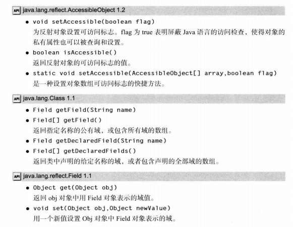

* 使用反射也可以**编写泛型数组代码**,并且可以**调用任何方法和构造器**

### 十二、继承的设计技巧

1. **将公共字段和方法设计在超类里**
2. **不要使用受保护**(protected)**的字段**(虽然有时更方便,但是子类的集合是无限的,子类和同包下的所有类都将可以访问它,破坏了**封装性**)
3. **使用继承实现`is-a`关系**
4. **除非所有继承的方法都有意义,否则不要使用继承**
5. **在覆盖方法时,不要改变预期设想的行为**
6. **使用多态,而不要使用类型信息**(只要看到类似的判断该对象类型进行不同操作的代码,都应该考虑使用多态)
7. **不要滥用反射**

## 接口与lambda表达式

### 一、接口

* 在Java程序设计语言中,接口不是类,而是对希望符合的这个类的一组需求,例如:`Arrays` 类中的`sort`方法承诺可以对对象数组进行排序,但要求满足下列前提对象所属的类必须实现了`Comparable`接口。下面是`Comparable`接口的代码：

```java
//在java5之前的实现方法,现已提升为泛型Comparable<T>
public interface Comparable
{
int compareTo(Object other);
}
```

这就是说，任何实现`Comparable`接口的类都需要包含`compareTo`方法,并且这个方法的参数必须是一个`Object`对象,返回一个整型数值

* **接口的实现步骤**:1️⃣将类声明为实现给定的接口(使用`implements`关键字);2️⃣对接口中所有方法提供定义(在接口中未声明方法为public是因为**接口中方法必为public**,在实现时不可省略,因为类的默认访问属性是什么都不写,编译会报错)

```java{.line-numbers}
//Comparable接口实现(建议CompareTo方法与equals方法兼容,结果保持一致)
class Employee implements Comparable{
  public int compareTo(Object otherObject){
    Employee other = (Employee) otherObject;
    return Double ,compare(sal ary, other,sal ary);
  }
}

//我们可以做得更好一些。可以为泛型 Comparable 接口提供一个类型参数
class Employee implements Coniparable<Employee>
{
  public int compareTo(Employee otherObject){
    return Double.compare(sal ary, other.sal ary);
  }
}
```

* **接口的属性**
  * 接口不是类不能被实例化
  * 可以用anObject intstanceof Comparable一样判断类是否扩展了该接口
  * 接口和继承层次一样,也可以从多用性高的拓展到专用性高的接口
  * 接口中的字段总是public static final(有些接口只定义常量),java规范建议不要通过多余的关键字
  * 每个类允许扩展多个接口,接口间用`,`隔开
* **接口与抽象类关系**
  * 为什么不把接口设计为抽象类:使用抽象类表示通用属性有一个问题,类只能扩展一个类,既然java没有引入多重继承,就提供了接口,事实上,接口可以提供多重继承的大部分好处,也没有多重继承复杂性和低效性

>C++有多重继承,但很少有人使用,有人甚至认为不应该使用,也有人认为应该像java一样使用

* 在java8中,允许给接口定义**静态方法**,之前都是放在一个伴随类里,这样有时伴随类就不必要了,在java9中,接口中方法可以是`private`,但它们只能在接口中被使用,作为接口基本方法的辅助方法
* **默认方法**:可以为接口方法定义一个默认实现,使用`default`修饰,默认方法可以调用其它接口中还未的方法,默认方法可以用于**接口演化**,可以使扩展的类不会因为没有实现新写入接口的方法,而出现**AbstractMethodError**错误

* **接口默认方法冲突解决**
1️⃣ 如果是与超类方法冲突,以超类方法为准,接口默认方法会被忽略
2️⃣ 如果都是接口方法,必须重写这个方法,才能使用(没有提供默认写法则没事)

>千万不要让接口重新定义Object类的方法,由于类优先原则,这样的方法无法使用

* **接口与回调**
* [回调](https://blog.csdn.net/zjpp2580369/article/details/83027547)是一种设计模式,可以指定某种事物发生时采取的某种特定的动作
* 比如:写一个定时通知的时钟,在很多语言中,这种情况可以通过定时调用完成,但是在java是类采用的是面向对象方法,可以向定时器传入某个类对象,然后定时器调用这个类的方法,由于对象可以有信息,因此更灵活,当然定时器需要知道调用哪个方法,并要求类实现了**ActionListener**接口

* cloneable接口:由于Object类的clone是浅拷贝(对于类内部的类对象没有拷贝),用于安全的克隆方法,不太常见且细节技术性过强,**[需要点这里](https://blog.csdn.net/qq_37113604/article/details/81168224)**

>cloneable接口是java中提供的少数标记接口之一,标记接口中不含任何方法,它唯一的作用就是允许在类查询使用instanceof建议你不要使用标记接口

### 二、lambda表达式

* lambda表达式(λ)是一种可传递的代码块,可以在以后执行一次或多次
* 例如之前使用接口完成了在指定间隔下完成工作,一个代码块将会传递给一个定时器,这个代码块会在将来某个时间调用
* 但目前为止,由于java的代码都在类里,不容易传递代码段,只能构造传递对象
* lambda是java之后找到的一种适合java的传递方法

---

* **lambda表达式的语法**
* **lambda的定义**:我们举比较字符串长度例子,这里要计算`first.length() - second.length()`first和second都是字符串,java是强类型语言,要标明类型,因此,应该这样写,`(String first,String second) -> first.length() - second.length()`,这就是一个lambda表达式,由参数、箭头和一些表达式组成(没有参数一定要打括号,并且符合函数,有返回值必须全部分支都有),这样的表达式能作为参数传入函数
* 这个表达式可以通过接口对象接收,代替

* **函数接口**:只有一个抽象方法的接口叫函数接口,需要扩展了它的对象时,就可以提供一个lambda表达式,例如:Arrays.sort()方法第二个参数需要一个实现了Comparator接口(只有一个方法)的实例,所以可以使用lambda表达式当这个实例`Arrays.sort(words,(first,second) -> first.length() - second.length());`,由于Comparator是作用于String上,所以可以不用声明类型

>lambda所能做的也只是转换为函数式的接口,不像Python,java最后没有增加函数类型

* **方法引用**:可以将方法作为lambda表达式参数,例如:可以使用System.out::println传入println方法,甚至可以是构造器方法,至于是哪一个,取决于上下文,这需通过map、collect和stream方法才能使用
* **lambda表达式使用的变量作用域**:由于lambda会在某一时间执行,这可能比传入参数晚很多,这是函数局部参数变量可能不在了,所以lambda表达式会捕获需要的参数,它可以捕获一个引用值不会改变的变量,即不能在lambda改变引用的数值,因为这样在并发时可能不安全,这个值哪怕在外面被改变都是不行的,即捕获的必须是事实最终变量(effectively final),不会变化
* lambda表达式里可以使用this参数,但指的是创建该表达式的类的this

---

* **lambda表达式的处理**
* lambda由一个参数表,一个代码块和一个事实最终变量(非参数且在外部定义的最终变量)组成,如果你希望代码以后执行,就可以用这个方法,然后处理
* 一个简单的例子:一个reapeat方法,`repeat(10,->System.out.println("Hello,World!"));`,要接受传入的lambda,需要选择一个函数式接口,在javaAPI提供了重要的函数式接口(见下图),应该在函数定义时使用它,如果我们使用`Runnable`接口,就应该这样定义函数repeat:

```java
public static void repeat(int n,Runnable action){
  for(int i = 0;i < n;i++){ action.run(); }
}
```

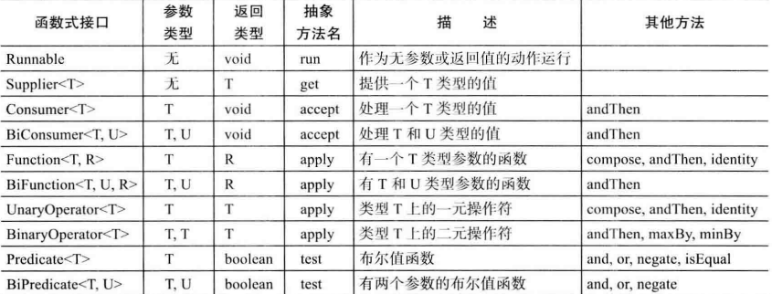

* 在上方例子中,调用函数接口的run()方法就会,执行lambda代码,这个方法无参无返回值,如果希望返回或者接受值,使用其他函数接口
* **合并函数**,使用这些函数等同于谓词and、or和negate例如,`Predicate.isEqual(a).or(Predicate.isEqual(b))`就等同于`x -> a.equals(x) || b.equals(x)`
* 特殊化接口,有时会更高效: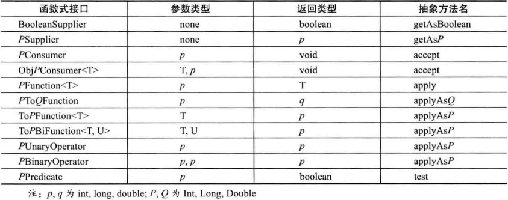

>如果设计你自己的接口,其中只有一个抽象方法,可以用`@FunctionalInterface`注解来标记这个接口。这样做有两个优点。如果你无意中增加了另一个非抽象方法,编译器会产生一个错误消息。另外javadoc页里会指出你的接口是一个函数式接口。
>并非必须使用这个注释,任何只有一个抽象方法的都是函数接口,不过使用是个好主意

* **内部类**是定义在类中的类,这个类可以对同包内的其他类隐藏,并且可以访问定义类的这个类的作用域内的数据,包括原本的私有数据,与C++的嵌套类类似,但更丰富更有用,虽然有些方面已经被lambda表达式代替(回调数据),但依旧很有用
* **使用内部类访问对象状态**,内部类总有一个隐式访问`外部类名.this`指向外部类,可以使用这个访问外部类方法和字段(包括private部分)
* **内部类的访问属性**,内部类可以为private(只有外部构造的类可以构造该类对象),外部类和内部类都可以为public和无修饰,**内部类的静态字段**只能为final,而且直接初始化,==内部类不能有静态方法==
* **内部类的安全性**:当java1.1版本增加了内部类,这很重要,但是违背了java比C++简单的设计理念,这是否没必要,使用javap工具,会发现编译器会将内部类与外部类的代码在编译时使用$隔开,而虚拟机一无所知,它会在编译时自动转换,转换成名字古怪的常规类而且如果需要访问外部类的私有字段,又不愿在外部类定义,是做不到用其他类访问的。
  * 这样做的确存在安全问题,任何人都可以通过调用这个转化的常规类的方法访问外部类,熟悉java文件结构的黑客可以使用16进制编辑器创建一个类文件,利用虚拟机指令调用那个方法,并且将攻击代码放入外部类同一个包里,但这样做需要技巧和决心,普通程序员不可能在无意中做到,必须刻意修改

---

* **局部类**:如果一个内部类只出现一次,可以在方法中定义这个局部类,这时不能使用访问权限修饰符修饰这个类,它的声明被限制在这个代码块内,如果使用这种声明方法,它还可以访问方法中的事实最终局部变量
  * 这个类甚至可以不设计名字,使用匿名的设计,如果你只需要创建一个该类型的对象,就可以使用这种方法
  * 匿名定义:`var 类对象名 = new 超类类名或接口名(构造参数){ 函数代码块部分和其他类定义 }`,它会继承超类或接口,这是普通内部类所不具有的
  * 在匿名类中不能定义构造器,如果需要初始化,可以使用初始化块,实际上,构造参数(括号中的内容)会传递给超类的构造器

* **双括号初始化**:使用匿名内部类一样的方法进行初始化,在后方使用`{{初始化块部分}}`,进行初始化,这个技巧很少使用

* 匿名子类与外部类的派生类的不同:在前面,定义equals方法时,会先判断两个类是否属于同一个类(使用getClass方法),但是使用`if(getClass() != other.getClass())return false;`对匿名子类判断会失败
* 在静态方法中使用getClass方法也会失败,因为静态方法没有this,应该创建一个Object类的匿名子类对象使用getClass方法`new Object(){}.getClass().getEnclosingClass();`(再对返回的class类处理得到外围类)
* **静态内部类**,有时候只是为了把一个类隐藏在另一个类内部,而不需要对外部类进行处理,就可以使用static声明,使用后不会生成外部类的this引用,并且可以有静态方法和字段,这个类的对象必须在外部类的静态方法中返回生成,例如:可以使用静态类完成同时计算数组的最大值最小值

>在接口中声明的内部类自动是static和public

```java{.line-numbers}
class ArrayAlg{
  public static class pair{
    private double first;
    private double second;
    public pair(double f,double s){
      first = f;
      second = s;
    }
    public double getFirst(){ return first; }
    public double getSecond(){ return second; }
  }

  public static pair minmax(double[] values){
    double min = values[0],max = values[0];
    for(double value:values){
      if(min > value){
        min = value;
      }
      if(max < value){
        max = value;
      }
    }
    return new pair(min,max);
  }
}
public class StaticInnerClassTest{
  public static void main(String arg[]){
    var values = new double[20];
    for(int i = 0; i < values.length;i++){
      values[i] = 100 * Math.random();
    }
    ArrayAlg.pair p = ArrayAlg.minmax(values);
    System.out.println("min = " + p.getFirst());
    System.out.println("max = " + p.getSecond());
  }
}
```

### 服务加载器

* 有时开发采用服务架构的应用,有些平台对这种方法提供支持,比如[OSGi](http://osgi.org),可以用于开发环境、应用服务器和其他复杂的应用。在jdk提供了一个加载服务的简单机制,由java平台模块提供支持
* 实现方法:
  * 定义一个接口或超类,写入包含服务的各个实例应该要提供的方法,例如可以定义一个Cipher接口,写入需要的方法
  * 用多个类扩展(继承)它,这些类可以放在不同的包里,但需要定义无参构造器
  * 初始化一个服务加载器,`ServiceLoader<Cipher> cipherLoader = ServiceLoader.load(Cipher.class)`,这个行为只会进行一次,ServiceLoader可以很容易地加载符合公共接口的服务
  * 定义方法,在服务加载器(可迭代对象,通过for-each遍历处理完成,也可通过流完成)中寻找可以完成服务的对象

### 代理

* 代理可以在运行时创建一组给定接口的新类,这很少见,但有时重要
* 想要创建一个代理对象,需要使用Proxy类的newProxyInstance方法,这个方法有三个参数
  * 一个类加载器
  * 一个class数组,对应需要实现的接口
  * 一个调用处理器(一个实现了InvocationHandler接口的对象,这个接口只有一个方法:`Object invoke(Object proxy,Method method,Object[] args)`,这个方法会传递一个Method对象和调用的参数)
* 代理用于处理什么问题
  * 将方法调用路由到远程服务器
  * 运行程序中将用户界面事件与动作关联(例如:在一些类执行时给予提示)
  * 为了调试,追踪方法调用
* [代理的使用](https://blog.csdn.net/hchhan/article/details/81571564),普通的代理,直接建立一个类,这个类中有另一个类的对象,如果需要就创建,可以增加其他方法,这就是最简单的代理(静态),每次出现新的需求,需要写新方法进行处理,下面是严格遵循接口的动态代理,这种代理,无论要代理对象如何变化,只要是针对该类的所有方法,都是统一处理的

1. 创建一个实现`InvocationHandler`接口的类,其中有需要代理的类的实例,初始化时需要代理的实例会赋值给它,这个类被称为==调用处理器==,在代理类执行操作时,会自动调用`invoke`方法。
2. 重写该类的`invoke`方法,这个方法重写的关键在于在执行时,在中间执行传入`method.invoke`方法,并将其`invoke`方法返回值返回,下面写的是查看需要代理对象的方法运行时间的==调用处理器==
3. 这时,如果需要代理的类为`ICoder`,它需要在每次操作时,查看前后时间,定义好该类
4. 在程序中,创建该类对象,再定义`InvocationHandler`对象指向==调用处理器==
5. 获得要代理对象的类加载器ClassLoader的对象(负责加载Java类到Java虚拟机中)
6. 通过类加载器得到一个**代理类**,通过Proxy.newProxyInstance(类加载器,实现了的接口,==调用处理器==)方法定义(绑定之前初始化的调用接口处理器,初始化为被代理的实例)
7. 使用代理类执行方法,就会收到代理响应

网上总结的: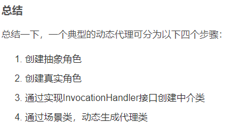,下方是网上的例子

```java{.line-numbers}
class CoderDynamicProxy implements InvocationHandler{

    //被代理的实例
  private ICoder coder;

  public CoderDynamicProxy(ICoder _coder){
      this.coder = _coder;
  }

  //调用被代理的方法
  //当我们调用代理类对象的方法时，这个“调用”会转送到中介类的invoke方法中
  //参数method标识了我们具体调用的是代理类的哪个方法，args为这个方法的参数
  @Override
  public Object invoke(Object proxy, Method method, Object[] args) throws Throwable {
    System.out.println(System.currentTimeMillis());
    Object result = method.invoke(coder, args);
    System.out.println(System.currentTimeMillis());
    return result;
  }
}

public class DynamicClient {
 
  public static void main(String args[]){
    //要代理的真实对象
    ICoder coder = new JavaCoder("Zhang");
    //创建中介类实例
    InvocationHandler  handler = new CoderDynamicProxy(coder);
    //获取类加载器
    ClassLoader cl = coder.getClass().getClassLoader();
    //动态产生一个代理类
    ICoder proxy = (ICoder) Proxy.newProxyInstance(cl, coder.getClass().getInterfaces(), handler);
    //通过代理类，执行方法,在执行前后出现时间显示
    proxy.do("Modify user management");
  }
}
```

### 反射、lambda与代理

* 反射:通过使用`java.lang.reflect`包中的类,和可获取到的class对象,对程序进行处理响应,使程序能判断自身类,==是对类的属性进行判断==
* lambda表达式:通过定义需要的函数接口的lambda对象,这个对象可由已有函数引用初始化,也可自定义函数代码块,达到将类函数代码块传递的目的,执行函数接口的函数就会执行代码块,==是传递代码块==
* 代理:通过使用反射的Method类和代理的InvocationHandler接口、Proxy类,通过一个实例,产生一个代理类,使用这个代理类的每一个方法都会执行相同的预订操作,==是在操作类时给出提示或状态显示==

## 异常处理

### 程序需要考虑的错误类型

* 用户输入错误
* 设备错误,一些设备可能不存在或出错
* 物理限制,存储空间可能不够了
* 代码错误

### java异常分类

* java中异常都是由`Throwable`继承而来,但是在下一层分解为`Error`和`Exception`,由`Error`和`RuntimeException`派生而来的称为非检查型错误,否则称为检查型错误
  * **Error**是系统内部错误和资源耗尽错误,应用程序不应该抛出该类型错误
  * **Exception**分解为IO类和Runtime错误,编程错误的异常属于Runtime,文件流的错误属于IO,==如果出现Runtime错误一定是你自己的问题==

### 异常抛出

* 使用`throw new 异常名()`抛出对应类型的异常,`new 异常名()`可以生成对应的异常类
* 函数抛出,如果整个函数有可能抛出异常,就可以使用`函数名(参数) throw 异常名{ 函数内容}`声明这个方法可能发生异常

### 自定义异常类

* 可以从已有的异常类派生出新的异常类,异常初始化时,可以引入一个字符串,描述该异常的详细信息,在`Throwable`类开始就可以使用`toString`方法或`getMessage`方法输出异常详细信息
* 在新定义异常时,需要构造无参和一个字符串参数的初始化器,字符串参数会传递给超类构造器`super()`

### 异常捕获

* 如果想要处理一个异常,而不是终止程序,就可以使用`try{ code }catch(ExceptionType e){ handler for this type }`处理异常
* 如果是一个覆盖超类的方法,而超类没有抛出异常,你就必须捕获每一个检查型异常,不允许在子类throw一个未在超类列出的异常
* 可以在一个try后面使用多个catch块捕获多个异常,对每个异常做不同处理,**甚至是抛出**
* **finally**子句,无论如何,在结束try-catch块内容时,都会执行的代码内容,一般用于关闭通道或打开的资源,如果在返回时,执行finally语句,其中有另一个返回,那么之前的返回值会被覆盖,如果在返回时出现异常,在finally子句里面还有一个返回甚至会吞掉这个异常,finally子句要体现在清理资源,不要把改变控制流的语句放在里面(return,break,throw等)
* **try-with-resource语句**:最简形式如下,当try块退出时,会自动调用资源类的close方法(如果资源实现了AutoClosable接口,里面只有一个会抛出异常的close方法)

```java{.line-numbers}
try(Resource res = ...){
  work with res
}

// eg:
try(var in = new Scanner(
  new FileInputStream("/usr/share/dict/words"),StandardCharsets.utf_8))
{
  while(in.hasNext()){
    System.out.println(in.next());
  }
}
```

* 在java9以后,在try()中可以使用之前定义好了的事实最终变量
* 如果try中出现异常,使用close方法也出现异常,在双try-catch块中,这可能带来问题,而使用try-with-resource块,之前try块的异常会抛出而close方法的异常会被抑制,这些异常将会自动捕获,并由addSuppressed方法增加到原来的异常,如果你对try-with-resource的所有异常感兴趣,可以调用getSuppressed方法抛出被抑制的异常
* 只有是使用资源,尽量使用这种方法关闭资源

### 分析程序的栈堆轨迹

* **栈堆轨迹**是程序执行过程中,某一时间点上所有挂起方法的调用的一个列表,当java因为未捕获一个异常而终止时,就会显示栈堆轨迹
* 调用Trowable类的非静态printStackTrace方法可以访问栈堆轨迹的文本描述信息

```java{.line-numbers}
var t = new Trowable();
var out = new StringWriter();
t.printStackTrace(new PrintWriter(out));
String description = out.toString();
```

* 更灵活的方法是使用StacWalker类，它会生成一个Stackwalker.StackFrame实例流,利用foreach函数传递一个流,进行调用,使用Stackwalker.StackFrame类可以得到执行代码的文件名和行号,使用toString会得到一个格式化字符串,包含这些信息

>在java9之前,Throwable.getStackTrace方法会生成一个StackTraceElement[]数组,包含整个堆栈的信息(与Stackwalker.StackFrame实例流类似的信息),它效率不高,且无法访问类对象,只能访问挂起方法的类名

### 异常的使用技巧

1. 异常处理不能代替测试,异常捕获的时间花费大大超过简单的判断花费的时间
2. 不要过分细化异常,尽量合并相邻的有直接关系的try块,减少代码量,使代码清晰
3. 充分利用异常的层次结构,不要只是抛出RuntimeException异常或只捕获Throwable异常;尽量不要因为逻辑错误,抛出检查型异常,不然可能经常要捕获在已知这种情况下不可能发生的异常;可以适当将异常转换成更合适的异常
4. 不要压制异常,如果异常很重要应该进行处理
5. 在检查错误时,苛刻比放任更好,如果出现异常情况,最好抛出,而不是放任,比如:弹栈操作pop,如果栈为空,是应该返回null还是抛出异常,最好在出错的地方抛出一个EmptyStrackException异常,好过之后访问时,出现NullPointerExecption异常
6. 不要羞愧于传递异常,这样可以把异常传递给更高层的方法,通知用户发生了错误,或直接放弃指令

> 5号和6号可归纳为早抛出,晚捕获

### 断言

* 在java中使用异常检查会让程序慢很多,而且测试完成后会一直保留,断言允许在测试中插入一些检查,并且在生成最终代码时会自动删除这些检查
* **定义一个断言**:`assert condition: expression;`,例如:`assert x >= 0;`或`assert x >= 0: x`,如果`x>=0`不成立,expression部分就会产生一个消息字符串,传入AssertionError的构造器中,这个表达式一般为字符串或出错的对象值,一般情况下也不会使用,因为如果使用,就会鼓励程序员在之后恢复程序运行,不符合断言设计初衷
* **启用禁用全部断言**:在默认情况下,断言是禁用的,如果需要,运行时可使用`-enableassertions`或`-ea`启用断言,例如:`java -enableassertions:包及子包(或类及子类) class文件`,当然也可以使用`-disableassertions`或`-da`,禁用断言

>对于系统类这种不使用类加载器加载的类,需使用`-enablestemassertions/-esa`命令打开断言,对于使用类加载器加载的类,也可以使用类加载器编程控制,在`java.lang.Classloader`库中有相应的方法

* **使用断言完成参数检查**:断言是失败的不可恢复的错误,仅在测试时使用,不应该使用断言通知恢复性错误
  * 对于方法参数而言,可以使用断言检查方法是否在合适的范围内,这种断言约定被称为前置条件(precontion),承诺在任何情况下都有正确的行为
  * 如果调用的参数在错误的范围,它的行为是难以预料的,如果测试调用时没有满足前置条件,断言会失败

* 使用断言来提供假设文档,对于if语句,在不执行if转而执行else语句的话,可以使用注释提供假设文档,例如:

```java{.line-numbers}
if(i % 3 == 0){
  ...
}else if(i % 3 == 1){
  ...
}else{ //i % 3 == 2
  //对于注释部分可以使用断言更好
  assert i % 3 == 2;
  ...
}
//因为java中,%号的定义为 (y / x) * x + y % x = y,这对于负数而言,会得到负的余数
//由于一些未考虑到的情况,if语句最后的else可能不止你所考虑的情况,因此使用断言判断更好
```

### 日志

* 每个程序员都熟悉在程序中间插入输出语句检查程序运行的行为,一旦发现,就要删除,如果又出现,又要插入
* 使用日志API可以很容易地开启取消不同等级的记录,并且可以将它存入xml文件中,也可以使用不同的记录配置
* **基本日志**:使用全局日志记录器(global logger)并调用info方法:`logger.getGlobal().info("操作名")`就可以记录该操作,在控制台显示出来,在前面使用`logger.getGlobal().setLevel(Level.OFF)`可以关闭所有日志,可以在main函数外面

---

* **高级日志**:你肯定不希望所有的消息记录到同一个日志记录器中,可以使用`public static final Logger 对象名 = Logger.getLogger("字符串,一般为包名")`,定义为static是因为java的垃圾回收机制,如果没有使用该变量,最终会被回收
* 日志有七个级别,从高到低为`SEVERE、WARNING、INFO、CONFIG、FINE、FINER、FINEST`,在默认情况下,只记录前三个级别,可以使用setLevel(Level.FINE)函数记录不同的级别(比它高的),也可以使用Level.ALL开启所有级别记录,Level.OFF关闭所有
* 当然,对于某一条可以使用log(Level.FINE,message)限定等级,它会显示调用堆栈得出的包含日志调用的类名和方法名
* 如果是**虚拟机优化了执行过程**的话,就无法得到准确的信息,就应该使用`logp(Level l,String clssName,String methodName,String message)`方法,在日志类里还有追踪流的方法`enter`和`exiting`
* 可以使用其中的`throwing(string className,string methodName,Throwable t)`或`log`方法抛出异常
* **修改日志管理器**:在java 9版本以后,日志管理器的配置文件位于`conf/logging.properties`,可以修改文件或使用`java -Djava.util.logging.config.file = configFile MainClass`修改使用的配置文件
* 在配置文件中,.level = INF0确定了默认日志级别,可以使用之前定义高级日志记录器对象使用的字符串.level = 级别修改记录器级别,记录器只负责生成记录,发送消息是处理器的任务,如果希望显示FINE级别及以下的消息,就需要`java.util.logging.ConsoleHander.level = FINE`,日志属性文件也可以由LogManager类处理

---

* **日志消息的本地化**:如果你制作的是全球化的应用程序,你可能希望日志文件全球用户都可以阅读,就应该在程序中使用多种语言的字符串资源包,将其命名为`logmessage_en.properties`文件中,其中en是编码,将他们与类文件放在一起,以便ResourceBundle类自动找到他们,这些文件是一个个定义的字符串(类似C++的define,会在日志记录器使用时,将键切换成对应的值,键值中间使用=号替换),包含占位符,便于之后传递值,在初始化getLogger时指定日志记录器使用的资源包
* **创建**时，创建一些的资源包,存储本地的特定信息,然后为资源包添加映射,映射与语言相关,一般存储在命名为`logmessages_en.properties`文件中,en是英文编码,将不同语言的映射放在一个文件夹下,ResourceBundle类能够自动找到他们,这些文件都是纯文本文件,在使用`Logger.getLogger()`函数时,除了LoggerName外,还可以传入一个资源包字符串(例如:`com.myCompany.logmessages`),然后为资源包指定键,一般使用`键名 = 值`的形式
* **使用**时,创建一个`Logger logger = Logger.getLogger("日志名称","资源包名")`,使用它的`log`或`info`这样的发送日志函数,传入键值,如果希望传值入键(键对应的值使用了占位符`{0}`)而且需要传的值较多,应该使用`logb`函数,它的最后一个参数是Object的可变参数列表,如果需要切换日志消息资源包,就可以使用`Locale.setDefault(Locale.国家名)`方法更改使用的资源包
* 附本地化实例图:
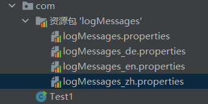 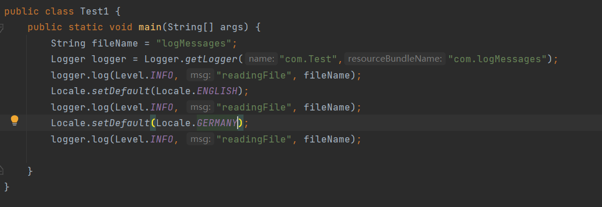 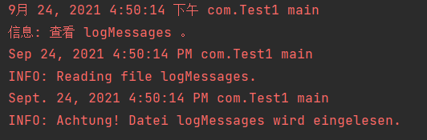 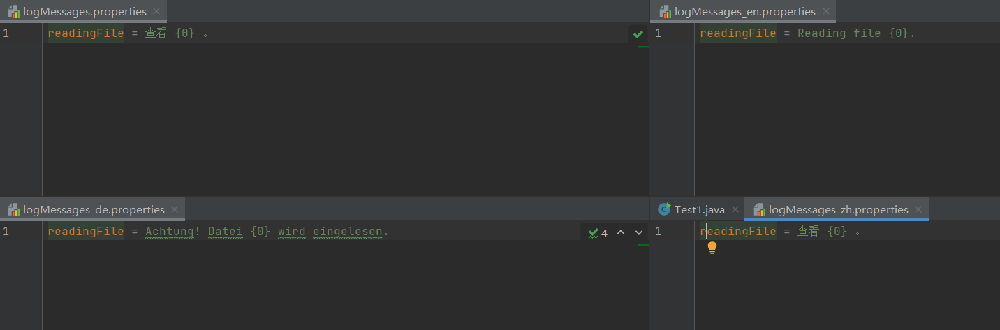

* **处理器**:在默认情况下,日志记录器会将记录发送到ConsoleHandler中,并由他输出到System.err流中,处理器也有日志级别,只有同时高于两者级别的日志才会被记录,这个级别可以由日志管理器配置文件设置:`java.util.logging.ConsoleHandler.level = INFO`
* 当然和日志记录器一样,绕过配置文件可以安装自己的处理器,使用自定义的`ConsoleHandler`对象`.setLevel(Level.FINE)`方法可以设置处理器的级别,再使用日志记录器的`addHandler()`方法,使用新的处理器
* 在默认的情况下,日志处理器和它的父处理器会同时发挥作用,所有新处理器的祖先都是名为""的处理器,如果不希望重要的消息出现两遍,就应该讲处理器的`useParentHandler`属性设置为`false`
* 如果希望将日志记录发送到其他地方,就要添加其他的处理器,日志API中提供了两个有用的处理器,`FileHandler`和`SocketHandler`,一个可以把日志添加到XMl格式文件中,一个可以把日志发送到指定的主机或端口,日志的存储可以开启循环功能,日志文件一般以javan.log文件命名(n = 0,1,2,3...),这些文件会被发送到用户的主目录下(没有主目录存储在默认位置`c:/Window`)
* 日志文件自命名,可使用如下表达式
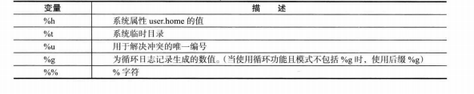
* **文件处理器的参数**:
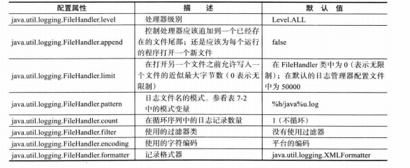
* **日志处理器的扩展**:如果希望在其它地方显示日志,就可以使用`Handler`类或`StreamHandler`类自定义处理器,使用流的方法输出到显示区域内,重写`publish`、`flush`、`close`方法

* **过滤器**：默认情况下，会根据日志级别进行过滤，每个日志记录器和处理器都有一个可选的过滤器来完成附加的过滤，这个过滤器要实现`Filter`接口的`isLoggable(LogRecord)`方法，这个方法应该对你想要保留的日志返回`true`,LogRecord对象有getMessage()方法可以返回日志信息字符串,用于分析日志信息,比如可以分析是否以特定单词开头
* **格式化器**:如果你不希望生成XML或文本格式的文件,可以自定义格式,扩展Fomatter类并覆盖`format(LogRecord)`方法,这个方法将消息部分格式化,替换参数应用于本地化处理,再覆盖`getHead(Handler)`方法和`getTail(Handler)`方法,用于生成格式化头和尾,最后使用`setFormatter()`方法设置
* **日志技巧**:
  * 对于有大量活动的类,可以使用`private static final Logger`,并用包名命名
  * 默认的配置会把INFO及以上的消息发送,用户可以覆盖这个配置,但改变过程有点复杂,因此最好在你的应用中安装一个更合适的配置
  * INFO、WARNING和SEVERE的消息都会显示到控制台上,最好只将有意义的消息设置成这些级别,一般消息设置为FINE级别是个好选择

### 调试技巧

* 如果编写了一个程序,认为恰当得捕获了所有异常,但是运行时程序异常,就应该使用调试,如果没有一个强大的编译器,就可以尝试以下技巧
  1. 使用打印或记录的方法把任意变量的值记录下来
  2. 在每个class文件中使用main函数进行测试,使用这样的单元测试桩独立测试使用的类
  3. 使用JUnit测试套件,它可以容易地组织测试用例,可以使用测试用例进行运行测试
  4. 日志代理,使用匿名子类(生成一个类的对象,在对象{}中创建匿名子类,定义方法,在方法中调用该类(super)的方法,并记录返回值等信息到日志中)插入日志记录堆栈轨迹
  5. 使用Trowable类的printStackTrace方法打印栈堆轨迹,然后重新抛出异常,以便找到相应的处理器,当然也可以使用dumpStack方法获得栈堆轨迹
  6. 在System.err中获取栈堆轨迹,并把它使用PrintWrite(StringWriter)对象记录下来
  7. 使用命令将程序错误记录到文件中
  8. 将栈堆轨迹使用Thread.setDefaultUncaughtExceptionHandler()方法记录到文件中
  9. 使用java -verbose观察类的加载过程
  10. 使用javac -Xlint告诉编译器寻找常见问题(比如switch缺少break语句),使用javac --help - X命令查看所有警告列表
  11. java虚拟机增加了对应用程序的监控和管理功能,可以使用jdk中的jconsole的图形工具显示有关虚拟机性能的统计结果,从正在运行的java程序列表中选择需要调试的程序
  12. java任务控制器(java Misson Control)是一个专业级性能分析和诊断工具,能关联到正在运行的虚拟机,分析java飞行记录器(java Flight Recorder)的输出,从正在运行的java应用程序收集诊断和性能分析数据

## 泛型

### 泛型基础

* **使用泛型设计的原因**:泛型设计意味着可以对不同类型的对象重用,不用重复编写收集不同对象完成相同操作的类
* **类型参数**:在java增加泛型之前,泛型的设计是由继承完成的,在这之前就有ArrayList类,它的数据存储由Object数组完成,但这样有一个问题,当获取一个非Object值,必须使用强制转换,而且没有任何检查,数组中可以存入任何值,而现在java加入了类型参数<>,在使用时不用进行强制转换
  * 编译器可以利用这个类型参数,在使用get这样的函数时,编译器知道返回值是哪个类型,不用进行强制转换,而且可以检查,防止插入错误的类型对象
* **泛型程序设计**:虽然像ArrayList这样的类型会被普遍采用,但是泛型的设计没有那么容易,泛型的设计要考虑泛型所有可能的用法,这个任务会有多难呢,比如:ArrayList中有一个addAll方法,添加另一个泛型的元素,如何设计这个方法使从ArrayList\<Manger>转到ArrayList\<Employee>中,但使反过来不行,这需要使用通配符类型(wildcard type),利用它可以完成编写,大部分只需知道如何使用就行,JDK的开发人员已经编写了大量的泛型类,所有的集合类都已经完成了泛型设计

### 定义简单泛型

* 泛型类就是有一个或多个类型变量的类这样的类引入了类型变量,用<>括了起来,放在类名后面,例如:定义泛型Pair类`public class Pair<T,U>{ ... }`,在类中可以指定这些类型的变量

>常见的做法是类型变量使用大写字母,在java库中,使用E代表集合的元素类型,K和V分别代表键和值,T(必要时使用U和S)表示任意类型

* 在使用时可以用对应的类型变量来实例化泛型,例如:`Pair<String>`

>从表面来看,泛型似乎和C++的模板类类似,唯一不同的是java没有template关键字,但是他们有明显的不同,在C++中会对所有类型实例化产生不同的类型,在这被称为代码膨胀,java中不会这样,而且C++不能对类型变量做出限制,如果使用时出现问题会得到含糊不清的错误消息

* **定义泛型方法**:可以在返回值前使用<>包括泛型类型,例如:`public static <T> T getMiddle(T... a){ ... }`这个声明应该在修饰符后面,返回值前面,泛型方法可以由任何的类定义,当调用时,应该使用类名.\<String>getMiddle("John","Q","Public");
  * 大多数情况下,调用时\<String>可以省略,因为编译器能有足够的信息判断出这个类型,在括号中使用的就是字符串可变参数列表,它能够识别出这个类型
  * 几乎所有情况,这个识别都没问题,只有极少数情况,识别到多个或0个匹配的识别,例如:`getMiddle(3.14,1729,0)`,这个有两种合法的解释,3.14是Double对象,1729和0都是Integer对象,编译器会寻找他们共同的超类型(包括超类和接口),他们有共同超类Number和共同接口Comparable,在这种情况下,编译器会给出晦涩的错误消息(不同编译器可能不同),这种情况应该将所有的参数写为double类型

### 类型变量的限定

* 有的时候,类和方法需要对某些类型变量加以约束,**限定**这个变量必需继承了某个类或扩展了某个接口,不然使用这个类或方法会产生一个编译错误,例如:`<T extends Employee & Comparable>`多个类或接口之间使用&分隔

### 泛型代码与虚拟机

* **类型擦除**:无论何时定义一个泛型类型,都会提供一个原始类型,这个原始类型就是去掉类型参数的泛型类型名,即将类型变量替换为第一个限定类型(没有则替换为Object),例如:`<T extends Employee & Comparable>`会替换为Employee,在使用后方其他接口时,自动插入强制类型转换,建议在书写限定类型时,将标签接口放在后面,减少强制转换次数,提高效率
* **转换泛型表达式**:在对或使用一个泛型对象赋值时,如果发生了类型擦除,编译器会插入强制类型转换,这样的话,在使用带泛型的表达式时,编译器会执行表达式右侧,得到返回值,然后将返回值进行强制类型转换,==如果不赋值(修改其他变量的值),强制类型转换即便写了也不会发生==,但返回时,编译器却认为写了的强制转换肯定发生了,如下代码能通过运行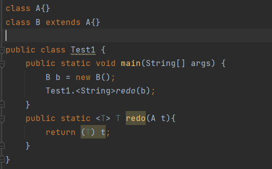
* **转换泛型方法**:如果使用泛型方法,在类型擦除后,也会成为原始类型的函数,其中的泛型会被替换,但是会带来问题:
  * 一个从该方法定义类继承的使用Object擦除的方法也会出现,这样就会出现两个不同的方法,但是他们不应该是不同的函数,这是因为希望方法调用具有多态性,会调用最合适的方法,由于不一定调用这个方法时,需要处理的类型是擦除后的类型,编译器会生成一个**桥方法**,例:`public void setSecond(Object second){ setSecond((LocalDate) second);}`我们不能这样编写同名同参的方法,桥方法在编译器中是由参数类型和返回值共同指定的(没有数据交换似乎不用写成泛型方法),JVM能够正确识别这种情况

>在之前使用方法覆盖超类方法时,桥方法其实出现过,子类方法可以使用比父类更严格的返回值类型,这就是因为有桥方法的存在,桥方法会调用那个重写的方法

* **虚拟机泛型事实**:
  * 虚拟机中没有泛型,只有普通的类和方法
  * 所有类型参数都会替换为它的限定类型
  * java会合成桥方法来保持多态
  * 为保证类型安全性,必要时会插入强制类型转换

### 遗留代码的调用

* 泛型的设计目标之一就是允许和遗留代码互操作,在刚出泛型时,一些类和方法进行了泛型更新,但是之后却从未更新,在那个java5的年代,没有使用泛型类型,所有的泛型都是来自原始类型,可能存在兼容性问题
  * 对原始类型使用确定泛型类型参数赋值,由于编译器无法确定这个泛型是否是执行正确的操作的泛型对象,编译器会发出一个警告,编译失败,如果实在需要使用遗留代码,可以使用`@SuppressWarnings("unchecked")`注解忽略下方定义的函数或操作警告
  * 对现有确定泛型使用原始类型泛型赋值,同样也会出现警告,在确认操作后也可以使用上方注解使之消失

### 泛型的限制和局限性

* 泛型不是万能的,由于类型擦除,在使用时会带来大量问题和限制

---

1. **不能使用基本类型实例化类型参数**:由于泛型的类型参数会擦除为Object类,所有的类型参数必须为继承于Object类
2. **运行时类型查询只适用于原始类型**:在进行类型检查(instanceof)时,只能判断它是否属于原始类型例如:`instanceof Pair<T>`而不是`instanceof Pair<String>`,否则会得到一个警告,这也使T不同的泛型对象类型查询的结果是一致的,而且也不存在确定T的泛型类的强制转换
3. **不能创建参数化类型数组**:由于数组会记住它的元素类型,在JVM中,泛型数组会被类型擦除成Object数组,但数组会记住元素类型,虽然赋值时擦除会导致这种检查无效,但是仍会导致一个类型错误(实例化的时候),java数组必须知道它持有的所有对象的具体类型，而泛型的这种运行时擦除机制违反了数组安全检查的原则

    >不允许是因为使用像普通数组一样使用`new 类型名[数组长度]`的方法会导致一个类型错误,声明泛型类型数组是合法的,只不过需要使用`(Pair<String>[]) new Pair<?>[10];`通配符类型,这个结果将是不安全的,可能存入非该类型的泛型变量,又或者可以通过创建一个例如`Pair[]`这样的非参数化类型的数组，然后将他强制类型转换为一个参数化类型数组,如果实在有需要,可以使用`ArrayList<Pair<String>>`更安全有效

4. **Varargs警告**:如果你希望使用泛型可变参数列表的话,JVM就不得不创建泛型数组了,在这种情况下,使用可变参数列表会得到一个警告,如果你确定要这么做,可以使用`@SuppressWarnings("unchecked")`或`SafeVarargs`注解该方法,对于任何只需读取数组元素的方法都可以使用`@SafeVarargs`注解(只能用于static、final或(java 9)private构造器和方法),其它方法可能被覆盖使这种注解没有意义,使用这种注解在对数组元素进行修改时,可能会出现危险,会在别处得到异常
5. **不能实例化类型变量**:不能在类似`new T()`的表达式中使用类型变量,因为类型擦除后会变成Object这样的限定类型,这肯定不是调用者期望的
    * 在Java8之前,传统的方法是使用反射,传入需要使用的类型的class值,使用它调用反射中的Constructor.newInstance()方法,例如创建`Pair<String>`变量的具体实现为:传入`String.class`(在定义处使用`Class<T> cl`泛型定义),然后使用`cl.getConstructor()`得到Constructor变量,调用`newInstance()`方法,即:`cl.getConstructor().newInstance();`
    * 在Java8之后,引入了lambda表达式,解决方法就变成了传入`String::new`这样的构造器表达式,然后使用函数接口(例如在这里可以使用`Supplier<T>`接口),完成对应的创建
6. **不能构造泛型数组**:这与第3点不同,泛型数组是`T[]`这样的数组,即对象数组,因为类型擦除,这会导致构造的数组变成擦除后的类型数组,然后会使用强制类型转换,但这转换这是一种假象,它依旧是擦除后的类型数组,但编译器无法察觉,如果仅仅作为私有字段,那么能成功,但如果是在方法中,则不行,在这个数组定义之后,需要使用其他对象引用或返回给其它对象时,会出现`ClassCastException`异常,但和实例化变量一样能够解决
    * 传统的办法,是利用反射,调用Array.newInstance()方法,它有两个参数,一个是该类的一个数组的类信息,另一个是新数组的长度,通过获取指定类来创建,就不会被擦除,例:`var result = (T[]) Array.newInstance(a.getClass().getComponentType(),2);`
    * 目前最好的方法是提供数组构造器表达式,然后使用`IntFuntion<T[]>`接口接收使用之后返回,例如:提供的是`String[]::new`,可以用于生成字符串数组
    * ArrayList类的toArray方法却不是这样实现的,他要生成`T[]`数组,但没有提供类型信息,因此不带参数的toArray方法返回的是`Object[]`,因此无参toArray生成的就是`Object[]`,如果需要得到对应类型的数组,应该使用带对应类型参数的数组,如果数组够大,它会使用它,不然会定义足够长度的数组
7. **不能抛出捕获泛型化实例**:不能用泛型类扩展异常类,异常处理中的catch的不能是类型变量,但泛型变量可以是异常类,即:`<T extends Throwable>`,在使用时,catch(Trowable)类异常即可
8. **取消检查型异常**:在java异常处理中,必须为检查型异常提供处理器,使用一个泛型方法,抛出Trowable异常,在捕获时,调用这个方法,就可以抛出检查型异常,应用场景就是对于从一些未声明抛出一些检查型异常的函数函数中抛出一些检查型异常,在调用的地方进行处理
    * 参考于[博客](https://blog.csdn.net/lfq88/article/details/107431640)
    * 老方法是抛出异常的详细信息,使用非静态`initCause()`方法,将一个未使用的`RuntimeException`异常的信息变成这个检查型异常的信息,抛出这个异常

    ```java{.line-numbers}
    RuntimeException t = ...;
    try{
    do work
    }catch (Throwable realCause) {
    t.initCause(realCause);
    throw t;
    }
    ```

    * 使用泛型的方法会更加简单,但要注意因为使用了RuntimeException,会有几个误区:
      * **其实最后抛出的是原类型异常**,强制转换并未发生(泛型的强制转换添加在赋值部分,如果值未被取出,就不会强制转换),编译器认为catch块中已经处理了该异常
      * 该静态方法会抛出非检查型异常，编译器不会报错，让它抛出,抛出的受查异常并没有用非受查异常的变量去接收，去取值，再次catch会找到它实际的类型，即非检查类型
      * **这并没有违反不能抛出泛型异常**,因为强制转换并没有发生,其实抛出的是确定异常

    ```java{.line-numbers}
    //消除产生的警告信息
    @SuppressWamings("unchecked")
    public static <T extends Throwable> void throwAs(Throwable e)throws T{
     throw (T) e;
    }
    //编译器就会认为 t 是一个非受查异常。
    Block.<RuntimeException>throwAs(t);
    ```

9. **泛型类的静态上下文中,类型变量无效**:在泛型类中定义静态泛型变量或者静态普通函数处理泛型看起来不错,但是行不通,在idea中会报无法获取`this`指针的错误,类型擦除后,无论声明什么类型,他们都共用一个static变量和方法,因此被禁止使用

    ```java{.line-numbers}
    public class Singleton<T>
    {
      private static T singletonInstance;//Error
      public static T getSingletonInstance(){ //Error
        if(singletonInstance == null){
          //construct new instance of T
        }
        return singletonInstance;
      }
    }
    ```

10. **类型擦除后的冲突**:在泛型类中定义与父类或接口继承来的方法名称相同,会产生冲突,比如:`equals(Object)`方法是从Object类中继承的,如果在泛型类`<T>`定义了`public boolean equals(T value)`方法,会带来冲突,因为类型擦除后,T变成了Object,这两个方法发生了命名冲突,需要将该方法重命名

  >这也就带来了另一个原则:一个类不能作为一个泛型类或泛型接口的不同参数化的子类,例如:`Employee implements Comparable<Employee>,Manager extends Employee implements Comparable<Manager>`是错误的,这样Manager同时implements了Comparable的不同参数化接口

### 泛型的继承规则

* 在使用泛型时,或许希望像java数组一样,利用多态性将子类存储在父类数组中,但这在泛型中不成立,因为无论类型变量T和S究竟有何关系,`Pair<T>`和`Pair<S>`都没有关系,他们也不建议存储在原始类型`Pair`中(没有类型检查,会有警告),这保证了泛型的安全,因为泛型没有像数组一样的特别保护(如果使用父类数组引用生成好的子类数组,依然不能往其中放父类的值)
* 泛型类可以扩展其他泛型类,在这一点上和普通类没有区别,例如:`ArrayList<Manager>`可以转换为`List<Manager>`,泛型的继承只与本身类有关和类型参数无关

### 通配符类型

* 由于严格的泛型类型使用起来并不愉快,设计者发明了巧妙的解决方案:通配符类型
* 在通配符类型中,允许类型参数发生变化,例如:`pair<? extends Employee>`表示了任何pair类型,只要它的类型参数是Employee的子类,只要能满足这个条件的,都能被它存储,如果你希望一个函数的参数是这样的,就可以使用通配符类型
* 使用通配符也可以引用满足这样条件的泛型,因为通配符类型,在使用通配符类型为参数的函数时,需要使用通配符类型赋值,通配符不是固定类型,在返回引用时可以使用满足通配符的类型接收
* 现在在通配符引用后能够了解哪些方法是安全的访问器方法或者不安全的通配符更改器方法,当通配符引用使用访问器方法时,没有问题,但是,使用更改器方法时,需要向其中传入一个通配符类型,就会产生不匹配,因为系统认为通配符和特定类型不是同一类型,你甚至不能用extends的类作为参数,因为通配符类型把函数改变了,例如:`T getA()`和`void setA(? extends ... aA)`变成了`? extends ... getA()`和`void setA(? extends ...)`,对于get方法，没问题，因为编译器知道可以把返回对象转换为一个正确的类型,但是对于set方法，编译器无法知道具体的类型(不知道类型是否正确)，所以会拒绝调用
* **通配符类型的超类限定**:<? super Manager>这个通配符限定了必须是Manager的超类类型
  * 用法:1️⃣超类型限定通常用于作为函数的参数类型,有的时候需要传入某类型的超类,例如:比较的接口传入一个可比的参数,`int CompareTo(? super T)`是目前`compareTo`方法的设计;2️⃣作为更细致的描述和限定,在定义寻找最小值的方法`<T extends Compareable<T>> T min(T[] t)`中,如果你希望使用的比较存在于较低继承的层面,可以使用`Comparable<? super T>`代替,获得更详细的描述和限定
* **无限定通配符**:Pair<?>这种没有限定的通配符,只能使用其中的访问器,返回值只能赋给Object对象,修改器无法使用(除非你愿意设置null),必须传入通配符变量,但是通配符变量不为任何确定变量,在不需要关注其中数据和其类型的情况下就可以使用它,可读性更好,不需要声明为泛型函数
* **通配符的捕获**:?不是一种类型,在需要使用通配符变量类型定义新变量的时候,可以定义一个泛型函数`<T> T setHelper(Pair<T>)`定义捕获通配符?并进行处理,虽然有的时候可以不使用泛型方法实现,但通配符捕获机制不可避免
  * 捕获的限制是必须为非常限定,你不能捕获无限定通配符,它可能有不同类型

### 反射和泛型

* 反射能在运行时获取对象信息,但泛型对象发生了类型擦除,很多信息无法获取
* 下面的是能够获得的泛型类的信息
* **泛型Class类**:现在的Class类已经被实现为了泛型类,例如:String.class是`Class<String>`的对象(事实上是唯一的)
  * `Class<T>`类有一些重要的方法如下:

```java{.line-numbers}
//返回一个无参构造器构造的T的实例
T newInstance()
//如果obj可以转换成T则返回obj,否则抛出BadCastException异常
T cast(Object obj)
//如果T属于枚举类型,返回所有值组成的数组,否则返回null
T[] getEnumConstants()
//返回类的超类,如果这个对象不是类对象或为Object对象,返回null
Class<? super T> getSuperclass()
//获得公共构造器或有给定参数的构造器,parameterTypes填入满足希望赋值的变量形式的变量
//区别是getConstructors只返回公共构造函数
//而getDeclaredConstructors返回所有的构造函数,
//可通过setAccessible(True)设置是否返回非公共的构造函数
Constructor<T> getConstructor(Class... parameterTypes)
Constructor<T> getDeclaredConstructor(Class... parameterTypes)
//构造器Constructor拥有newInstance(Object...)方法,可以使用获得的构造器构造实例
```

* **使用Class\<T>参数进行匹配**:在使用时传入类型变量`class<T>`,然后可以使用这个类型变量返回生成的对应变量

```java{.line-numbers}
//示例
public static <T> Pair<T> makePair(Class <T> c)throws 
InstantiationException,IllegalAccessException{
  //如果使用makePair(Emmployee.class),类型参数T和Employee匹配
  //编译器可以推断出方法会返回Pair<Employe>对象
  return new Pair<>(c.newInstance(),c.newInstance());
}

```

* **虚拟机中的泛型信息**:java泛型的特性是类型擦除,但擦除后的类仍然保留了一些记忆,例如:原始类Pair知道它来自于`Pair<T>`,只不过不知道T是什么类型,类似的,对于限定的类型`public static <T extends Comparable<? super T>> T min(T[] a)`,反射能够确定:
  * 这个泛型方法有类型参数T -> 通过class类
  * 这个类型有子限定,其本身也是个泛型 -> 通过TypeVariable接口,描述类型变量,如:`T extends Comparable<? super T>`
  * 这个限定类型有一个通配符 -> WildcardType接口,描述通配符,如:`? super T`
  * 通配符的参数为超类型限定 -> ParameterizedType接口,描述泛型类或接口类型,如:`Comparable<? super T>`
  * 这个泛型方法有泛型数组参数 -> GenericArrayType接口,描述泛型数组,如:`T[]`
* 以上的类和接口都拓展了Type类型,它们有很多类似的方法从Type类继承而来,例如都有getName()方法
* 具体使用[见此文](https://blog.csdn.net/showdy/article/details/53463570)
* **类型字面量**:你可能会希望由值的类型决定程序行为,例如:希望用户指定一种方法来存储某个特定类的对象,但对泛型类,擦除会带来问题,泛型的不同类型声明擦除后都为同一个原始类型,如果对泛型类,需要捕获对应泛型类型的Type实例,然后构造一个匿名子类,捕获泛型的超类型(CDI和Guice等注入框架,就使用类型字面量来控制泛型类型的注入)

```java{.line-numbers}
//例子:
ArrayList<Integer> arrayList = new ArrayList<Integer>() {};
Type type = arrayList.getClass().getGenericSuperclass();
ParameterizedType parameterizedType = (ParameterizedType) type;
for (Type t : parameterizedType.getActualTypeArguments()) {
  System.out.println(t.getTypeName()); // java.lang.Integer
}

```

* 使用匿名内部类
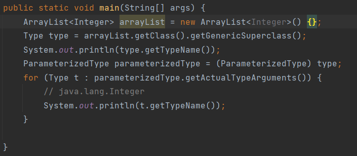
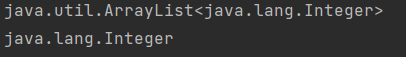
* 未使用匿名内部类
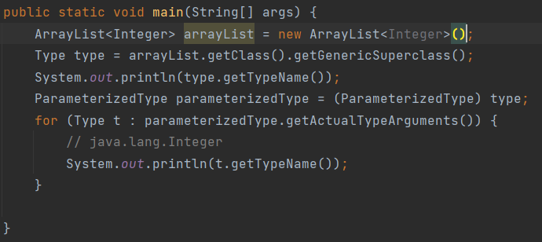
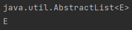

* 详细补充内容可以看[Java泛型](https://juejin.cn/post/6844903865435832333)

* 附反射和泛型交互的部分主要方法:
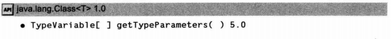
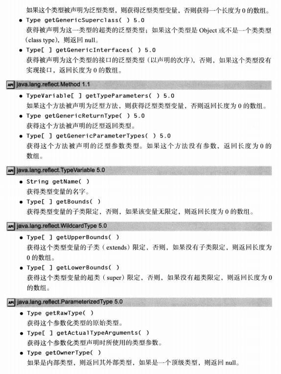
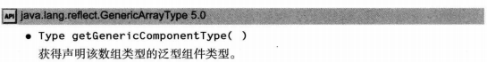

## 集合

### 集合框架

* 在Java最初版本只提供了少部分数据结构接口,随着Java1.2版本问世,设计人员开始考虑推出功能完善的数据结构,他们希望类库小而易于学习,不希望像C++的STL一样复杂,又希望融入泛型算法
* 与数据结构类库常见做法一样,java把接口和实现分离,在接口中并没有写明实现方法,一个个类拓展了接口,完成了不同的目标(例如:链式队列和循环队列),他们可以通过接口直接引用并使用,在Java中还设计了如AbstractQueue这样的类供设计者更方便地实现自己的对应数据结构

* **Collection接口**:集合最基本的接口是Collection接口,他有两个基本方法:`boolean add(E element)`向集合中添加元素,成功改变集合返回true和`Iterator<E> iterator()`返回实现了迭代器的对象,通过它可依次访问集合中的元素
* **Iterator接口**:迭代器中有四个方法:`E next()`反复调用可以逐个访问所有元素,如果没有下一个抛出NoSuchElementException异常,`boolean hasNext()`判断有没有下一个元素,`void remove()`删除上一个访问(使用`next()`)的元素,如果没有使用next()会抛出IllegalStateException异常,`default void forEachRemaining(Consumer<? super E> action)`如果不希望写foreach,可以使用这个传入一个需要执行的lambda表达式,它会对每个元素不断调用直到没有元素为止
  * 在使用next()时,应该进行判断,如果有下一个,则继续,实际上,foreach循环在编译器中被简单转换为这样的循环(例:`Iterator<String> iter = str.iterator(); while(iter.hasNext()){ String element = iter.next; //and do something with element}`),只要该对象扩展了Iterator接口就可以使用foreach循环,而Collection就扩展了,因此集合都可以使用foreach循环
  * **Java的迭代器处理方式**:C++是根据数组索引建模完成迭代器的,而java不是这样,查找和位置紧密结合,查找元素唯一的方法是通过next()方法,在执行时,迭代器会随next()调用向前移动,可以认为迭代器在两个元素之间,使用next()方法会使迭代器越过一个元素,并返回越过的元素,这和InputSteam.read读取数据流类似

>其实Iterator接口的next方法和hasNext方法和Enumeration接口的方法功能一致,本来设计者准备继续使用Enumeration接口实现,但它的方法名太长了,于是使用了新接口

* **泛型的实用方法**:由于上面介绍的都是泛型接口,意味着你可以编写能够处理任何集合类型的方法,例如:检测任意集合是否包含指定元素的方法,Java的设计者认为,如果这些方法很有用,应该提供给用户使用,这样使用者就不用自己定义了,contains就是这样的方法,Collection有很多这种样子的方法,如果希望创建自己的数据结构,可以使用AbstractCollection类,许多工具方法已经实现

```java{.line-numbers}
//Collection的有用的方法
//返回用于访问集合的迭代器
Iterator<E> iterator();
//返回存储元素的个数
int size();
//判断有没有元素
boolean isEmpty();
//是否包含一个元素,包含返回true
boolean contains(Object);
//包含集合所有元素返回true
boolean containsAll(Collection<E>);
//添加元素,成功改变集合返回true
boolean add(E);
//添加集合所有元素,集合改变返回true
boolean addAll(Collection<? extends E>);
//删除满足条件的元素,如果改变集合返回true
default boolean removeIf(Predicate<? super E>);
//删除所有元素(比新创建快)
void clear();
//删除不在给定集合中的元素,改变集合返回true
boolean retainAll(Collection<?> other);
//返回集合中的对象数组(Object类型存储)
Object[] toArray();
//返回这个集合中的对象数组(给定类型存储),如果给定数组够大,就用给定数组存储
<T> T[] toArray(T[]);
```

### 集合框架接口

* 集合接口继承图:
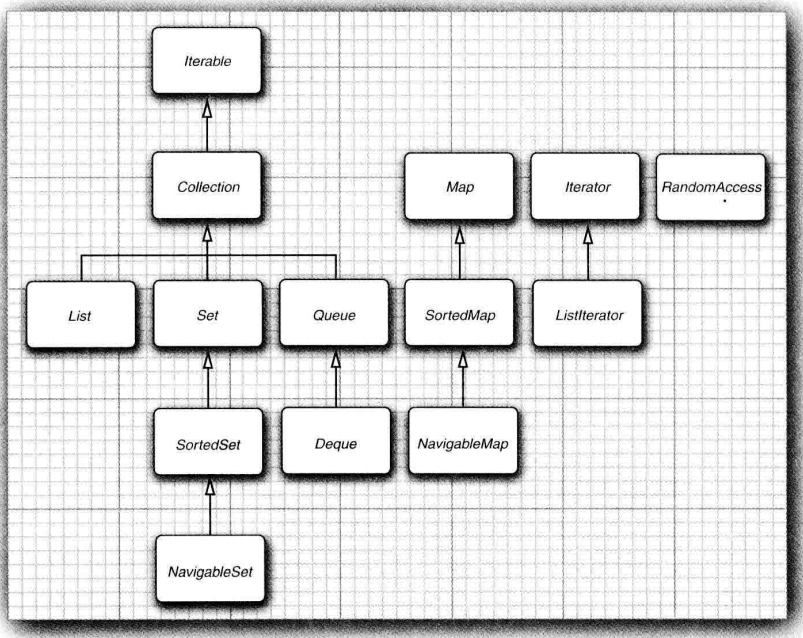
* 集合有两个基本的接口**Collection**(单值)和**Map**(键值对),对**Map**迭代,得到的都是key,如果希望从中得到值,应该使用get(Key)
* **List**是一个有序集合,它增加的元素会到特定位置,可以**随机访问**(存取对应位置的值),**ListIterator**继承了**Iterator**接口,提供了在迭代器前增加一个元素的方法add(E),在这方面,设计地不太好,由于有两种有序的数据结构(数组和链表)能够支持集合,数组很适合随机访问,但链表随机访问很慢,最好声音使用迭代器,如果提供两个不同接口会容易些
* **Set**接口相当于更严谨定义的**Collection**接口,它的方法更为严谨,add方法不能添加重复元素,定义完善的equal方法,如果两集合元素相同,不论位置,返回true,如果equal方法返回真,hashCode()的值也应该保持一致,Set可允许编写只接受集的方法
* SortedSet和SortedMap接口会提供用于排版的比较器对象,这两个接口提供可以得到子集视图的方法
* 在Java6中引入了NavigableSet和NavigableMap包含一些用于搜索和遍历有序集合和映射的方法,TreeSet和TreeMap实现了这些接口

>**RandomAccess**接口是一个标记接口,不包含任何方法,但可用来测试,集合是否支持高效的随机访问(根据索引直接读取)

### 具体集合

* java类库的集合和用途简述:
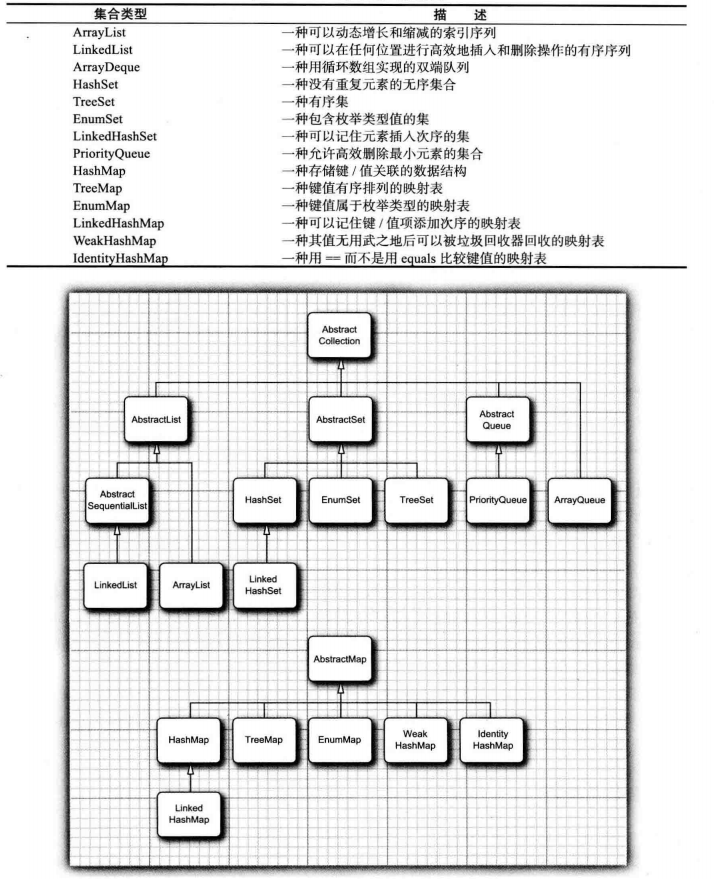
* **ArrayList**:在之前已经介绍了ArrayList,它是可变长度数组,这里对方法不再说明
  * 如果希望这个可变数组列表能够胜任多线程任务,应该使用Vector,它的所有方法都是同步的,可以安全地从多个线程中访问对象,而ArrayList是不同步的,如果不需要使用同步线程,不希望在同步上浪费大量时间,就使用ArrayList,否则使用Vector
* **LinkList链表**:可以高效增减数组元素的序列,在Java中,所有的链表实际上都是双向链接的,删除元素和修改元素都只需修改元素周围的链接(java会自动回收),链表绕来绕去的指针给人留下了极坏的印象,在Java中提供了LinkedList类用于存放链表,它是有序集合,每个位置都很重要
  * LinkList.add方法将对象添加到链表尾部,LinkList类将元素添加特定位置的方法依赖于ListIterator接口,通过迭代器负责实现
  * 如果需要在中间添加元素,可以转换使用迭代器LinkIterator遍历,然后遍历完要添加位置的前一个元素,使用迭代器.add(E)的方法添加元素到刚访问的元素之后,而set方法会修改刚访问的元素,如果在生成迭代器之后,直接调用add方法,会将元素添加到表头
  * ListIterator接口还有反向next的方法`previous()`和判断方法`hasPrevious()`,可以往回遍历
  * 请勿一边修改一边遍历集合,如果在另一个迭代器修改了,这个迭代器检测出从外部修改了,会对next()调用抛出`ConcurrentModificationException`异常,因为迭代器会记录自己的修改次数,迭代器会检查单独修改次数和总集合修改次数一致,如果不一致,会抛出该异常
  * java还给LinkList提供了访问特定位置的方法,虽然一般需要访问特定位置的时候,链表效率不高,会选择数组类型,但java还是提供了get(int)得到对应位置对象(它有个小优化,如果位置在中位数之后使用逆向遍历),LinkIterator中还有nextIndex和previousIndex方法获取下一次迭代的位置信息
  * 如果数据长度很小,不必为get和set带来的开销而烦恼,完全可以使用ArrayList,如果需要随机访问,就使用ArrayList或数组
  * LinkedList实现了removeFirst和removeLast移除首尾的双端队列Deque接口的方法
* **HashSet散列集**:链表和数组的元素次序是根据你的意愿确定的,如果想要知道某一元素的位置,但不知道其位置只能遍历整个集合,但散列集不一样,它是根据元素的散列码得到的位置,不同数据将产生不同的散列码,散列码可通过`hashCode()`方法得到,字符串的散列码根据内容决定,而从Object继承的散列码计算方式是根据存储地址来的,如果你希望自己实现,这个实现应该和equals函数结果一致
  * 散列表数据结构就可以快速查找对象,在java中散列表(**HashSet**就基于此)是通过桶列表实现的,一个链表头构成的数组,每个桶存储散列码在一个区间内的元素,如果桶足够多,链表中的元素足够散(不根据散列码),查找的时间会很短
  * 如果插入到表里的元素过多,就会增加桶中元素的冲突,降低检索性能,如果知道预计存入元素应该设定初始桶数目,一般设定为预计元素的75%-150%
  * 当然,如果估计的桶数目过低,或者没法估计(默认为16),散列表太满时,会再散列,创建更多桶的表存储,而装填因子会确定何时重新,如果装填因子为0.75(默认值),说明填满了75%,就会重新分配,新的表容量是之前的两倍,对于大多数情况,这是合理的
  * HashSet使用随机分散(似乎只是append添加到末尾)的方式将元素分散在链表中,所以会以看起来随机的顺序访问元素,只有不关心次序的情况下,才能使用它,如果希望遍历集合,可以将其转换为iterator进行处理,它实现了Collection系接口的方法
* **TreeSet树集**:它和散列集类似,但是它是有序集合,可以以任意顺序将元素插入集合中,在遍历时自动按排序后的顺序呈现,当前排序使用的是红黑树,如果树中有n个元素,查找元素正确位置平均经过$log_{2}n$次比较
  * 要使用树集必须保证元素类型提供了Comparable接口(实现为只有两个元素完全相同时,结果才为0),或者在初始化时传入一个Comparator比较器,如果不需要保证它是有序的,请使用散列集
  * 从java6开始,TreeSet实现了`NavigableSet`接口,增加了几个查找元素以及反向遍历的便利方法,例如:得到比给定元素大的最小元素`higher()`,返回大于等于给定元素的最小元素`ceiling()`,删除并返回集合中的最大值`pollFirst()`等
* **Queue队列和Deque双端队列**:队列允许在尾部添加元素,头部删除元素,而双端队列允许在头尾都增减元素,而ArrayDeque和LinkedList类都实现了Deque接口

```java{.line-numbers}
//一些java.util.Queue方法的描述:
boolean add(E);
boolean offer(E);
//add和offer都是添加元素的方法,如果队列满了,add会抛出异常,而第二个方法只会返回false
E remove();
E poll();
//如果队列不空,抛出头部元素,如果队列是空的,第一个抛出异常,第二个返回null
E element();
E peek();
//如果队列不空,返回队列头元素,但不删除,如果队列为空,element抛出异常,peek返回null

//一些java.util.Deque方法
void addFirst();
void addLast();
void offerFirst();
void offerLast();
//将给定的元素添加到特定位置,在空间满时,add抛出异常,offer返回false
E removeFirst();
E removeLast();
E pollFirst();
E pollLast();
//如果队列不为空,删除对应位置的元素,如果队列为空,remove抛出异常,poll返回null
E getFirst();
E getLast();
E peekFirst();
E peekLast();
//如果队列不为空,返回对应位置的元素,不删除,如果为空,get抛出异常,peek返回null
```

* **PriorityQueue优先队列**:优先队列可以按照任何顺序插入,但会按照有序的规则进行检测,无论何时调用remove方法,会得到按规则得到的最小元素,其实优先队列没有对所有元素排序,而是使用堆来存放数据,使用add和remove操作,都会使最小元素位于堆顶
  * 拓展了`Iterable <E>,Collection <E>,Queue <E>`接口,一般使用add和remove方法
  * 初始化时,允许使用指定的比较器排序,可传入比较器方法,或者使用已拓展Comparable接口的对象,在不使用时,被称为小顶堆,而使用了反的比较方法,得到的最大元素位于堆顶的称为大顶堆,`PriorityQueue<Integer> heap = new PriorityQueue<>((a, b) -> b.compareTo(a));`
  * 初始化时允许给定初始容量
  * 对于寻找一棵树的第K小值,就可以使用堆和队列,在堆中存放k个极小值,队列当栈用存放遍历的元素,当堆满时,如果想进堆元素大于堆顶,则不处理,不然抛出堆顶,存放新元素

### 映射

* 和集合不同,映射(map)是一种用于查找相关元素的数据结构,如果提供了键就能找到值
* **映射库的两个基本实现(HashMap,TreeMap)**:这两个都实现了Map接口,散列映射对键进行散列,树映射将元素根据键的顺序组织为一棵搜索树,散列或比较函数都只应用于键,不会对值进行散列或比较,如果需要取值,请记住键名(唯一的)
  * 如果需要对整个映射的所有键值对进行处理,可以使用foreach方法传入需要做的操作的lambda表达式或直接使用for-each循环
* 如果有相同的键想要存入一个映射,会覆盖之前的值
* 映射扩展了Map接口,其中的方法和collection接口名称不同,下面是方法列举:

```java{.line-numbers}
//java.util.Map<K,V>
V get(Object);
//获得与键关联的值,如果映射没有这个键对象,会返回null
default V getOrDefault(Object,V);
//获得与键关联的值,如果映射没有这个键对象,返回设定值
V put(K,V);
//将值放入映射中,如果之前有这个键,返回之前的值,否则返回null
void putAll(Map<? extends K,? extends V>);
//将其它映射中所有值加入
boolean containsKey(Object);
//判断映射是否有这个键,如果有返回true
boolean containsValue(Object);
//判断映射是否有这个值,如果有返回true
default void foreach(BiConsumer<? super K,? super V>);
//对所有键值对执行给定的lambda表达式

//java.util.HashMap<K,V>初始化函数
HashMap();
HashMap(int);
HashMap(int,float);
//初始化函数中，int指定初始容量，float给定最大装填因子(当达到散列到更大的散列中)

//java.util.TreeMap<K,V>初始化函数
TreeMap();
TreeMap(Comparator<? super K>);
TreeMap(Map<? extends K,? extends V>);
TreeMap(SortedMap<? extends K,? extends V>);
//初始化树映射,使用比较器Comparator,Map和SortedMap是其它映射条目,会添加到该映射中

//java.util.SortedMap<K,V>初始化函数
Comparator<? super K> comparator();
//返回使用的比较器,如果使用的是CompareTo方法,返回null
K firstKey();
K lastKey();
//返回比较的最大值键或最小值键
```

* **更新映射条目**:处理映射的一个难点是更新映射条目,正常情况下,要更新键对应的值,可以使用getOrDefault取出值,然后进行处理,再使用put放入,,这可以连在一起,比如对于词数统计值加1:`counts.put(word,counts.getOrDefault(word) + 1);`,不过也可以使用merge方法简化这个操作
  * 在Map接口里有`default V merge(K key,V value,BiFunction<? super V,? super V,? extends V> remappingFuncton);`方法,这个方法中的Key如果和非null值关联,将函数remappingFuncton应用到value和当前对应值上,返回函数结果作为新的值,如果键不存在,则放入key和value
  * 在Map接口里还有`default V compute(K key,BiFunction<? super K,? super V,? extends V> remappingFuncton);`方法,直接将键对应的值取出和键一起作为函数参数,将结果作为值存入,如果结果为null删除这个键
  * Map中还有很多类似的处理函数,像上面的例子就可以使用`counts.merge(word,1,Integer::sum)`
* **映射视图**:像Python一样可以使用键集,值集合(不是一个集),以及键值对集,键和键值对可以构成一个集合,因为键是唯一的,他们是返回Set集合(使用的方法是KeySet和entrySet),而值集合返回的是Collection对象(使用的方法是values),值得说明的是键集是一种非HashSet和TreeSet的一种另外一个实现的对象,Set集合扩展了Collection接口,一般使用其中方法像使用其它集合一样使用keySet
  * 使用for-each枚举映射条目,对于单一键或者值而言,可以使用存储的类型进行枚举,如:`Set<String> keys = map.KeySet(); for(String key:keys){ //do something with key }`,使用String就可以了,但是对于键值对集,这样不行,在Map中定义了内部类Entry,可以使用`Map.Entry<K,V>`获取每一映射,当然也可以使用var避免笨拙的声明,然后使用内部类对应的方法getKey获取键,getValue获取值
  * 对键集视图中使用remove方法事实上会删除这个键值对,但是不能对键集视图添加元素,如果使用add方法,会抛出UnsupportedOperationException异常,这对映射条目视图(键值对集)同样有效,尽管对它而言,添加键值对似乎有意义,而Entry类也提供了修改值的方法setValue()

### 重要集和映射

* **弱散列映射**:集合库中还有专用的映射类,他们用来解决某些问题,例如:**WeakHashMap**类是为了解决键值对中某一键的所有引用都已失去,但由于这个键依旧存储在集合中,虽然任何部分都不会再使用这个键了,但他不会被垃圾回收的问题,因此,在程序中需要经常删除已确定不会再使用的键,或者也可以选择使用`WeakHashMap`,当只有在映射内存在对应引用时,会将这个键删除
  * 工作原理:WeakHashMap使用弱引用保存键,这是WeakReference对象,这种对象包含另一个对象的引用,对于这种类型的对象,垃圾回收机制在对象只由WeakReference对象引用的时候,也会将对象回收,这里会将已回收的弱引用放到一个队列里,WeakHashMap将会周期性检查队列,以便找出新增加的弱引用,将其从映射中删除

---

* **链接散列集与映射**:LinkedHashSet和LinkedHashMap会记住插入元素的顺序,这样可以避免存储项位置看起来是随机的,它的实现原理是通过和HashSet一样的桶和双向链表储存,在存储元素时,不但要把元素存储进去,还要把上一个和下一个元素的引用添加到双向链表,在使用iterator转换时,顺序会和添加顺序一致
  * 变种:使用`LinkedHashMap<K,V>(initialCapacity,loadFactor,true)`创建的链接散列映射,它在调用元素或放置元素时,都会将元素放在链表末尾(散列表桶中位置不变),这是为了处理"最近最少使用"的问题,如果一个元素最近最少使用,那它就会出现在迭代器前面,一般经常使用的会保存在内存中,而少使用的才会只放在数据库中,当在表中找不到元素项或表满时,就可以通过迭代器删除前面的元素,它们就是最少使用的元素,这个删除最少使用的元素可以自动化,只需要构造LinkedHashMap的子类(匿名子类,覆盖方法就够了),覆盖`protected boolean removeEldestEntry(Map.Entry<K,V> eldest)`方法,当你的这个方法返回true时,,添加的条目就会覆盖最老的条目,或者可以考虑最老元素,来决定是否删除

---

* **枚举集**:EnumSet是枚举类型元素集的高效实现,由于枚举类型只有有限个实例,因此,它使用位序列实现,如果对应的值在集中,相应的位置为1,EnumSet没有公共的类构造器,使用工厂方法构造,可以使用Set接口的方法修改,而对应的EnumMap是键为枚举类型的映射,需要在构造函数中传入键的类型,例如:有枚举Weekday,可使用`new EnumMap<Weekday,Employee>(Weekday.class)`构造

---

* **标识散列映射**:IdentityHashMap的键的散列值,不是使用HashCode计算的,而是使用System.identityHashCode计算,这是hashCode根据对象内存地址得到散列码时使用的方法,在进行比较时,IdentityHashMap使用`==`而不是equals,不同的对象哪怕内容一样,也是不同的,这可以用来查看哪些对象已经遍历过了,数据结构很简单,实际就是一个Object数组，但是在存储上并没有使用链表来存储，而是将K和V都直接存放在Object数组上,使用散列值存储,到一定程度会扩容

### 视图和包装器

* 你可能会认为用这么多接口和类来实现数量不多的具体集合类没太大必要,但前面展示的不是全部,可以使用视图获得其他实现了Collection接口或Map接口的对象,比如使用KeySet方法得到的特殊集合,看起来好像就是创建了一个新的集合,填入所有的键,然后返回就结束了,但是情况不是这样,实际上,它返回了一个Set对象,通过Set操纵原映射,这种集合就是视图

---

* **视图的应用**

1. **小集合**:在java9中引入了一些静态方法,可以生成给定元素的集或列表,以及给定的键值对映射of方法,这个方法一共有12个重载,从0-10个参数到一个参数可变的方法(Map无法提供可变参数的方法,可以使用ofEntries能接受任意个Entry对象),提供特定性可以提高效率,这些集合对象是不可修改的,如果试图改变集合对象会导致UnsupportedOperationException异常,如果需要它可更改,可传递给ArrayList<>构造器,在Collections类(与Collection接口不同)中,还有重复性小集合的方法nCopies(n,anObject)将anObject重复存放n次,返回的结果也是实现list接口的不可变对象

    ```java{.line-numbers}
    List<String> name = List.of("Peter","Paul","Marry");
    Set<Integer> name = Set.of(2,3,5);
    Map<String，Integer> name = Set.of("Peter",2,"Paul",3,"Marry",5);
    //传给ArrayList,得到可变集合
    var name = ArrayList<>(List.of("Peter","Paul","Marry"));
    ```

2. **子范围**:可以为很多集合建立子范围视图,假如有一个列表staff,如果想要取出其中第10-19号元素,可以使用`staff.subList(10,20)`获得子范围视图,与String的subString基本相同,对子视图执行任何操作,操作都会自动反映到整个列表,Set和Map也有类似的方法,会返回在两键/元素之间的Map/Set子视图,在Java6引入的NavigableSet接口允许更多的控制子视图的范围的操作,比如视图是否包括边界
3. **不可修改的视图**:Collections类中还有几个方法用于生成不可修改的视图,如果你需要你的代码查看不修改一个集合内容,就可以使用这些方法,如果修改会抛出异常,集合仍保持不变,不可更改的视图不是集合本身不可修改，这些集合依旧可以通过其原始引用修改,只是不能通过该视图修,由于返回的是对应的接口,而不是类,有的定义在类中的方法无法使用,下面是可使用的不可修改视图生成方法,都需要传入可转换的接口类型,每个方法都用于处理一个接口
    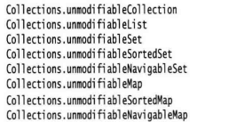
4. **同步视图**:如果从多个线程访问集合,就必须确保集合不被意外地破坏,例如:一个进程在插入元素,另一个进程在散列集合,这是灾难性的,可以使用视图保证集合是线程安全的,而没有实现线程安全的集合类,可以将任何一个映射转换成有同步访问方法的Map,使用`var map = Collections.synchronizedMap(new HashMap<String,Employee>);`这样就可以线程安全地使用map了,每个方法使用结束后才会执行下一个方法
5. **检查型视图**:检查型视图对泛型可能出现的问题提供调试分析,比如:将错误的元素类型放入这个集合中,在使用add()方法时,检查不到,只有在使用get()方法将它的值给一个应该使用类型的对象时,会出现强制类型转换异常,检查型视图可以检查这种问题,可以使用`List<String> safeString = Collections.checkedList(strings,String.class)`定义一个安全的列表,strings是一个列表

    >检查型视图受限于虚拟机,如果在集合中存入的是泛型,无法阻止其他类型化的泛型插入

6. **可选操作说明**:通常情况下,视图都有一定的限制,可能只读,可能无法更改大小,可能只能删除不能插入(键视图),如果试图执行不恰当的操作,视图就会抛出UnsupportedOperationException异常,在集合和迭代器接口中有很多被作为可选操作的方法,从理论上来讲,这种安排不令人满意,但是更好的解决方案会使接口数量增加数倍,让类库设计者无法接受,虽然可选操作被认为不应该出现在自己的设计中,但集合却不适合这种看法,集合设计者需要解决一组极其严格的而且相互冲突的需求,在你自己的编程问题中,很少会遇到这种问题,能够找到不使用可选这种极端做法

### 算法

* **为什么要使用泛型算法**:泛型集合接口有一个很大的优点,即算法只要实现一次,编写一些算法很繁琐,很容易出错,人们不可能次次调试这些算法,在集合中,使用泛型解决一些问题,首先考虑执行这个算法所需要的最小集合接口,然后以此为参数类型的限定,然后就可以实现这个方法了,在java类库中,虽然不如标准C++类库一样丰富,但也有一些基础算法,包括二分查找、排序和一些其它实用算法
* **排序与混排**:排序算法已经成为大多数编程标准语言库中的一个组成部分,java程序设计语言也不例外,`Collections`类中的`sort`方法可以对实现了`List`接口的集合(可修改的,即支持`set`方法)进行排序,这个方法假定元素实现了`Comparator`接口,当然也可以传入一个比较器,如果希望结果降序,可以使用`Collections.reverseOrder()`,这个方法会返回一个比较器,相当于`b.compareTo(a)`即反过来比较(在Comparator接口中有一模一样作用的同名方法),在java集合中,sort使用的是归并排序,虽然比快速排序慢,但是稳定,对于链表,是先存入数组,对数组排序,再复制回去
* **二分查找**:如果在数组中查找对象,通常要依次遍历整个数组,但如果是有序的就可以使用二分查找,Collections.binarySearch方法就实现了这个算法,要查找元素,就必须提供集合和要查找的元素,如果集合没有采用CompareTo方法排序,还需要提供比较器对象,它会返回对应元素的索引,如果返回为负值,说明其中没有这个元素,不过这个返回值也是有意义的,可以通过返回值i来判断,这个元素应该存放在哪个位置,能保证数组的有序,插入位置应该为`- i - 1`,使用`add.(- i - 1,element)`就可以插入正确的位置,这个方法首先会查看对应数组是否实现了`RandomAccess`接口(链表就没有),否则会转而使用线性搜索
* **其他简单算法**:包括复制元素到另一个列表;用常量值填充容器;逆置列表元素顺序等,下面就是部分实现函数,如果不满意,也可以使用Collection接口中的removeIf(删除满足条件的元素)和replaceAll(对每个元素进行处理)方法传入lambda表达式:
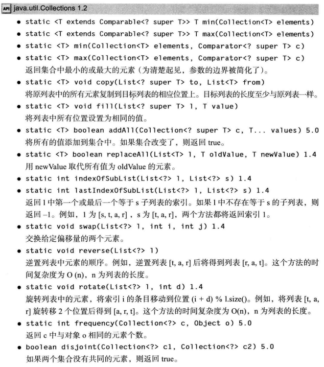
* **批操作**:像Collection.replaceAll一样的方法就是批操作,在Collections中也有removeAll,retainAll(得到交集的操作)是成批复制或删除元素的,像这种批操作可以更进一步,利用到键视图或子范围视图这样的视图上,完成更改操作
* **集合和数组的转换**:java的API大部分内容集合都是在集合框架前设计的,有的时候需要在集合和数组之间转换,如果需要把数组转换为集合,使用List.of方法可以达到目的,而将集合转换成数组就没那么容易了,可以使用toArray方法,得到的是Object数组,哪怕你知道其中存储的类型,也无法强制类型转换,不过你可以提供一个指定存储的类型的数组,会根据你传入的数组,创建正确类型的数组,如果提供的数组足够大,就直接使用这个数组存放
* **编写自己的算法**:如果编写自己的算法,应该尽可能使用集合接口,而不是其具体实现,就如开头说的一样,接收一个通用的集合接口,处理所有相关问题,如果顺序重要,使用List接口,如果顺序不重要就使用接收任意类型的集合Collections,而返回值最好也如此设计(返回接口类型)

### 遗留的集合

* 从java1问世以来,集合框架中存在大量遗留的容器类
* **Hashtable**类:经典的Hashable类和HashMap类作用一样,实际上,使用的接口也相同,与Vector类一样,它的方法是同步的,但现在可以使用HashMap方法,如果需要并发访问,则要使用ConcurrentHashMap
* **枚举**:遗留的集合通过Enumeration接口而不是Iterator接口遍历元素序列,也就是前面说过的被替代的接口,如果发现遗留类实现了Enumeration接口,就可以使用`Collections.list()`方法将类转换为ArrayList或者使用`Collections.enumeration()`方法将一个集合转换为实现了Enumeration接口的对象
* **属性映射**:属性映射是一种特殊的映射结构,它具有3个特点:
  1️⃣ 键与值都是字符串
  2️⃣ 这个映射很容易保存到文件或从文件加载
  3️⃣ 有二级表存放默认值
  * 实现属性映射的java类名为**Properties**,属性映射对于指定程序的配置很有用,可以使用`setProperty()`方法添加映射,使用`store()`将映射保存在文件输出流对象中,加载时可使用`load()`方法从文件输入流对象中加载属性映射,使用`getProperty(key)`得到对应的值,当然这个方法可以添加另一参数默认值,在没有该映射时,返回默认值,如果嫌麻烦,可以使用二级映射(初始化时从设定好的表中导入默认值,然后再执行添加操作)
  * 属性是没有层次结构的简单表格,有的时候需要有类似`window.main.color`这样的层次结构,Properties类没有方法组织这样的层次结构,如果需要存储复杂的配置信息,应该改为使用Preference类

>出于历史方面的原因,Properties实现了Map<Object,Object>,因此可以使用Map的get和put方法存入任何数据,因此最好坚持使用getProperty和setProperty方法

* **栈**:从1.0版开始,标准类库就包含了Stack类,其中有push和pop方法,但Stack类扩展了Vector类,从理论角度来看,Vector类不太令人满意,你甚至能够使用并非栈操作的insert和remove方法在任何地方插入和删除值
* **位集**:BitSet类用于存储一个位序列,把它称为位向量可能更加合适,如果需要高效存储位序列就可以使用位集,由于位集将位包装在字节里,所以使用位集比使用Boolean的ArrayList要高效得多,如果需要得到某个位置的状态(true or false),可以使用get(i)方法,而使用set(i)方法和clear(i)方法分别可以把i位置变成true和false,在位集中,还有与其它位集做与或异或的操作,甚至还有对于另一个位集为1的对应位置都变成0的andNot方法,最终这些操作会直接反映到自身上
  * **经典案例**:"埃拉托色尼筛选法"算法的实现,这个方法用来批量查找素数,依次删除$2,3,...,\sqrt{n}$的倍数,这不是非常好的寻找素数的方法,但由于某些原因,成为了测试编译器性能的基准(也不是很好的测试基准的方法,因为它主要测试位运算),在java中,可以使用位集实现,一开始,先把所有设置为开(true),然后将已知素数的倍数置为关(false)状态,在java和C++实现执行做时间比较,如果没有改变g++的优化级别,java会比C++快很多,如果运行时间过长,触发Hotspot(java的动态编译器),java只能与C++打成平手

## 并发

### 综述

* 你可能很熟悉多任务,这是操作系统的一种能力,看起来可以同时刻运行多个程序,例如:在下载邮件同时可以打印文件,如今人们往往有多cpu的计算机,但并发进程不受限于CPU的数目,多线程程序在更低一层扩展了多任务的概念:单个程序在同时完成多个任务,如果一个程序可以同时执行多个任务,则称这个程序是多线程的
* **多进程和多线程的区别**:多进程每个进程是独立的,有各自的变量,而多线程的数据是共享的,共享变量使得数据的通信更加方便,但会有风险,实际应用中,多线程很有用
* **并发的原因**:
  * 更好地利用单个CPU:能够更好地利用计算机中的资源
  * 更好地利用多个CPU或CPU内核:需要为应用程序使用多个线程,以便能够利用所有CPU或CPU核心
  * 在响应能力方面更好的用户体验:提出的请求可以由后台线程执行,GUI线程在此期间可以自由地响应其他用户请求
  * 在公平性方面更好的用户体验:在用户之间更公平地共享计算机资源,客户端的请求由各自的线程执行,没有任务可以独占时间

### 线程

* **什么是线程**:可以设计一个简单程序,完成银行账户的资金转账,可以使用多个线程,如果使用单独的线程完成任务,在单独的线程中,我们可以定义银行类存储账目信息,然后通过一个函数式接口,传入任务,比如说使用Runnable,从这个接口的对象完成操作,构造一个Thread对象`var t = new Thread(r);`然后`t.start()`启动线程,这个方法会立即返回,新的线程会并发执行,如果你写了两个`r`并让他们在上下两行分别执行,他们的输出是交错的,说明两个线程在并发执行

>直接调用Thread或Runnable的run方法是不会产生一个线程的,它只会在本线程执行这些操作,应当调用start方法

* **线程状态**:线程一般处于六种不同的状态,调用`getState`方法能够获得线程的状态
  * New(新建)
  * Runnable(可运行)
  * Blocked(阻塞):
  * Waiting(等待)
  * Timed Waiting(计时等待)
  * Termainated(终止)

* **新建线程**:**新建线程**是使用new Thread(r)创建之后还没有开始运行,当处于这个状态时,可以进行线程的基础准备工作
* **可运行线程**:一旦调用了start(),线程就变成了**可运行线程**,但一个可运行的程序可能正在运行,也可能没有运行
  * java没有把运行中作为一个状态,一旦开始运行,它也不一定始终保持运行状态,具体线程调度细节依赖于操作系统提供的服务,抢占式调度系统会给每个可运行线程一个时间片执行任务,并且在线程数目多于处理器时再分配,并考虑优先级
* **阻塞和等待线程**:当线程处于阻塞或等待时,它暂时不工作,而且消耗最少的资源,要由线程调度器重新激活,具体细节取决于它是如何不工作的
  * 可能是试图获得一个内部的对象锁,而这个锁被其他线程占有,这个线程会被堵塞
  * 线程在等待其他线程的运行条件,这个时候就进入等待状态
  * 线程调用了有超时参数的方法,会使线程进入计时等待的状态,直到超时期满或接受到适当的通知
* **终止线程**:线程会由于两个情况终止
  * run方法正常退出
  * 因为没有捕获的异常终止了run方法,意外终止
  * 可以调用线程的stop方法杀死线程,它会抛出一个ThreadDeath异常,但现在已被废弃

### 线程属性

* **中断线程状态**:当程序出现异常或执行完毕返回时,线程将终止,除了已经弃用的stop方法没有方法能够使它强制终止,不过interrupt方法用来请求终止一个线程,当调用intertupt方法时,会设置线程的**中断状态**,这是每个线程都有的boolean标志,每个线程都应该不时检查这个变量,以判断是否中断
  * 要想检查是否设置了中断状态,可以调用Thread.currentThread()方法获得当前线程,然后调用.isInterrupt方法,这个方法需要线程没被阻塞,如果阻塞会抛出InterruptedException异常,如果在使用了sleep或wait调用阻塞的线程上使用了isInterrupt方法,这个线程将被中断
  * 没有任何要求如何处理被中断的方法,中断的状态只是要引起注意,中断的线程可以决定如何响应中断
  * 如果在迭代中重复执行sleep或其他中断方法,就不应该使用isInterrupt方法,sleep方法会清除中断状态,并抛出InterruptException异常,因此如果循环使用了这些方法,应该捕获抛出的异常,而不是检查状态
  * 捕获InterruptException异常,应该在捕获后使用interrupt方法设置中断状态,或者将其抛给调用线程的执行者
* **守护线程**:可以调用`t.setDaemon(true)`将一个线程转换成守护线程,守护线程的唯一用途是为其它线程提供服务,比如计时器线程就是个例子,如果只剩下守护线程,虚拟机会退出,==这一方法必须在线程启动前调用==
* **线程名**:在默认情况下,线程有容易记得名字,例如:`Thread-2`,可以使用setName方法设置线程名,在转储时,可能有用
* **未捕获异常的处理器**:线程的run方法不能抛出任何检查型异常,但是,未捕获的非检查型异常会使线程终止,对于可以传播的异常并没有任何的catch子句,这些异常在线程死亡前,这些异常会被传递到用于处理未捕获异常的处理器,这个处理器必须属于一个实现了`Thread.UncaughtExceptionHandler`接口的类,这个接口只有一个方法`uncaughtException`,可以用`setUncaughtExceptionHandler`方法为任何线程安装处理器,如果没有设置默认处理器,默认处理器为null,如果没有为单个线程安装处理器,那么处理器应该是该线程的`ThreadGroup`对象(可以一起管理的线程的集合)
  * ThreadGroup类实现了多线程的异常处理器接口,它的uncaughtException方法会执行操作:
    * 如果该线程有父线程组,使用父线程组的uncaughtException方法
    * 否则,如果Thread.getDefaultExceptionHandler方法不为空,则调用它
    * 否则,如果Throwable是一个ThreadDeath实例什么都不做
    * 否则,将线程名和Throwable的栈轨迹输出到System.err流

* **线程的优先级**:在JAVA程序设计语言中,每个线程都有一个优先级,默认情况下,一个线程会继承构造它的那个线程的优先级,用setPriority方法可以提高或降低任何一个线程的优先级(在Thread中有对应的优先级int常量(从1到10))

### 同步

* **竞态条件**:在大多数情况下,两个或两个以上的线程要同时对同一个数据进行存取,这种情况可能会相互覆盖,可能会导致对象被破坏,这种情况就称为竞态条件
* **同步存取**:为了避免多线程破坏数据,必须学习如何同步存取,比如银行系统,会出现几个线程同时更新银行账户余额,一段时间后不知不觉就会出现错误
* **竞态条件详解**:假如在银行中更新账户学习时出现这个问题,两个线程在同时执行`accounts[to] += amount`,这不是原子操作,这个指令可能做以下处理,1️⃣先将`accounts[to]`加载到寄存器,2️⃣增加amount,3️⃣返回`accounts[to]`,假如第一个线程执行了1和2操作,然后运行权被抢占,而第二个线程开始执行并执行完成,第一个线程恢复后,进行第3步,会覆盖第2个线程的更新
* java的测试程序能够检查到上方的破坏,当然也有可能出现假警报,使用`javap -c -v`查看类的虚拟机字节码,可以看到每一条语句的执行都是由1或者多条指令组成的,在这些指令任何一条上,都有可能中断,在一个有多核的现代处理器上,出问题的风险相当高

---

* **锁对象**:java提供了synchronized关键字来达到防止其他并发访问代码块,而java5之后又提供了ReetrantLock类处理这种情况,先说ReetrantLock类
* ReetrantLock类是通过以下形式保护代码块

```java{.line-numbers}
myLock.lock(); //a ReetrantLock Object
try{
  ...
}finally{
  myLock.unLock(); //确保即使出现异常也能够解锁
}
//使用锁时,不能使用try-with-resource
//因为解锁语句不是close,而且一般希望多个线程共享一个变量
```

* 这个结构能确保即使有大量线程进入临界区,一旦一个线程锁定了锁对象,其他线程无法通过lock语句,直到第一个线程释放了这个锁对象,你可以把锁对象设置为类变量,在需要的函数里使用(但需要所有线程的所有操作都是对同一个类的实例使用,否则锁是不同的,不会堵塞)
* **重入锁**:[ReentrantLock是独占锁且可重入的](https://www.cnblogs.com/takumicx/p/9338983.html),通过lock()方法先获取锁三次,然后通过unlock()方法释放锁3次,程序可以正常退出
  * 锁对象存在一个计数来跟踪对lock的嵌套调用,每使用一次lock应该对应一个unlock释放,这样可以使被保护的代码块调用使用相同锁的方法
  * 注意不要在临界区域出现异常而跳出,此时,锁将被释放,对象可能被破坏
  * 公平锁:可以使用`new ReentrantLock(boolean)`构造一个公平锁,在锁释放后倾向于等待时间最长的线程,但速度很慢,而且对于已经被线程调度器忽略的线程不会得到公平的处理

* **条件对象**:对于需要满足某些条件才能执行,可以先等待其他线程完成后再执行的线程而言,可以使用条件对象解锁,并等待其他线程执行,条件对象可以通过ReentrantLock对象的newCondition()方法生成,有`await()`方法,可以使线程进入这个条件的等待集,它将暂停并放弃锁,直到其他线程完成前置操作并调用条件对象的`signalAll()`方法,会重新激活等待集中的所有线程,当这些线程被移除等待集时,他们将成为可运行线程,调度器会把他们激活,signalAll方法只是通知这些线程可以再次检查条件,因此一般使用`while(condition){ condition.await(); }`,当一个线程使用await暂停时,没有办法自己激活,需要其他线程重新调用,如果没有,它永远不会运行,产生死锁现象,如果所有可能解锁的线程都使用await方法,那么程序会永远挂起,条件对象还有随机激活一个线程的signal方法,如果这个被激活的线程条件仍未满足,那仍然不能运行,并且可能出现死锁
* **锁对象和条件对象小结**:
  * 锁可以用来保护代码片段,一次只能有一个线程执行被保护的代码
  * 锁可以管理试图进入被保护代码的线程
  * 锁可以有多个相关联的条件对象
  * 每个条件对象管理已经进入保护代码但是不能运行的线程

---

* **synchronized**:Lock和Condition接口允许程序员充分控制锁定
