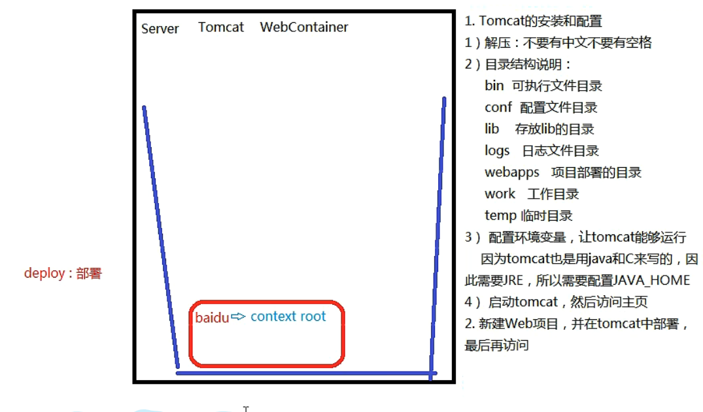
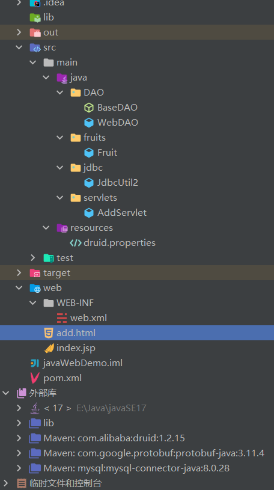
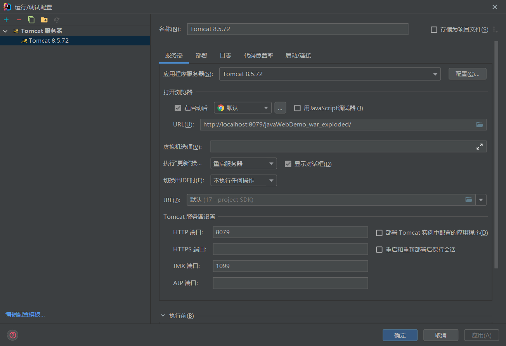
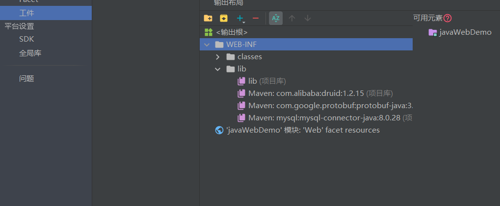
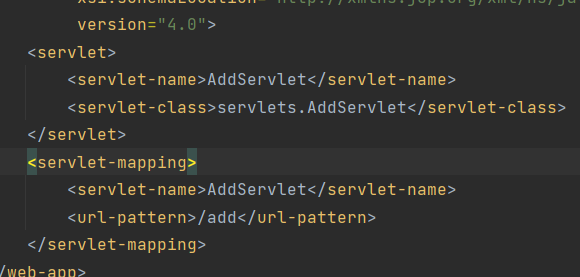
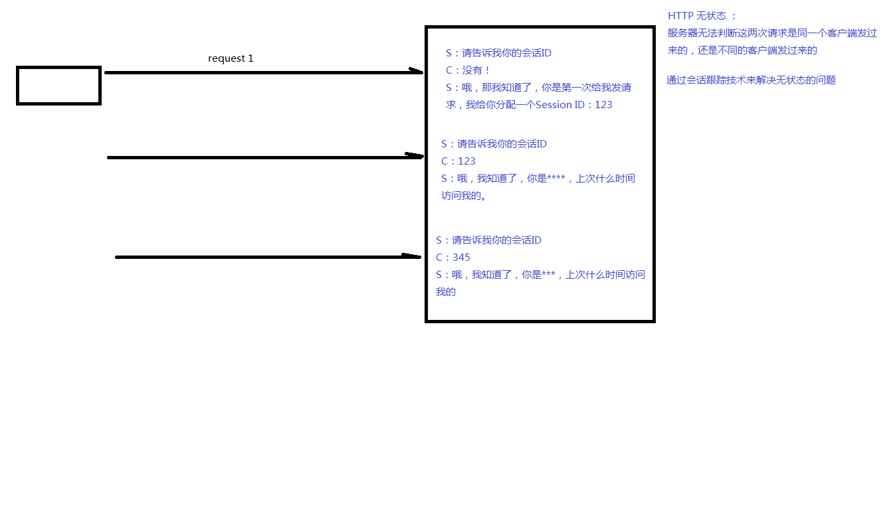

# javaWeb

## 基础概念

* javaWeb:BS模式(浏览器服务器模式)
  * TomCat:服务器容器,用于部署项目
  * Java/JDBC/DB
  * HTML/CSS/JavaScript

## TomCat简单使用

* TomCat安装细节



* TomCat简单部署:将要部署的普通html项目放在webapps文件夹下,在项目内增加WEB-INF文件夹,使用https:**//ip地址:TomCat端口号/项目目录名/index.html**访问项目
* TomCat使用idea部署:使用idea创建web项目

* 使用TomCat注意事项:
  * 配置TomCat支持
  * 引入TomCat的api依赖,依赖位于TomCat\lib下,引入该lib,才能使用servlet类
  * 在部署项目同时将依赖项部署
  * 初级引入servlet:
  >servlet从3.0版本开始也支持注解注册，在要注册的类上添加注解@webServlet("/ServletName"),也可以传入更多参数,使用多级结构

  ```java
  @webServlet(
    //对应服务地址
    urlPatterns = "ServletName",
    //初始配置参数的列表
    initPatterns = {
      @webInitParam(name="key1",value="value1"),
      @webInitParam(name="key2",value="value2")
    }
  )
  ```

## Servlet

>Servlet是TomCat中的一个接口,用于响应浏览器发出的请求(POST,GET,HEAD等)

1. 设置Servlet获取的request的编码

   * tomcat8之前, 设置编码：
     * get请求方式：

       ```java
       //get方式目前不需要设置编码（基于tomcat8）
       //如果是get请求发送的中文数据, 转码稍微有点麻烦（tomcat8之前）
       String fname = request.getParameter("fname");
       //1.将字符串打散成字节数组
       byte[] bytes = fname.getBytes("ISO-8859-1");
       //2.将字节数组按照设定的编码重新组装成字符串
       fname = new String(bytes,"UTF-8");
       ```

     * post请求方式：

       ```java
       request.setCharacterEncoding("UTF-8");
       ```

   * tomcat8开始, 设置编码, 只需要针对post方式

       ```java
       request.setCharacterEncoding("UTF-8");
       ```

   * 需要注意的是, 设置编码(post)这一句代码必须在所有的获取参数动作之前

2. Servlet的继承关系 - 重点查看的是服务方法（service()）
   1. 继承关系

      ```java
      - javax.servlet.Servlet接口
        - javax.servlet.GenericServlet抽象类
            - javax.servlet.http.HttpServlet抽象子类
      ```

   2. 相关方法(主要为生命周期方法和do响应方法)

      ```java
      javax.servlet.Servlet接口:
        void init(config) - 初始化方法
        void service(request,response) - 服务方法
        void destroy() - 销毁方法

      javax.servlet.GenericServlet抽象类：
        void service(request,response) - 仍然是抽象的

      javax.servlet.http.HttpServlet 抽象子类：
        void service(request,response) - 不是抽象的
          1. String method = req.getMethod(); 获取请求的方式
          2. 各种if判断,根据请求方式不同,决定去调用不同的do方法
              if (method.equals("GET")) {
                  this.doGet(req,resp);
              } else if (method.equals("HEAD")) {
                  this.doHead(req, resp);
              } else if (method.equals("POST")) {
                  this.doPost(req, resp);
              } else if (method.equals("PUT")) {
                  this.doPut(req, resp);
              }
          3. 在HttpServlet这个抽象类中,do方法都差不多:显示未实现相关方法
          protected void doGet(HttpServletRequest req, HttpServletResponse resp) throws ServletException, IOException {
              String protocol = req.getProtocol();
              String msg = lStrings.getString("http.method_get_not_supported");
              if (protocol.endsWith("1.1")) {
                  resp.sendError(405, msg);
              } else {
                  resp.sendError(400, msg);
              }
          }
      ```

   3. 小结：
    * 继承关系: `HttpServlet -> GenericServlet -> Servlet`
    * Servlet中的核心方法: `init()`,`service()`,`destroy()`
    * 服务方法: 当有请求过来时,`service`方法会自动响应(其实是tomcat容器调用的)
      * 在`HttpServlet`中我们会去分析请求的方式：到底是`get`,`post`,`head`还是`delete`等等
      * 然后再决定调用的是哪个do开头的方法
      * 那么在`HttpServlet`中这些do方法默认都是405的实现风格-要我们子类去实现对应的方法, 否则默认会报405错误
    * 因此, 我们在新建`Servlet`时, 我们才会去考虑请求方法, 从而决定重写哪个方法

3. Servlet的生命周期
   * 生命周期：从出生到死亡的过程就是生命周期。对应Servlet中的三个方法：`init()`,`service()`,`destroy()`
   * 默认情况下:
     * 第一次接收请求时, 这个Servlet会进行实例化(调用构造方法)、初始化(调用init())、然后服务(调用service())
     * 从第二次请求开始, 每一次都是服务
     * 当容器关闭时, 其中的所有的servlet实例会被销毁, 调用销毁方法
   * 通过案例我们发现：
     * Servlet实例tomcat只会创建一个, 所有的请求都是这个实例去响应。
     * 默认情况下, 第一次请求时, tomcat才会去实例化, 初始化, 然后再服务.这样的好处是什么？ 提高系统的启动速度 。 这样的缺点是什么？ 第一次请求时, 耗时较长。
     * 因此得出结论： 如果需要提高系统的启动速度, 当前默认情况就是这样。如果需要提高响应速度, 我们应该设置Servlet的初始化时机。
   * Servlet的初始化时机：
     * 默认是第一次接收请求时, 实例化, 初始化
     * 我们可以通过\<load-on-startup\>来设置servlet启动的先后顺序,数字越小, 启动越靠前, 最小值0
   * Servlet在容器中是：单例的、线程不安全的
     * 单例：所有的请求都是同一个实例去响应
     * 线程不安全：一个线程需要根据这个实例中的某个成员变量值去做逻辑判断。但是在中间某个时机, 另一个线程改变了这个成员变量的值, 从而导致第一个线程的执行路径发生了变化
   * 我们已经知道了servlet是线程不安全的, 给我们的启发是:尽量的不要在servlet中定义成员变量。如果不得不定义成员变量, 那么不要去：
     * 不要去修改成员变量的值
     * 不要去根据成员变量的值做一些逻辑判断

4. Http协议
    * Http被称为超文本传输协议
    * Http是无状态的
    * Http请求响应包含两个部分：请求和响应
      * 请求：请求包含三个部分:请求行,请求消息头,请求主体
        * 请求行包含是三个信息:请求的方式,请求的URL,请求的协议（一般都是HTTP1.1）
        * 请求消息头中包含了很多客户端需要告诉服务器的信息, 比如:我的浏览器型号、版本、我能接收的内容的类型、我给你发的内容的类型、内容的长度等等
        * 请求体：三种情况

          |方式|请求体情况|备注|
          |---|---|---|
          |get方式   |没有请求体  |但是有一个queryString|
          |post方式  |有请求体    |form data|
          |json格式  |有请求体    |request payload|

      * 响应：
        响应也包含三本:响应行,响应头,响应体
        * 响应行包含三个信息：协议,响应状态码(200),响应状态(ok)
        * 响应头：包含了服务器的信息；服务器发送给浏览器的信息（内容的媒体类型、编码、内容长度等）
        * 响应体：响应的实际内容（比如请求add.html页面时, 响应的内容就是\<html\>\<head\>\<body\>\<form....)

5. 会话

   * Http是无状态的
     * HTTP 无状态 ：服务器无法判断这两次请求是同一个客户端发过来的, 还是不同的客户端发过来的
     * 无状态带来的现实问题：第一次请求是添加商品到购物车, 第二次请求是结账；如果这两次请求服务器无法区分是同一个用户的, 那么就会导致混乱
     * 通过会话跟踪技术来解决无状态的问题。

   * 会话跟踪技术
     * 客户端第一次发请求给服务器, 服务器获取session, 获取不到, 则创建新的, 然后响应给客户端
     * 下次客户端给服务器发请求时, 会把sessionID带给服务器, 那么服务器就能获取到了, 那么服务器就判断这一次请求和上次某次请求是同一个客户端, 从而能够区分开客户端
    
     * 常用的API：

       ```java
       request.getSession() -> 获取当前的会话, 没有则创建一个新的会话
       request.getSession(true) -> 效果和不带参数相同
       request.getSession(false) -> 获取当前会话, 没有则返回null, 不会创建新的
       session.getId() -> 获取sessionID
       session.isNew() -> 判断当前session是否是新的
       session.getMaxInactiveInterval() -> session的非激活间隔时长, 默认1800秒
       session.setMaxInactiveInterval()
       session.invalidate() -> 强制性让会话立即失效
       ...
       ```

   * session保存作用域
     * session保存作用域是和具体的某一个session对应的
     * 常用的API：

        ```java
        void session.setAttribute(k,v)
        Object session.getAttribute(k)
        void removeAttribute(k)
        ```

6. 服务器内部转发以及客户端重定向

   * 服务器内部转发:`request.getRequestDispatcher("/Other_Servlet").forward(request,response);`
     * 一次请求响应的过程, 对于客户端而言, 内部经过了多少次转发, 客户端是不知道的
     * 地址栏没有变化
   * 客户端重定向:`response.sendRedirect("/Other_Servlet");`
     * 两次请求响应的过程。客户端肯定知道请求URL有变化
     * 地址栏有变化

7. Thymeleaf - 视图模板技术
   * 添加thymeleaf的jar包
   * 新建一个Servlet类ViewBaseServlet,其中有配置函数`init()`和渲染模板函数`processTemplate()`
   * 在web.xml文件中添加配置context-param
      * 配置前缀 view-prefix
      * 配置后缀 view-suffix
   * 使得我们的Servlet继承ViewBaseServlet

   * 根据逻辑视图名称 得到 物理视图名称

    ```java
   //此处的视图名称是 index
   //那么thymeleaf会将这个 逻辑视图名称 对应到 物理视图 名称上去
   //逻辑视图名称 ：   index
   //物理视图名称 ：   view-prefix + 逻辑视图名称 + view-suffix
   //所以真实的视图名称是：      /       index       .html
   super.processTemplate("index",request,response);
    ```

   * 使用thymeleaf的标签
   `th:if`,`th:unless`,`th:each`,`th:text`

8. 状态码解析

    ```java
    // 200 : 正常响应
    // 404 : 找不到资源
    // 405 : 请求方式不支持
    // 500 : 服务器内部错误
    ```

9. Servlet保存作用域
   * 使用setAttribute()设置局部变量,使用getAttribute()获取
   * 保存作用域:
     * page:现在一般不使用,当年jsp使用的作用域,指当前页面有效
     * request:请求,指一次请求有效,使用req.setAttribute()就是这种范围,即内部转发可以使用此方法保存的内容,重定向不行
     * session:会话,指一次会话有效,使用session.setAttribute()就是这种范围
     * application:一次应用程序内有效,指存入servletContext = req.getServletContext()中的数据,同样使用setAttribute()的方法

10. Servlet的配置文件web.xml使用
    * Servlet配置文件中包含了servlet的一些配置信息

      ```xml
      <?xml version="1.0" encoding="UTF-8"?>
      <web-app xmlns="http://xmlns.jcp.org/xml/ns/javaee"
        xmlns:xsi="http://www.w3.org/2001/XMLSchema-instance"
        xsi:schemaLocation="http://xmlns.jcp.org/xml/ns/javaee http://xmlns.jcp.org/xml/ns/javaee/web-app_4_0.xsd"
        version="4.0">
          <!-- Servlet初始化参数声明 -->
            <!-- 通过ServletContext servletContext = getServletContext();可以获取Context-Param中的信息 -->
            <!-- 服务的函数中也可通过req.getServletContext();获取对应对象 -->
            <!-- 服务的函数中也可通过session.getServletContext();获取对应对象 -->
            <!-- 通过String value = ServletContext.getInitParameter("contextConfigLocation")获取值 -->
          <context-param>
              <param-name>contextConfigLocation</param-name>
              <param-value>classpath:applicationContext.xml</param-value>
          </context-param>
          <!-- servlet注册 -->
          <servlet>
              <!-- servlet取名 -->
              <servlet-name>AddServlet</servlet-name>
              <!-- 对应的类地址 -->
              <servlet-class>servlets.AddServlet</servlet-class>
              <!-- 可选标签,表示在服务器启动时,就进行实例化,初始化 -->
              <!-- servlet的四个生命周期:实例化,初始化,服务,销毁 -->
              <load-on-startup>1</load-on-startup>
              <!-- 可选标签,在初始化时可以获取到,进行处理 -->
              <!-- 可以重写init函数,在init中获取其中数据,进行处理 -->
                <!-- - 获取config对象: ServletConfig config = getServletConfig(); -->
                <!-- - 获取参数: String value = config.getInitParameter("key"); -->
              <init-param>
                  <param-name>key</param-name>
                  <param-value>value</param-value>
              </init-param>
              <init-param>
                  <param-name>key</param-name>
                  <param-value>value</param-value>
              </init-param>
          </servlet>
          <!-- servlet引用 -->
          <servlet-mapping>
              <!-- 引用的servlet名 -->
              <servlet-name>AddServlet</servlet-name>
              <!-- 对应的服务地址,即为https://localhost:8080/服务端名称/add -->
              <url-pattern>/add</url-pattern>
          </servlet-mapping>
      </web-app>
      ```

## javaweb优化方向

* 实现尽可能的关系清晰:通过文件描述类和关系,如配置文件application.xml,这也是之后框架的做法,在配置文件中配置相关信息,使用w3提供的java提取xml的结点的方法,将信息提取出来,在服务器启动时(或处理的Servlet初始化时)完成该提取分析处理工作,如:提供反射提供一个`BeanMap`专门存储操作的地址和这些bean(java对象)的关系
* 减少冗余代码:在使用servlet的过程中,存在大量的servlet处理不同的请求,这样让每一个servlet都必须独立完成请求处理工作,造成了代码的冗余
  * 处理办法是让一个servlet专门处理各种请求,在请求中提供专门的信息码oper对应提供不同操作的地址或名称,由服务器内部转发处理,即总人口,DispatchServlet
  * 该类需要通过字符串处理获取对应的处理名,将处理名通过反射到对应的`BeanMap`中,取出对应的对象执行对应的操作
* 不同层之间解耦:为了实现尽可能的0耦合,需要使用文件来展示所有应该使用的类名,处理操作名,使用反射取出并对应起来,通过反射在初始化时给需要的变量赋值,这样删除某个类,就能够使其他类不报错(其他类中对应属性设置为null,在初始化时根据xml文件反射赋值),方便更换某个类

## 业务层初学

* 早期方式:Model1或Model2,使用jsp,其中包括各种内容
  * Html/CSS/js
  * java与数据库通信的代码
  * java展示数据的代码
* MVC方式:Model模型,View视图,Controller控制器
  * 视图层:用于数据展示和用户交互的界面
  * 控制层:接收客户端的请求,具体的功能通过模型完成
  * 模型层:实现具体的与数据库交互的功能,模型也有很多种,包括pojo(也称为vo)数据载体(值对象),业务模型组件(BO/biz),数据访问层组件(DAO),数据传输对象(DTO)
  >DAO和BO区别:
  >对于DAO而言:都是单精度方法,即一个方法对应一个操作
  >对于BO而言:其中的方法都是业务方法,比较复杂,对应多步操作,即粗粒度方法,需要多个DAO方法的调用实现一个业务功能
* IOC - 控制反转
  1. 之前在Servlet中，我们创建service对象，FruitService fruitService = new FruitServiceImpl();
     * 这句话如果出现在servlet中的某个方法内部，那么这个fruitService的作用域（生命周期）应该就是这个方法级别；
     * 如果这句话出现在servlet的类中，也就是说fruitService是一个成员变量，那么这个fruitService的作用域（生命周期）应该就是这个servlet实例级别
  2. 之后我们在applicationContext.xml中定义了这个fruitService。然后通过解析XML，产生fruitService实例，存放在beanMap中，这个beanMap在一个BeanFactory中
     * 因此，我们转移（改变）了之前的service实例、dao实例等等他们的生命周期。控制权从程序员转移到BeanFactory。这个现象我们称之为控制反转
* DI - 依赖注入
  1. 之前我们在控制层出现代码：FruitService fruitService = new FruitServiceImpl()；那么，控制层和service层存在耦合
  2. 之后，我们将代码修改成FruitService fruitService = null;然后，在配置文件中配置,这就是依赖注入方式

    ```xml
    <bean id="fruit" class="FruitController">
        <property name="fruitService" ref="fruitService"/>
    </bean>
    ```

## 过滤器

* 过滤器Filter
  * Filter也属于Servlet规范
  * Filter开发步骤：新建类实现Filter接口，然后实现其中的三个方法：init、doFilter、destroy
  * 配置Filter，可以用注解@WebFilter，也可以使用xml文件 `<filter>`,`<filter-mapping>`,其中项也同样修改,即将之前带Servlet的配置改为带filter的配置
  * Filter.doFilter第三个参数为FilterChain类型,有方法chain.doFilter放行
* Filter在配置时，和servlet一样，也可以配置通配符，例如 @WebFilter("*.do")表示拦截所有以.do结尾的请求
* 过滤器链
  * 如果采取的是注解的方式进行配置，那么过滤器链的拦截顺序是按照全类名的先后顺序排序的
  * 如果采取的是xml的方式进行配置，那么按照配置的先后顺序进行排序
  * 一半注解一半配置文件的方式进行配置(完全不推荐),先进入配置文件,再进入注解的

## 事务

* 事务管理
  * 此次设计一个类专门管理事务,通过使用ThreadLocal类存储和获取该线程设置的数据库连接对象,达到同线程为同一事务的效果,此事务类可以在过滤器Fitter被激活

* ThreadLocal
  * ThreadLocal称之为本地线程变量,我们可以通过set(obj)方法在当前线程上存储数据、通过get()方法在当前线程上获取数据,即一个字典,key为ThreadLocal本身
  * set方法源码分析：

    ```java
    public void set(T value) {
        Thread t = Thread.currentThread(); //获取当前的线程
        ThreadLocalMap map = getMap(t);    //每一个线程都维护各自的一个容器（ThreadLocalMap）
        if (map != null)
            map.set(this, value);          //这里的key对应的是ThreadLocal，因为我们的组件中需要传输（共享）的对象可能会有多个（不止Connection）
        else
            createMap(t, value);           //默认情况下map是没有初始化的，那么第一次往其中添加数据时，会去初始化
    }
    ```

  * get方法源码分析：

    ```java
    public T get() {
      Thread t = Thread.currentThread(); //获取当前的线程
      ThreadLocalMap map = getMap(t);    //获取和这个线程（企业）相关的ThreadLocalMap（也就是工作纽带的集合）
      if (map != null) {
          ThreadLocalMap.Entry e = map.getEntry(this);   //this指的是ThreadLocal对象，通过它才能知道是哪一个工作纽带
          if (e != null) {
              @SuppressWarnings("unchecked")
              T result = (T)e.value;     //entry.value就可以获取到工具箱了
              return result;
          }
      }
      return setInitialValue();
    }
    ```

* 监听器

  ```java
  ServletContextListener //监听ServletContext对象的创建和销毁的过程
  HttpSessionListener //监听HttpSession对象的创建和销毁的过程
  ServletRequestListener //监听ServletRequest对象的创建和销毁的过程
  // ----------------------------
  ServletContextAttributeListener //监听ServletContext的保存作用域的改动(add,remove,replace)
  HttpSessionAttributeListener //监听HttpSession的保存作用域的改动(add,remove,replace)
  ServletRequestAttributeListener //监听ServletRequest的保存作用域的改动(add,remove,replace)
  // ----------------------------
  HttpSessionBindingListener //监听某个对象在Session域中的创建与移除
  HttpSessionActivationListener //监听某个对象在Session域中的序列化和反序列化
  ```

  * 配置方法

    ```xml
    //在web.xml中配置
    <listener>
      <listener-class>类位置</listener-class>
    </listener>

    //使用注解
    //@webListener
    ```

* ServletContextListener的应用 - ContextLoaderListener
