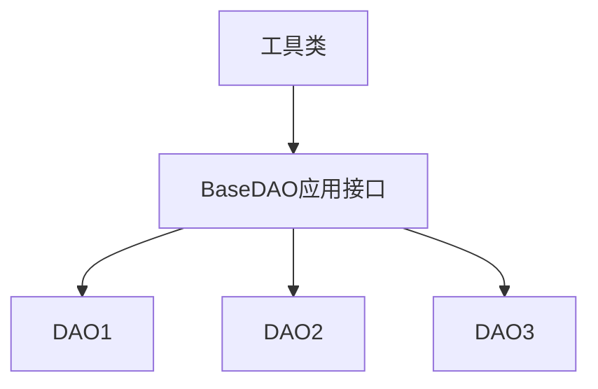

# JDBC技术

## jdbc的基本使用

* 驱动选择
  * 使用方法:使用文件在`lib`引入或`maven`引入,在`pom.xml`中增加

    ```java
    <!-- https://mvnrepository.com/artifact/mysql/mysql-connector-java -->
        <dependency>
            <groupId>mysql</groupId>
            <artifactId>mysql-connector-java</artifactId>
            <version>8.0.28</version>
        </dependency>
    ```

  * 注册版本相关

    ```java
    mysql 5+版本使用 new com.mysql.jdbc.Driver()
    mysql 8+版本使用 new com.mysql.cj.jdbc.Driver()
    ```

* 使用步骤(基础版)
  * 注册驱动
  * 获取链接
  * 创建发送sql语句的对象
  * 发送sql语句,并获取sql返回值
  * 处理返回值对象
  * 关闭连接,销毁对象

    ```java
    public static void useJdbc() throws SQLException{
        //注册驱动
        class.forName("com.mysql.cj.jdbc.Driver") 

        //获取链接(使用8.0.25以上版本jdbc无需设置时区)
        Connection conn = DriverManager.getConnection("jdbc:mysql://127.0.0.1:3306/db?useUnicode=true&characterEncoding=utf8&useSSL=true","root","123456");

        //创建statement对象并发送sql语句
        //Statement statement = conn.createStatement();
        //String sql = "SELECT * FROM numbers";
        //ResultSet rs = statement.executeQuery(sql);
        //PreparedStatement对象使用
        String sql = "SELECT * FROM numbers WHERE num == ?";
        PreparedStatement ps = connect.preparedStatement(sql);
        ps.setObject(1,1000);
        ResultSet rs = ps.excuteQuery();

        //处理ResultSet对象
        while(rs.next()){
            String name = rs.getString("name");
            int age = rs.getInt("age");
            System.out.println(name + '\t' + age);
        }

        //释放对象,关闭连接
        rs.close();
        statement.close();
        conn.close();
    }
    ```

## 注册驱动

* 基础方案使用`DriverManager.registerDriver(new Driver());`
  * 该方法在`registerDriver`方法中注册一次驱动
  * 而在`new Driver()`时会触发`Driver`类的静态代码块也会注册一次驱动
  * 相当于注册了两次驱动
* **仅进行一次驱动注册**:只触发静态代码块(在类加载的时刻触发)
  * class加载机制
    * 加载:class文件->jvm中的class对象
    * 连接:验证文件类型->准备静态变量值->解析触发静态代码块
    * 初始化:静态变量赋真实值
  * 类加载触发方式
    * new一个类对象
    * 调用类静态方法
    * 调用静态属性
    * 接口的default实现也会触发
    * **反射**
    * 子类触发父类
    * 程序入口方法main
  * **使用反射触发**,方便之后通过外部配置文件修改驱动

    ```java
    //反射触发静态代码块注册
    class.forName("com.mysql.cj.jdbc.Driver")
    ```

## 获取连接

* `getConnection`方法,是一个重载方法
* 数据库连接核心属性
  * 数据库所在`ip`地址
  * 数据库端口号
  * 连接数据库名称
  * 账号密码
  * 可选信息
* 3个参数方法
  * url:字符串类型,数据库所在地址和库名,以及其他可选信息,语法:`jdbc:数据库管理软件名称[mysql/oracle]://ip地址:port端口号/数据库名称?key=value&key==value(可选信息键值对)`
  >如果是本机默认端口3306,可省略为`jdbc:mysql:///db1`,两个一起省略
  * user:字符串类型,数据库账号
  * password:字符串类型,数据库密码
* 2个参数方法
  * url:同上
  * info:`properties`类,均为string的key:value对,用于标记用户账户信息,类似map,使用put方法放入
* 1个参数方法
  * url:格式同上,使用可选参数`user=root&password=123456`传入账户信息
* **一般选择3个参数方法**
* url路径可选信息(8版本以后省略)
  * `serverTimezone=Asia/Shanghai`(8.0.25以后不用添加版本)
  * `useUnicode=true`
  * `characterEncoding=utf8`
  * `useSSL=true`

## 创建statement对象

* `sql`分类
  * `DDL`数据定义语言，用于定义表、列等
  * `DML`数据操作语言，用于定义数据库记录数据和操作
  * `DQL`数据查询语言，用来查询记录数据
  * `DTL`数据事务语言，用来操作事务
  * `DCL`数据控制语言，用来操作用户和授权
  * `TPL`事务控制语言,操作事务
* 2种方法传递`sql`语句
  * executeUpdate方法:返回int类型,执行的是非DQL类型语句,返回值表示受影响的行数;执行DQL类型语句返回0
  * executeQuery方法:返回值是ResultSet对象,执行的是DQL类型语句
* **PreparedStatement使用**:如果有动态值的语句应该使用此方法
  * 编写语句,使用占位符`?`代替需要传入的参数
  * 创建PS对象,使用`connect.preparedStatement(sql);`方法传入sql语句
  * 使用`ps.setObject(index,内容变量)`传入数据,下标从1开始
  * 使用`ps.excuteQuery`方法执行

## 查询结果解析

* 查询结果返回的是ResultSet类中,该类内部有行有列,需要使用对应方法解析
* 逐行获取数据,游标初始在第1行上方,调用next方法,将游标下移一行,如果有下一行返回true,即:`while(rs.next()){处理数据}`
  >移动光标方法很多,但只需要使用next方法就好,查询结果中存在不想要的数据,说明查询条件有问题,应该完善查询条件,而不是使用其他方法跳过
* 获取列数据的方法:get+类型(列下标或列名),列下标从1开始
* 一般批量取使用下标(使用`rs.getMetaData()`转换出结果集列的对象`ResultSetMetaData`,使用`getColumnCount`方法获取列的数目,从1取值),如果需要列名,使用`ResultSetMetaData`的`getColumnLabel(index)`方法获取对应下标的列的别名(使用getColumnName只能够获取名称)
* 一般手动取使用列名(如果查询时使用别名,应该写别名)

## 关闭资源

* 使用close方法关闭资源,逆声明方向依次关闭

## 主键回显

* 在操作时,一般不止对一个表进行操作,将新插入的表项的主键列属性拿回,在其他表插入时使用称为主键回显
* 回显方法

```java
//使用两个参数的connect.preparedStatement()方法
//第二个参数为Statement.RETURN_GENERATED_KEY
PreparedStatement ps = connect.preparedStatement(sql,Statement.RETURN_GENERATED_KEY);

//使用getGeneratedKey方法获取主键返回的对象
ResultSet rs = ps.getGeneratedKeys();
```

## 批量插入

* 执行批量插入操作应该使用下列方法

```java
//告知数据库应该支持批量操作,添加可选属性rewriteBatchedStatements=true
Connection conn = DriverManager.getConnection("jdbc:mysql://127.0.0.1:3306/db?rewriteBatchedStatements=true&useUnicode=true&characterEncoding=utf8&useSSL=true","root","123456");

//使用values而不是value插入,不在末尾添加;
String sql = "INSERT INTO number(id) values (?)";
PreparedStatement ps = connect.preparedStatement(sql);
for(int i = 0;i < 10000;i++){
  ps.setObject(1,i);

  //不执行语句,增加新的行
  ps.addBatch();
}
//执行所有批处理操作
ps.excuteBatch();
```

## 事务操作

* 使用事务:必须使用同一个连接操作sql语句

```java
public class Transaction {
  
  @Test
  public void transacted() throws Exception {
      Class.forName("com.jdbc.cj.jdbc.Driver");

      Connection conn = DriverManager.getConnection("jdbc:mysql://localhost:3306/db1","root","123456");

      try {
        //关闭自动提交
        conn.setAutoCommit(false);
        addMoney(conn,"name1",500);
        subMoney(conn,"name2",500);
        //提交事务
        conn.commit();
      }catch (SQLException e) {
        //回滚事务
        conn.rollback();
        //抛出异常
        throw e;
      }finally {
        conn.close();
      }

  }

  private void addMoney(Connection conn, String name1, int money) throws Exception{
    PreparedStatement stmt = conn.prepareStatement("UPDATE bank SET money = money + ? WHERE name = ?");
    stmt.setString(1, name1);
    stmt.setInt(2, money);
    stmt.executeUpdate();
    stmt.close();
  }

  private void subMoney(Connection conn, String name2, int money) throws Exception{
    PreparedStatement stmt = conn.prepareStatement("UPDATE bank SET money = money - ? WHERE name = ?");
    stmt.setString(1, name2);
    stmt.setInt(2, money);
    stmt.executeUpdate();
    stmt.close();
  }
}
```

## 连接池

* 将连接回收保存,节约每次创建和释放连接的时间
* java中`javax.sql.DataSource`接口规范了连接池获取和回收连接的方法
* Druid连接池使用

* 硬编码方式(参数写在代码内)

```java
    public void getStart() throws Exception {
        DruidDataSource source = new DruidDataSource();

        //设置必须参数
        source.setDriverClassName("com.mysql.cj.jdbc.Driver");
        source.setUsername("root");
        source.setPassword("root");
        source.setUrl("jdbc:mysql://127.0.0.1:3306/db1");

        //非必须参数
        source.setInitialSize(5); //初始连接数目
        source.setMaxActive(10); //最大连接数目

        //获取连接
        Connection connection = source.getConnection();

        //回收连接
        connection.close();
    }
```

* 软编码方式

```properties
# properties配置文件固定命名
driverClassName=com.mysql.cj.jdbc.Driver
username=root
password=root
url=jdbc:mysql:///db1
```

```java
public void getStart() throws Exception {
  //读取配置文件
  Properties properties = new Properties();
  BufferedReader bufferedReader = new BufferedReader(new FileReader("src/main/resources/druid.properties"));
  properties.load(bufferedReader);
  //利用工厂方法创建
  DataSource dataSource = DruidDataSourceFactory.createDataSource(properties);
  bufferedReader.close();

  //获取连接
  Connection connection = dataSource.getConnection();

  //回收连接
  connection.close();
}
```

## 创建对应的工具类和应用类

* 结构



* 工具类
  * 版本1:不考虑事务,每次获取都提供不同的连接

  ```java
  /**
   *        V1.0版本的工具类
   *
   *        提供获取连接池连接和回收连接的操作
   *
   *        内部使用static代码块完成创建连接池工作
   *
   */
  public class JdbcUtil1 {

      public static DataSource dataSource = null;

      static {
          try {
              Properties properties = new Properties();
              BufferedReader reader = new BufferedReader(new FileReader("src/main/resources/druid.properties"));
              properties.load(reader);

              dataSource = DruidDataSourceFactory.createDataSource(properties);

              reader.close();
          } catch (Exception e) {
              e.printStackTrace();
          }
      }

      /**
       * 获取连接池连接
       * @return 连接池中的连接
       * @throws SQLException
       */
      public static Connection getConnection() throws SQLException {
          return dataSource.getConnection();
      }

      /**
       * 回收连接
       * @throws SQLException
       */
      public static void freeConnection(Connection connection) throws SQLException {
          connection.close();
      }
  }
  ```

  * 版本2:考虑事务,对同线程提供相同连接

  ```java
  /**
   *        V2.0版本的工具类
   *
   *        提供获取连接池连接和回收连接的操作
   *        内部使用static代码块完成创建连接池工作
   *
   *        另外:对于相同线程,应该使用相同连接,方便开启事务
   *        可以使用ThreadLocal存储线程本地变量
   *        在提供连接时,先查看本地变量是否存在,不存在再获取并存储
   *        回收时,不需要提供连接信息,直接从本地变量中取,如果本地变量不为空,释放
   *
   */
  public class JdbcUtil2 {

      public static DataSource dataSource = null;

      public static ThreadLocal<Connection> tl = new ThreadLocal<>();

      static {
          try {
              Properties properties = new Properties();
              BufferedReader reader = new BufferedReader(new FileReader("src/main/resources/druid.properties"));
              properties.load(reader);

              dataSource = DruidDataSourceFactory.createDataSource(properties);

              reader.close();
          } catch (Exception e) {
              e.printStackTrace();
          }
      }

      /**
       * 获取连接
       * @return 连接池中的连接
       * @throws SQLException
       */
      public static Connection getConnection() throws SQLException {
          Connection connection = tl.get();

          //如果不存在本地变量,获取并存入
          if (connection == null) {
              connection = dataSource.getConnection();
              tl.set(connection);
          }

          return connection;
      }

      /**
       * 回收连接
       * @throws SQLException
       */
      public static void freeConnection() throws SQLException {
          Connection connection = tl.get();
          if(connection != null) {
              //移除本地变量
              tl.remove();

              //还原变量
              connection.setAutoCommit(true);

              //回收连接
              connection.close();
          }
      }
  }
  ```

* 高级封装(DAO应用类):针对增删查改进行专门封装,使用工具类完成

> 分成两部分,一部分简化DQL,一部分简化非DQL

```java
/**
 * 基础DAO类,是所有DAO类的父类
 */
public abstract class BaseDAO {
    /**
     * 非DQL操作
     * @param sql 非查询操作sql语句
     * @param params 需要添加的占位符参数,从前往后,应该等于占位符数量
     * @return 语句影响行数
     * @throws SQLException
     */
    public static int executeUpdate(String sql,Object... params) throws SQLException {
        //获取连接
        Connection conn = JdbcUtil2.getConnection();

        //占位符赋值
        PreparedStatement preparedStatement = conn.prepareStatement(sql);
        if (params != null && params.length > 0) {
            for (int i = 1; i <= params.length; i++) {
                preparedStatement.setObject(i,params[i - 1]);
            }
        }

        //执行sql操作
        int rows = preparedStatement.executeUpdate();

        //关闭资源
        preparedStatement.close();
        //true说明没有开启事务
        if (conn.getAutoCommit()){
            JdbcUtil2.freeConnection();
        }

        return rows;
    }

    /**
     * DQL操作
     * @param tClass 查询完成后存储的类类型,方便之后使用反射等机制
     * @param sql sql查询字符串,要求查询的列别名和提供的类内属性名一致
     * @param params 需要添加的占位符参数,从前往后,应该等于占位符数量
     * @param <T> 需要存储的类的名称
     * @return 查询结果列表
     * @throws SQLException
     * @throws InstantiationException
     * @throws NoSuchMethodException
     * @throws InvocationTargetException
     * @throws IllegalAccessException
     * @throws NoSuchFieldException
     */
    public static <T> List<T> executeQuery(Class<T> tClass,String sql, Object... params) throws SQLException, InstantiationException, NoSuchMethodException, InvocationTargetException, IllegalAccessException, NoSuchFieldException {
        //获取连接
        Connection conn = JdbcUtil2.getConnection();

        //占位符赋值
        PreparedStatement preparedStatement = conn.prepareStatement(sql);
        if (params != null && params.length > 0) {
            for (int i = 1; i <= params.length; i++) {
                preparedStatement.setObject(i,params[i - 1]);
            }
        }

        ResultSet rs = preparedStatement.executeQuery();
        ResultSetMetaData metaData = rs.getMetaData();
        int columnCount = metaData.getColumnCount();

        List<T> list = new ArrayList<T>();
        while (rs.next()) {
            T t = tClass.getDeclaredConstructor().newInstance();

            for (int i = 1; i <= rs.getMetaData().getColumnCount(); i++){
                Object value = rs.getObject(i);
                String propertyName = metaData.getColumnLabel(i);

                //反射赋值
                Field field = tClass.getDeclaredField(propertyName);
                field.setAccessible(true);
                field.set(t, value);
            }

            list.add(t);
        }

        rs.close();
        preparedStatement.close();

        //true说明没有开启事务
        if (conn.getAutoCommit()){
            JdbcUtil2.freeConnection();
        }

        return list;
    }
}
```
