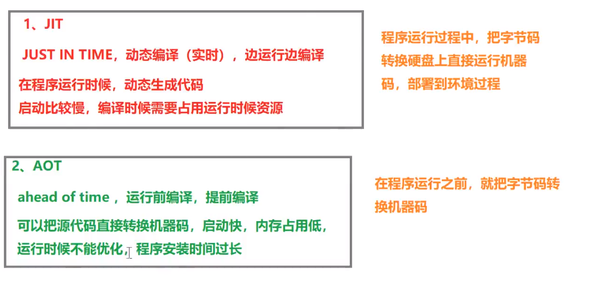

# spring

## 依赖

* 使用maven进行包管理,引入spring

```xml
<!-- 引入spring IoC相关依赖 -->
<dependency>
    <groupId>org.springframework</groupId>
    <artifactId>spring-context</artifactId>
    <version>6.0.3</version>
</dependency>

<!-- 引入spring AOP相关依赖 -->
<!--spring aop依赖-->
<dependency>
    <groupId>org.springframework</groupId>
    <artifactId>spring-aop</artifactId>
    <version>6.0.2</version>
</dependency>
<!--spring aspects依赖-->
<dependency>
    <groupId>org.springframework</groupId>
    <artifactId>spring-aspects</artifactId>
    <version>6.0.2</version>
</dependency>

<!--spring对junit的支持相关依赖-->
<dependency>
    <groupId>org.springframework</groupId>
    <artifactId>spring-test</artifactId>
    <version>6.0.2</version>
</dependency>

<!-- 事务相关 -->
<!--spring jdbc  Spring 持久化层支持jar包-->
<dependency>
    <groupId>org.springframework</groupId>
    <artifactId>spring-jdbc</artifactId>
    <version>6.0.2</version>
</dependency>
<!-- MySQL驱动 -->
<dependency>
    <groupId>mysql</groupId>
    <artifactId>mysql-connector-java</artifactId>
    <version>8.0.30</version>
</dependency>
<!-- 数据源 -->
<dependency>
    <groupId>com.alibaba</groupId>
    <artifactId>druid</artifactId>
    <version>1.2.15</version>
</dependency>

<!-- validation相关依赖 -->
<dependency>
    <groupId>org.hibernate.validator</groupId>
    <artifactId>hibernate-validator</artifactId>
    <version>7.0.5.Final</version>
</dependency>

<dependency>
    <groupId>org.glassfish</groupId>
    <artifactId>jakarta.el</artifactId>
    <version>4.0.1</version>
</dependency>
```

## 使用xml配置IoC

* 使用xml文件
  * 建立spring的xml文件,名称随意
  * 使用ApplicationContext接口,一般创建该接口的实现类`new ClassPathXmlApplicationContext(classpath)`完成引入
  * 使用接口中的getBean方法完成类获取
* 有关bean标签的使用

```xml
<?xml version="1.0" encoding="UTF-8"?>
<beans xmlns="http://www.springframework.org/schema/beans"
       xmlns:xsi="http://www.w3.org/2001/XMLSchema-instance"
       xsi:schemaLocation="http://www.springframework.org/schema/beans http://www.springframework.org/schema/beans/spring-beans.xsd">
    <!-- 最基础版本配置,默认为单例,使用scope="prototype"修改创建方式 -->
    <!-- 默认调用无参构造方法,可以使用constructor-arg使用有参方法,name为参数名,value/ref为值 -->
    <bean name="user" class="com.xmlTest.User"></bean>

    <!-- 为其中属性在xml文件中赋值,需要对应属性实现public的set方法 -->
    <!-- map赋值使用map -->
    <bean name="user" class="com.IocTest.User">
    <!-- String,int等赋值使用value字段 -->
    <!-- 特殊字符需要进行处理 -->
    <!-- 空使用<null/>标签 -->
    <!-- <,>使用转译&lt;和&rt;或使用子value标签后用![CDATA[<>]]包裹 -->
    <property name="uid" value="123"></property>
    <!-- 类赋值使用ref字段 -->
    <!-- 也可以使用子标签bean赋值 -->
    <!-- 还可以使用name为dep1.name1方式级联赋值 -->
    <property name="dep" ref="dep1"></property>
    <!-- 数组赋值使用array -->
    <property name="array">
        <array>
            <value>103</value>
            <value>123</value>
        </array>
    </property>
    <!-- list赋值使用list -->
    <property name="list">
        <list>
            <ref bean="One"></ref>
            <ref bean="Two"></ref>
            <ref bean="Three"></ref>
        </list>
    </property>
    <!-- map赋值使用map -->
    <property name="map">
        <map>
            <entry>
                <key>
                    <value>1001</value>
                </key>
                <ref bean="o"></ref>
            </entry>
            <entry>
                <key>
                    <value>1002</value>
                </key>
                <ref bean="t"></ref>
            </entry>
        </map>
    </property>
    </bean>
    <bean name="dep1" class="com.IocTest.dep"></bean>

    <!-- 自动装配 -->
    <!-- 如果只能找到一个匹配项即可使用自动装配 -->
    <!-- 有byType和byName两种方式 -->
    <bean id="userController" class="com.controller.UserController" autowire="byType"></bean>

    <bean id="userService" class="com.service.impl.UserServiceImpl" autowire="byType"></bean>

    <bean id="userDao" class="com.dao.impl.UserDaoImpl"></bean>
</beans>
```

* 使用便捷的命名空间:一般为添加对应xmlns地址和命名空间地址

```xml
<!-- spring命名空间头 -->
<beans xmlns="http://www.springframework.org/schema/beans"
       xmlns:xsi="http://www.w3.org/2001/XMLSchema-instance"
       xsi:schemaLocation="http://www.springframework.org/schema/beans http://www.springframework.org/schema/beans/spring-beans.xsd">
    <!-- 使用util命名空间,为list等命名,使用ref即可为类赋值 -->
    <!-- xmlns:util="http://www.springframework.org/schema/util" -->
    <!-- xsi:schemaLocation添加"http://www.springframework.org/schema/util http://www.springframework.org/schema/util/spring-util.xsd" -->

    <!-- 同理也可以使用p命名空间,便捷赋值 -->
    <!-- xmlns:p="http://www.springframework.org/schema/p" -->
    <!-- xsi:schemaLocation添加"http://www.springframework.org/schema/p http://www.springframework.org/schema/p/spring-p.xsd" -->
</beans>
```

* 引入properties文件,便于以后修改

```properties
jdbc.user=root
jdbc.password=atguigu
jdbc.url=jdbc:mysql://localhost:3306/ssm?serverTimezone=UTC
jdbc.driver=com.mysql.cj.jdbc.Driver
```

```xml
<?xml version="1.0" encoding="UTF-8"?>
<beans xmlns="http://www.springframework.org/schema/beans"
       xmlns:xsi="http://www.w3.org/2001/XMLSchema-instance"
       xmlns:context="http://www.springframework.org/schema/context"
       xsi:schemaLocation="http://www.springframework.org/schema/beans
       http://www.springframework.org/schema/beans/spring-beans.xsd
       http://www.springframework.org/schema/context
       http://www.springframework.org/schema/context/spring-context.xsd">

    <!-- 引入外部属性文件 -->
    <context:property-placeholder location="classpath:jdbc.properties"/>

    <!-- 使用${}方式使用对应值 -->
    <bean id="druidDataSource" class="com.alibaba.druid.pool.DruidDataSource">
        <property name="url" value="${jdbc.url}"/>
        <property name="driverClassName" value="${jdbc.driver}"/>
        <property name="username" value="${jdbc.user}"/>
        <property name="password" value="${jdbc.password}"/>
    </bean>

</beans>
```

## spring细节

>**spring主体内容**

* spring是根据IoC等思想构造的框架,帮助我们管理实例对象
  * IoC主要继承结构
    
  * AOP

---

>**对象创建生命周期**

* 生命周期
  * bean对象创建(调用无参构造器)
  * 给bean对象设置属性
  * bean的后置处理器(初始化之前)
  * bean对象初始化(需在配置bean时指定初始化方法):使用init-method提供方法名
  * bean的后置处理器(初始化之后)
  * bean对象就绪可以使用
  * bean对象销毁(需在配置bean时指定销毁方法):使用destroy-method提供方法名
  * IoC容器关闭:调用ClassPathXmlApplicationContext的close方法

    ```xml
    <!-- 使用init-method属性指定初始化方法 -->
    <!-- 使用destroy-method属性指定销毁方法 -->
    <bean class="com.atguigu.spring6.bean.User" scope="prototype" init-method="initMethod" destroy-method="destroyMethod">
        <property name="id" value="1001"></property>
        <property name="username" value="admin"></property>
        <property name="password" value="123456"></property>
        <property name="age" value="23"></property>
    </bean>
    ```

* 后置处理器:是spring中实现了BeanPostProcessor接口的类,并且配置到容器中,bean后置处理器不是单独针对某一个bean生效,而是针对IoC容器中所有bean都会执行

---

>**FactoryBean整合其他框架**

* FactoryBean:是Spring提供的一种整合第三方框架的常用机制
  * 和普通的bean不同,配置一个FactoryBean类型的bean,在获取bean的时候得到的并不是class属性中配置的这个类的对象,而是getObject()方法的返回值
  * 通过这种机制,Spring可以帮我们把复杂组件创建的详细过程和繁琐细节都屏蔽起来,只把最简洁的使用界面展示给我们

## spring注解配置IoC

* spring使用注解配置方式,首先要配置组件扫描功能,以开启注解读入

```xml
<?xml version="1.0" encoding="UTF-8"?>
<beans xmlns="http://www.springframework.org/schema/beans"
       xmlns:xsi="http://www.w3.org/2001/XMLSchema-instance"
       xmlns:context="http://www.springframework.org/schema/context"
       xsi:schemaLocation="http://www.springframework.org/schema/beans
    http://www.springframework.org/schema/beans/spring-beans-3.0.xsd
    http://www.springframework.org/schema/context
            http://www.springframework.org/schema/context/spring-context.xsd">

    <!--开启基本组件扫描功能,base-package为扫描的包目录-->
    <context:component-scan base-package="com.atguigu.spring6"></context:component-scan>

    <!--过滤器扫描-->
    <context:component-scan base-package="com.atguigu.spring6">
        <!-- context:exclude-filter标签：指定排除规则 -->
        <!-- 
            type：设置排除的依据
            type="annotation",根据注解排除,expression中设置要排除的注解的全类名
            type="assignable",根据类型排除,expression中设置要排除的类型的全类名
        -->
        <context:exclude-filter type="annotation" expression="org.springframework.stereotype.Controller"/>
            <!--<context:exclude-filter type="assignable" expression="com.atguigu.spring6.controller.UserController"/>-->
    </context:component-scan>

    <!-- 扫描指定 -->
    <context:component-scan base-package="com.atguigu" use-default-filters="false">
    <!-- context:include-filter标签：指定在原有扫描规则的基础上追加的规则 -->
    <!-- use-default-filters属性：取值false表示关闭默认扫描规则 -->
    <!-- 此时必须设置use-default-filters="false",因为默认规则即扫描指定包下所有类 -->
    <!-- 
 		type：设置包含的依据
		type="annotation",根据注解包含,expression中设置要包含的注解的全类名
		type="assignable",根据类型包含,expression中设置要包含的类型的全类名
	-->
    <!-- 例: 扫描Controller注解 -->
    <context:include-filter type="annotation" expression="org.springframework.stereotype.Controller"/>
    <!-- 例: 扫描UserController类 -->
    <!--<context:include-filter type="assignable" expression="com.atguigu.spring6.controller.UserController"/>-->
    </context:component-scan>
</beans>
```

---

>**注解的类别和添加方法**

* **类注解**:定义在类上,四种注解效果相同,仅为人为辨别设计,对应不同层

  |注解|说明|
  |---|---|
  | @Component  | 该注解用于描述 Spring 中的 Bean,它是一个泛化的概念,仅仅表示容器中的一个组件（Bean）,并且可以作用在应用的任何层次,例如 Service 层、Dao 层等。  使用时只需将该注解标注在相应类上即可|
  | @Repository | 该注解用于将数据访问层（Dao 层）的类标识为 Spring 中的 Bean,其功能与 @Component 相同|
  | @Service    | 该注解通常作用在业务层（Service 层）,用于将业务层的类标识为 Spring 中的 Bean,其功能与 @Component 相同|
  | @Controller | 该注解通常作用在控制层（如SpringMVC 的 Controller）,用于将控制层的类标识为 Spring 中的 Bean,其功能与 @Component 相同|

* **定义在属性或变量上**:单独使用`@Autowired`注解,**默认根据类型装配**,源码中有两处需要注意:
  * 第一处:该注解可以标注在哪里?
    * 构造方法上
    * 方法上
    * 形参上
    * 属性上
    * 注解上
  * 第二处:该注解有一个required属性,默认值是true,表示在注入的时候要求被注入的Bean必须是存在的,如果不存在则报错。如果required属性设置为false,不存在不报错

    ```java
    package com.atguigu.spring6.service.impl;

    import com.atguigu.spring6.dao.UserDao;
    import com.atguigu.spring6.service.UserService;
    import org.springframework.beans.factory.annotation.Autowired;
    import org.springframework.stereotype.Service;

    @Service
    public class UserServiceImpl implements UserService {

        //下列方法均可注入,选择其一
        //默认根据属性装配,若有多个匹配项,抛出异常
        //1.可通过在属性上写出注解注入
        @Autowired
        private UserDao userDao;

        //2.可通过set方法注入属性中
        @Autowired
        public void setUserDao(UserDao userDao) {
            this.userDao = userDao;
        }

        //3.可通过在构造方法上使用注解注入属性中
        @Autowired
        public UserServiceImpl(UserDao userDao) {
            this.userDao = userDao;
        }

        //4.可通过在构造方法属性上使用注解注入
        public UserServiceImpl(@Autowired UserDao userDao) {
        this.userDao = userDao;
        }

        //5.单一构造方法,不写注解也会注入,需要所有方法字段均可注入
        public UserServiceImpl(UserDao userDao) {
            this.userDao = userDao;
        }
    }
    ```

* **定义在属性或变量上**,**依变量名称注入**,使用`@Autowired`和`@Qualifier`注解

    ```java
    package com.atguigu.spring6.service.impl;

    import com.atguigu.spring6.dao.UserDao;
    import com.atguigu.spring6.service.UserService;
    import org.springframework.beans.factory.annotation.Autowired;
    import org.springframework.stereotype.Service;

    @Service
    public class UserServiceImpl implements UserService {

        @Autowired
        @Qualifier("userDaoImpl") // 指定bean的名字
        private UserDao userDao;

        @Override
        public void out() {
            userDao.print();
            System.out.println("Service层执行结束");
        }
    }
    ```

>**总结**

* 使用类注解标记的bean会交给springIoC管理,这样才能被@Autowired注解注入
* @Autowired注解可以出现在：属性上、构造方法上、构造方法的参数上、setter方法上
* 当带参数的构造方法只有一个，@Autowired注解可以省略
* @Autowired注解默认根据类型注入。如果要根据名称注入的话，需要配合@Qualifier注解一起使用

---

>**使用@Source注解注入**

* **@Resource注解默认根据名称装配byName，未指定name时，使用属性名作为name。通过name找不到的话会自动启动通过类型byType装配。**
* @Resource注解属于JDK扩展包，所以不在JDK当中，需要额外引入以下依赖：【**如果是JDK8的话不需要额外引入依赖。高于JDK11或低于JDK8需要引入以下依赖。**】

    ```xml
    <dependency>
        <groupId>jakarta.annotation</groupId>
        <artifactId>jakarta.annotation-api</artifactId>
        <version>2.1.1</version>
    </dependency>
    ```

* 使用

    ```java
    package com.atguigu.spring6.service.impl;

    import com.atguigu.spring6.dao.UserDao;
    import com.atguigu.spring6.service.UserService;
    import jakarta.annotation.Resource;
    import org.springframework.beans.factory.annotation.Autowired;
    import org.springframework.beans.factory.annotation.Qualifier;
    import org.springframework.stereotype.Service;

    @Service
    public class UserServiceImpl implements UserService {

        //根据name字段注入,可省略name字段,根据属性本身名称注入
        //若未找到对应名称,根据字段注入,出现多个匹配项时报错
        @Resource(name = "myUserDao")
        private UserDao myUserDao;

        @Override
        public void out() {
            myUserDao.print();
            System.out.println("Service层执行结束");
        }
    }
    ```

### 全注解开发

* 使用配置类代替xml配置文件

    ```java
    package com.atguigu.spring6.config;

    import org.springframework.context.annotation.ComponentScan;
    import org.springframework.context.annotation.Configuration;

    //标识为一个配置类
    @Configuration
    //组件扫描某些类
    //@ComponentScan({"com.atguigu.spring6.controller", "com.atguigu.spring6.service","com.atguigu.spring6.dao"})
    //组件扫描包
    @ComponentScan("com.atguigu.spring6")
    public class Spring6Config {
    }
    ```

* 使用该配置类对应的IoC容器

    ```java
    @Test
    public void testAllAnnotation(){
        ApplicationContext context = new AnnotationConfigApplicationContext(Spring6Config.class);
        UserController userController = context.getBean("userController", UserController.class);
        userController.out();
        logger.info("执行成功");
    }
    ```

## AOP

* 使用代理模式,能够将切面相关的代码和业务层功能代码分离,方便代码的维护和管理
* AOP（Aspect Oriented Programming）是一种设计思想，是软件设计领域中的面向切面编程，它是面向对象编程的一种补充和完善，它以通过预编译方式和运行期动态代理方式实现，在不修改源代码的情况下，给程序动态统一添加额外功能的一种技术。利用AOP可以对业务逻辑的各个部分进行隔离，从而使得业务逻辑各部分之间的耦合度降低，提高程序的可重用性，同时提高了开发的效率

>相关术语

* 横切关注点:分散在每个各个模块中解决同一样的问题，如用户验证、日志管理、事务处理、数据缓存都属于横切关注点
  * 从每个方法中抽取出来的同一类非核心业务。在同一个项目中，我们可以使用多个横切关注点对相关方法进行多个不同方面的增强


* 通知（增强）
  * **增强，通俗说，就是你想要增强的功能，比如 安全，事务，日志等**。每一个横切关注点上要做的事情都需要写一个方法来实现，这样的方法就叫通知方法
  * 前置通知：在被代理的目标方法**前**执行
  * 返回通知：在被代理的目标方法**成功结束**后执行（**寿终正寝**）
  * 异常通知：在被代理的目标方法**异常结束**后执行（**死于非命**）
  * 后置通知：在被代理的目标方法**最终结束**后执行（**盖棺定论**）
  * 环绕通知：使用try...catch...finally结构围绕**整个**被代理的目标方法，包括上面四种通知对应的所有位置


* 切面:封装通知方法的类


* 目标:被代理的目标对象

* 代理:向目标对象应用通知之后创建的代理对象

* 连接点:这也是一个纯逻辑概念，不是语法定义的
  * 把方法排成一排，每一个横切位置看成x轴方向，把方法从上到下执行的顺序看成y轴，x轴和y轴的交叉点就是连接点。**通俗说，就是spring允许你使用通知的地方**


* 切入点:定位连接点的方式
  * 每个类的方法中都包含多个连接点，所以连接点是类中客观存在的事物（从逻辑上来说）
  * 如果把连接点看作数据库中的记录，那么切入点就是查询记录的 SQL 语句

* **Spring 的 AOP 技术可以通过切入点定位到特定的连接点。通俗说，要实际去增强的方法**
* 切点通过 org.springframework.aop.Pointcut 接口进行描述，它使用类和方法作为连接点的查询条件

* 切入点表达式: 

---

* 基于注解配置动态代理
  * 动态代理分为JDK动态代理和cglib动态代理
  * 当目标类有接口的情况使用JDK动态代理和cglib动态代理，没有接口时只能使用cglib动态代理
  * JDK动态代理动态生成的代理类会在com.sun.proxy包下，类名为$proxy1，和目标类实现相同的接口
  * cglib动态代理动态生成的代理类会和目标在在相同的包下，会继承目标类
  * 动态代理（InvocationHandler）：JDK原生的实现方式，需要被代理的目标类必须实现接口。因为这个技术要求**代理对象和目标对象实现同样的接口**（兄弟两个拜把子模式）
  * cglib：通过**继承被代理的目标类**（认干爹模式）实现代理，所以不需要目标类实现接口
  * AspectJ：是AOP思想的一种实现。本质上是静态代理，**将代理逻辑“织入”被代理的目标类编译得到的字节码文件**，所以最终效果是动态的。weaver就是织入器。Spring只是借用了AspectJ中的注解
    
    

---

>**实现**

* 切面类编写

    ```java
    // @Aspect表示这个类是一个切面类
    @Aspect
    // @Component注解保证这个切面类能够放入IoC容器
    @Component
    public class LogAspect {
        //execution( ... )称为表达式,表示需要切入哪些方法
        //内需要填入[方法类型 返回值类型] 方法所属类.方法名称(参数列表)
        //支持使用*表示全类型 ...表示任意参数函数

        @Before("execution(public int com.atguigu.aop.annotation.CalculatorImpl.*(..))")
        public void beforeMethod(JoinPoint joinPoint){
            String methodName = joinPoint.getSignature().getName();
            String args = Arrays.toString(joinPoint.getArgs());
            System.out.println("Logger-->前置通知，方法名："+methodName+"，参数："+args);
        }

        @After("execution(* com.atguigu.aop.annotation.CalculatorImpl.*(..))")
        public void afterMethod(JoinPoint joinPoint){
            String methodName = joinPoint.getSignature().getName();
            System.out.println("Logger-->后置通知，方法名："+methodName);
        }

        //返回通知能够获取返回值
        @AfterReturning(value = "execution(* com.atguigu.aop.annotation.CalculatorImpl.*(..))", returning = "result")
        public void afterReturningMethod(JoinPoint joinPoint, Object result){
            String methodName = joinPoint.getSignature().getName();
            System.out.println("Logger-->返回通知，方法名："+methodName+"，结果："+result);
        }

        //异常通知能够获取异常信息
        @AfterThrowing(value = "execution(* com.atguigu.aop.annotation.CalculatorImpl.*(..))", throwing = "ex")
        public void afterThrowingMethod(JoinPoint joinPoint, Throwable ex){
            String methodName = joinPoint.getSignature().getName();
            System.out.println("Logger-->异常通知，方法名："+methodName+"，异常："+ex);
        }
        
        @Around("execution(* com.atguigu.aop.annotation.CalculatorImpl.*(..))")
        public Object aroundMethod(ProceedingJoinPoint joinPoint){
            String methodName = joinPoint.getSignature().getName();
            String args = Arrays.toString(joinPoint.getArgs());
            Object result = null;
            try {
                System.out.println("环绕通知-->目标对象方法执行之前");
                //目标对象（连接点）方法的执行
                result = joinPoint.proceed();
                System.out.println("环绕通知-->目标对象方法返回值之后");
            } catch (Throwable throwable) {
                throwable.printStackTrace();
                System.out.println("环绕通知-->目标对象方法出现异常时");
            } finally {
                System.out.println("环绕通知-->目标对象方法执行完毕");
            }
            return result;
        }
        
    }
    ```

* 使用xml文件配置自动注解

    ```xml
    <?xml version="1.0" encoding="UTF-8"?>
    <beans xmlns="http://www.springframework.org/schema/beans"
        xmlns:xsi="http://www.w3.org/2001/XMLSchema-instance"
        xmlns:context="http://www.springframework.org/schema/context"
        xmlns:aop="http://www.springframework.org/schema/aop"
        xsi:schemaLocation="http://www.springframework.org/schema/beans
        http://www.springframework.org/schema/beans/spring-beans.xsd
        http://www.springframework.org/schema/context
        http://www.springframework.org/schema/context/spring-context.xsd
        http://www.springframework.org/schema/aop
        http://www.springframework.org/schema/aop/spring-aop.xsd">
        <!--
            基于注解的AOP的实现：
            1、将目标对象和切面交给IoC容器管理（注解+扫描）
            2、开启AspectJ的自动代理，为目标对象自动生成代理
            3、将切面类通过注解@Aspect标识
        -->
        <context:component-scan base-package="com.atguigu.aop.annotation"></context:component-scan>

        <aop:aspectj-autoproxy />
    </beans>
    ```

* 使用xml文件自行配置代理

    ```xml
    <?xml version="1.0" encoding="UTF-8"?>
    <beans xmlns="http://www.springframework.org/schema/beans"
        xmlns:xsi="http://www.w3.org/2001/XMLSchema-instance"
        xmlns:context="http://www.springframework.org/schema/context"
        xmlns:aop="http://www.springframework.org/schema/aop"
        xsi:schemaLocation="http://www.springframework.org/schema/beans
        http://www.springframework.org/schema/beans/spring-beans.xsd
        http://www.springframework.org/schema/context
        http://www.springframework.org/schema/context/spring-context.xsd
        http://www.springframework.org/schema/aop
        http://www.springframework.org/schema/aop/spring-aop.xsd">
        <context:component-scan base-package="com.atguigu.aop.xml"></context:component-scan>

        <aop:config>
            <!--配置切面类-->
            <aop:aspect ref="loggerAspect">
                <aop:pointcut id="pointCut" 
                        expression="execution(* com.atguigu.aop.xml.CalculatorImpl.*(..))"/>
                <aop:before method="beforeMethod" pointcut-ref="pointCut"></aop:before>
                <aop:after method="afterMethod" pointcut-ref="pointCut"></aop:after>
                <aop:after-returning method="afterReturningMethod" returning="result" pointcut-ref="pointCut"></aop:after-returning>
                <aop:after-throwing method="afterThrowingMethod" throwing="ex" pointcut-ref="pointCut"></aop:after-throwing>
                <aop:around method="aroundMethod" pointcut-ref="pointCut"></aop:around>
            </aop:aspect>
        </aop:config>
    </beans>
    ```

## 事务

* spring对jdbc操作封装,需要引入依赖

    ```xml
    <dependencies>
        <!--spring jdbc  Spring 持久化层支持jar包-->
        <dependency>
            <groupId>org.springframework</groupId>
            <artifactId>spring-jdbc</artifactId>
            <version>6.0.2</version>
        </dependency>
        <!-- MySQL驱动 -->
        <dependency>
            <groupId>mysql</groupId>
            <artifactId>mysql-connector-java</artifactId>
            <version>8.0.30</version>
        </dependency>
        <!-- 数据源 -->
        <dependency>
            <groupId>com.alibaba</groupId>
            <artifactId>druid</artifactId>
            <version>1.2.15</version>
        </dependency>
    </dependencies>
    ```

* jdbc封装类JdbcTemplate及其使用
  * 创建

    ```java
    public class JDBCTemplateTest {

        @Autowired
        private JdbcTemplate jdbcTemplate;
        
    }
    ```

  * 功能大全

    |函数名|参数列表|功能|
    |---|---|---|
    |update|sql, ...args|执行sql语句完成增删改操作, args为填入sql的参数, 返回操作影响行数|
    |queryForObject|sql, requiredType, rowMapper, ...args|执行sql语句,将结果返回,**非常灵活,有多种重载方式**,参数requireType和rowMapper均可选, requireType为将查询结果强转为此类型, 如Integer; rowMapper为一个接口,返回不同类型数据,使用这个接口里面的实现类完成数据的封装,可使用子类BeanPropertyRowMapper\<T>,它首先将这个类实例化,然后通过名称匹配的方式,映射到属性中去,也可以自己实现rowMapper接口|
    |query|sql,rowMapper, ...args|查询返回List,在rowMapper完成封装|
    |batchUpdate|sql,list|批量更新,list为List\<Object[]>类型

  * 测试增删改功能

    ```java
    @Test
    //测试增删改功能
    public void testUpdate(){
        //添加功能
    String sql = "insert into t_emp values(null,?,?,?)";
    int result = jdbcTemplate.update(sql, "张三", 23, "男");
        
        //修改功能
    //String sql = "update t_emp set name=? where id=?";
        //int result = jdbcTemplate.update(sql, "张三atguigu", 1);

        //删除功能
    //String sql = "delete from t_emp where id=?";
    //int result = jdbcTemplate.update(sql, 1);
    }
    ```

  * 查询数据返回对象

    ```java
    public class Emp {

        private Integer id;
        private String name;
        private Integer age;
        private String sex;

        //生成get和set方法
        //......

        @Override
        public String toString() {
            return "Emp{" +
                    "id=" + id +
                    ", name='" + name + '\'' +
                    ", age=" + age +
                    ", sex='" + sex + '\'' +
                    '}';
        }
    }
    ```

    ```java
    //查询：返回对象
    @Test
    public void testSelectObject() {
        //写法一
    //        String sql = "select * from t_emp where id=?";
    //        Emp empResult = jdbcTemplate.queryForObject(sql,
    //                (rs, rowNum) -> {
    //                    Emp emp = new Emp();
    //                    emp.setId(rs.getInt("id"));
    //                    emp.setName(rs.getString("name"));
    //                    emp.setAge(rs.getInt("age"));
    //                    emp.setSex(rs.getString("sex"));
    //                    return emp;
    //                }, 1);
    //        System.out.println(empResult);

        //写法二
        String sql = "select * from t_emp where id=?";
        Emp emp = jdbcTemplate.queryForObject(sql,
                    new BeanPropertyRowMapper<>(Emp.class),1);
        System.out.println(emp);
    }
    ```

  * 查询数据返回list集合

    ```java
    @Test
    //查询多条数据为一个list集合
    public void testSelectList(){
        String sql = "select * from t_emp";
        List<Emp> list = jdbcTemplate.query(sql, new BeanPropertyRowMapper<>(Emp.class));
        System.out.println(list);
    }
    ```

  * 查询返回单个的值

    ```java
    @Test
    //查询单行单列的值
    public void selectCount(){
        String sql = "select count(id) from t_emp";
        Integer count = jdbcTemplate.queryForObject(sql, Integer.class);
        System.out.println(count);
    }
    ```

### 事务声明和操作

* 使用tx命名空间配置bean.xml文件

    ```xml
    <?xml version="1.0" encoding="UTF-8"?>
    <beans xmlns="http://www.springframework.org/schema/beans"
        xmlns:xsi="http://www.w3.org/2001/XMLSchema-instance"
        xmlns:context="http://www.springframework.org/schema/context"
        xmlns:tx="http://www.springframework.org/schema/tx"
        xsi:schemaLocation="http://www.springframework.org/schema/beans
        http://www.springframework.org/schema/beans/spring-beans.xsd
        http://www.springframework.org/schema/context
        http://www.springframework.org/schema/context/spring-context.xsd
        http://www.springframework.org/schema/tx
        http://www.springframework.org/schema/tx/spring-tx.xsd">
        <!-- 导入外部属性文件 -->
        <context:property-placeholder location="classpath:jdbc.properties" />

        <!-- 配置数据源 -->
        <bean id="druidDataSource" class="com.alibaba.druid.pool.DruidDataSource">
            <property name="url" value="${jdbc.url}"/>
            <property name="driverClassName" value="${jdbc.driver}"/>
            <property name="username" value="${jdbc.user}"/>
            <property name="password" value="${jdbc.password}"/>
        </bean>

        <!-- 配置 JdbcTemplate -->
        <bean id="jdbcTemplate" class="org.springframework.jdbc.core.JdbcTemplate">
            <!-- 装配数据源 -->
            <property name="dataSource" ref="druidDataSource"/>
        </bean>

        <!--
            开启事务的注解驱动
            通过注解@Transactional所标识的方法或标识的类中所有的方法，都会被事务管理器管理事务
        -->
        <!-- transaction-manager属性的默认值是transactionManager，如果事务管理器bean的id正好就是这个默认值，则可以省略这个属性 -->
        <tx:annotation-driven transaction-manager="transactionManager" />
    </beans>
    ```

  * 使用注解配置事务

    ```java
    //事务注解@Transactional
    //属性readOnly设置为真,表示只读不写入,方便数据库优化
    @Transactional(readOnly = true)
    //超时时间单位秒
    //@Transactional(timeout = 3)
    public void buyBook(Integer bookId, Integer userId) {
        //查询图书的价格
        Integer price = bookDao.getPriceByBookId(bookId);
        //更新图书的库存
        bookDao.updateStock(bookId);
        //更新用户的余额
        bookDao.updateBalance(userId, price);
        //System.out.println(1/0);
    }
    ```

  * 异常处理:声明式事务默认只针对运行时异常回滚，编译时异常不回滚,可以通过@Transactional中相关属性设置回滚策略
    * rollbackFor属性：需要设置一个Class类型的对象
    * rollbackForClassName属性：需要设置一个字符串类型的全类名

    * noRollbackFor属性：需要设置一个Class类型的对象
    * rollbackFor属性：需要设置一个字符串类型的全类名

    ```java
    //虽然购买图书功能中出现了数学运算异常(ArithmeticException)
    //但是我们设置的回滚策略是，当出现ArithmeticException不发生回滚
    //因此购买图书的操作正常执行
    @Transactional(noRollbackFor = ArithmeticException.class)
    //@Transactional(noRollbackForClassName = "java.lang.ArithmeticException")
    public void buyBook(Integer bookId, Integer userId) {
        //查询图书的价格
        Integer price = bookDao.getPriceByBookId(bookId);
        //更新图书的库存
        bookDao.updateStock(bookId);
        //更新用户的余额
        bookDao.updateBalance(userId, price);
        System.out.println(1/0);
    }
    ```

  * 全注解配置

    ```java
    package com.atguigu.spring6.config;

    import com.alibaba.druid.pool.DruidDataSource;
    import org.springframework.context.annotation.Bean;
    import org.springframework.context.annotation.ComponentScan;
    import org.springframework.context.annotation.Configuration;
    import org.springframework.jdbc.core.JdbcTemplate;
    import org.springframework.jdbc.datasource.DataSourceTransactionManager;
    import org.springframework.transaction.annotation.EnableTransactionManagement;
    import javax.sql.DataSource;

    @Configuration
    @ComponentScan("com.atguigu.spring6")
    @EnableTransactionManagement
    public class SpringConfig {

        @Bean
        public DataSource getDataSource(){
            DruidDataSource dataSource = new DruidDataSource();
            dataSource.setDriverClassName("com.mysql.cj.jdbc.Driver");
            dataSource.setUrl("jdbc:mysql://localhost:3306/spring?characterEncoding=utf8&useSSL=false");
            dataSource.setUsername("root");
            dataSource.setPassword("root");
            return dataSource;
        }

        @Bean(name = "jdbcTemplate")
        public JdbcTemplate getJdbcTemplate(DataSource dataSource){
            JdbcTemplate jdbcTemplate = new JdbcTemplate();
            jdbcTemplate.setDataSource(dataSource);
            return jdbcTemplate;
        }

        @Bean
        public DataSourceTransactionManager getDataSourceTransactionManager(DataSource dataSource){
            DataSourceTransactionManager dataSourceTransactionManager = new DataSourceTransactionManager();
            dataSourceTransactionManager.setDataSource(dataSource);
            return dataSourceTransactionManager;
        }
    }
    ```

### 事务属性:隔离级别

* **①介绍**

数据库系统必须具有隔离并发运行各个事务的能力，使它们不会相互影响，避免各种并发问题。一个事务与其他事务隔离的程度称为隔离级别。SQL标准中规定了多种事务隔离级别，不同隔离级别对应不同的干扰程度，隔离级别越高，数据一致性就越好，但并发性越弱

隔离级别一共有四种：

* 读未提交：READ UNCOMMITTED

  允许Transaction01读取Transaction02未提交的修改

* 读已提交：READ COMMITTED

  要求Transaction01只能读取Transaction02已提交的修改

* 可重复读：REPEATABLE READ

  确保Transaction01可以多次从一个字段中读取到相同的值，即Transaction01执行期间禁止其它事务对这个字段进行更新

* 串行化：SERIALIZABLE

  确保Transaction01可以多次从一个表中读取到相同的行，在Transaction01执行期间，禁止其它事务对这个表进行添加、更新、删除操作。可以避免任何并发问题，但性能十分低下

各个隔离级别解决并发问题的能力见下表：

| 隔离级别         | 脏读 | 不可重复读 | 幻读 |
| ---------------- | ---- | ---------- | ---- |
| READ UNCOMMITTED | 有   | 有         | 有   |
| READ COMMITTED   | 无   | 有         | 有   |
| REPEATABLE READ  | 无   | 无         | 有   |
| SERIALIZABLE     | 无   | 无         | 无   |

各种数据库产品对事务隔离级别的支持程度：

| 隔离级别         | Oracle  | MySQL   |
| ---------------- | ------- | ------- |
| READ UNCOMMITTED | ×       | √       |
| READ COMMITTED   | √(默认) | √       |
| REPEATABLE READ  | ×       | √(默认) |
| SERIALIZABLE     | √       | √       |

* **②使用方式**

```java
@Transactional(isolation = Isolation.DEFAULT)//使用数据库默认的隔离级别
@Transactional(isolation = Isolation.READ_UNCOMMITTED)//读未提交
@Transactional(isolation = Isolation.READ_COMMITTED)//读已提交
@Transactional(isolation = Isolation.REPEATABLE_READ)//可重复读
@Transactional(isolation = Isolation.SERIALIZABLE)//串行化
```

### 事务属性:传播行为

* 什么是事务的传播行为？
  * 在service类中有a()方法和b()方法，a()方法上有事务，b()方法上也有事务，当a()方法执行过程中调用了b()方法，事务是如何传递的？合并到一个事务里？还是开启一个新的事务？这就是事务传播行为
* 一共有七种传播行为:
  * ==REQUIRED==:支持当前事务，如果不存在就新建一个(默认),**【没有就新建，有就加入】**
  * SUPPORTS:支持当前事务，如果当前没有事务，就以非事务方式执行,**【有就加入，没有就不管了】**
  * MANDATORY:必须运行在一个事务中，如果当前没有事务正在发生，将抛出一个异常,**【有就加入，没有就抛异常】**
  * ==REQUIRES_NEW==:开启一个新的事务，如果一个事务已经存在，则将这个存在的事务挂起,**【不管有没有，直接开启一个新事务，开启的新事务和之前的事务不存在嵌套关系，之前事务被挂起】**
  * NOT_SUPPORTED:以非事务方式运行，如果有事务存在，挂起当前事务,**【不支持事务，存在就挂起】**
  * NEVER:以非事务方式运行，如果有事务存在，抛出异常,**【不支持事务，存在就抛异常】**
  * NESTED:如果当前正有一个事务在进行中，则该方法应当运行在一个嵌套式事务中。被嵌套的事务可以独立于外层事务进行提交或回滚。如果外层事务不存在，行为就像REQUIRED一样,**【有事务的话，就在这个事务里再嵌套一个完全独立的事务，嵌套的事务可以独立的提交和回滚。没有事务就和REQUIRED一样。】**

>使用@Transactional(propagation = Propagation.REQUIRED)配置事务传播行为

### 事务通知

* xml配置

```xml
<!-- 提前引入aspect依赖 -->
<aop:config>
    <!-- 配置事务通知和切入点表达式 -->
    <aop:advisor advice-ref="txAdvice" pointcut="execution(* com.atguigu.spring.tx.xml.service.impl.*.*(..))"></aop:advisor>
</aop:config>
<!-- tx:advice标签：配置事务通知 -->
<!-- id属性：给事务通知标签设置唯一标识，便于引用 -->
<!-- transaction-manager属性：关联事务管理器 -->
<tx:advice id="txAdvice" transaction-manager="transactionManager">
    <tx:attributes>
        <!-- tx:method标签：配置具体的事务方法 -->
        <!-- name属性：指定方法名，可以使用星号代表多个字符 -->
        <tx:method name="get*" read-only="true"/>
        <tx:method name="query*" read-only="true"/>
        <tx:method name="find*" read-only="true"/>
    
        <!-- read-only属性：设置只读属性 -->
        <!-- rollback-for属性：设置回滚的异常 -->
        <!-- no-rollback-for属性：设置不回滚的异常 -->
        <!-- isolation属性：设置事务的隔离级别 -->
        <!-- timeout属性：设置事务的超时属性 -->
        <!-- propagation属性：设置事务的传播行为 -->
        <tx:method name="save*" read-only="false" rollback-for="java.lang.Exception" propagation="REQUIRES_NEW"/>
        <tx:method name="update*" read-only="false" rollback-for="java.lang.Exception" propagation="REQUIRES_NEW"/>
        <tx:method name="delete*" read-only="false" rollback-for="java.lang.Exception" propagation="REQUIRES_NEW"/>
    </tx:attributes>
</tx:advice>
```

## Junit整合

* 整合Junit框架,让Junit知道我们使用了spring,自动配置容器,无需使用以下代码配置容器

    ```java
    ApplicationContext context = new ClassPathXmlApplicationContext("xxx.xml");
    ```

  * 需要提前引入spring-test依赖,提供支持

    ```xml
    <!--spring对junit的支持相关依赖-->
    <dependency>
        <groupId>org.springframework</groupId>
        <artifactId>spring-test</artifactId>
        <version>6.0.2</version>
    </dependency>
    ```

* Junit4
  * 依赖配置

    ```xml
    <!-- junit测试 -->
    <dependency>
        <groupId>junit</groupId>
        <artifactId>junit</artifactId>
        <version>4.12</version>
    </dependency>
    ```

  * spring引入

    ```java
    import com.atguigu.spring6.bean.User;
    import org.junit.Test;
    import org.junit.runner.RunWith;
    import org.springframework.beans.factory.annotation.Autowired;
    import org.springframework.test.context.ContextConfiguration;
    import org.springframework.test.context.junit4.SpringJUnit4ClassRunner;

    @RunWith(SpringJUnit4ClassRunner.class)
    @ContextConfiguration("classpath:beans.xml")
    public class SpringJUnit4Test {

        @Autowired
        private User user;

        @Test
        public void testUser(){
            System.out.println(user);
        }
    }
    ```

* Junit5
  * 依赖配置

    ```xml
    <!--junit5测试-->
    <dependency>
        <groupId>org.junit.jupiter</groupId>
        <artifactId>junit-jupiter-api</artifactId>
        <version>5.9.0</version>
    </dependency>
    ```

  * spring引入

    ```java
    import com.atguigu.spring6.bean.User;
    import org.junit.jupiter.api.Test;
    import org.junit.jupiter.api.extension.ExtendWith;
    import org.springframework.beans.factory.annotation.Autowired;
    import org.springframework.test.context.ContextConfiguration;
    import org.springframework.test.context.junit.jupiter.SpringExtension;
    import org.springframework.test.context.junit.jupiter.SpringJUnitConfig;

    //两种方式均可
    //方式一
    //@ExtendWith(SpringExtension.class)
    //@ContextConfiguration("classpath:beans.xml")
    //方式二
    @SpringJUnitConfig(locations = "classpath:beans.xml")
    public class SpringJUnit5Test {

        @Autowired
        private User user;

        @Test
        public void testUser(){
            System.out.println(user);
        }
    }
    ```

## 资源操作

* Resource接口:Spring 的 Resource 接口位于`org.springframework.core.io`中,旨在成为一个更强大的接口，用于抽象对低级资源的访问
* Resource接口继承了InputStreamSource接口，提供了很多InputStreamSource所没有的方法。InputStreamSource接口，只有一个方法：

    ```java
    public interface InputStreamSource {

        InputStream getInputStream() throws IOException;

    }
    ```

* **其中一些重要的方法:**
  * getInputStream(): 找到并打开资源，返回一个InputStream以从资源中读取。预计每次调用都会返回一个新的InputStream()，调用者有责任关闭每个流
  * exists(): 返回一个布尔值，表明某个资源是否以物理形式存在
  * isOpen: 返回一个布尔值，指示此资源是否具有开放流的句柄。如果为true，InputStream就不能够多次读取，只能够读取一次并且及时关闭以避免内存泄漏。对于所有常规资源实现，返回false，但是InputStreamResource除外
  * getDescription(): 返回资源的描述，用来输出错误的日志。这通常是完全限定的文件名或资源的实际URL
* **其他方法:**
  * isReadable(): 表明资源的目录读取是否通过getInputStream()进行读取。
  * isFile(): 表明这个资源是否代表了一个文件系统的文件。
  * getURL(): 返回一个URL句柄，如果资源不能够被解析为URL，将抛出IOException
  * getURI(): 返回一个资源的URI句柄
  * getFile(): 返回某个文件，如果资源不能够被解析称为绝对路径，将会抛出FileNotFoundException
  * lastModified(): 资源最后一次修改的时间戳
  * createRelative(): 创建此资源的相关资源
  * getFilename(): 资源的文件名是什么 例如：最后一部分的文件名 myfile.txt

>**实现类**

* ==UrlResource类==:Resource的一个实现类，用来访问网络资源，它支持URL的绝对路径
  * http:------该前缀用于访问基于HTTP协议的网络资源
  * ftp:------该前缀用于访问基于FTP协议的网络资源
  * file: ------该前缀用于从文件系统中读取资源
* ==ClassPathResource类==:用来访问类加载路径下的资源,其主要优势是方便访问类加载路径里的资源
* ==FileSystemResource类==:用于访问文件系统资源，使用FileSystemResource来访问文件系统资源并没有太大的优势，因为Java提供的File类也可用于访问文件系统资源
* ServletContextResource类:这是ServletContext资源的Resource实现，它解释相关Web应用程序根目录中的相对路径。它始终支持流(stream)访问和URL访问，但只有在扩展Web应用程序存档且资源实际位于文件系统上时才允许java.io.File访问
* InputStreamResource类:是给定的输入流(InputStream)的Resource实现
* ByteArrayResource类:字节数组的Resource实现类,通过给定的数组创建了一个ByteArrayInputStream

    ```java
    //需要时,构建对应对象
    //UrlResource类创建
    UrlResource url = null;
    try {
            url = new UrlResource("www.baidu.com");
        } catch (Exception e) {
            throw new RuntimeException(e);
        }
    //ClassPathResource类创建
    ClassPathResource resource = new ClassPathResource("a.txt");
    //FileSystemResource类创建
    FileSystemResource resource = new FileSystemResource("a.txt");
    ```

>**ResourceLoader**

* Spring 提供如下两个标志性接口：
  * **ResourceLoader**:该接口实现类的实例可以获得一个Resource实例
  * **ResourceLoaderAware**:该接口实现类的实例将获得一个ResourceLoader的引用
* 在ResourceLoader接口里仅有如下方法：
  * **Resource getResource（String location）**:用于返回一个Resource实例。ApplicationContext实现类都实现ResourceLoader接口，因此ApplicationContext可直接获取Resource实例

    ```java
    package com.atguigu.spring6.resouceloader;

    import org.springframework.context.ApplicationContext;
    import org.springframework.context.support.ClassPathXmlApplicationContext;
    import org.springframework.core.io.Resource;

    public class Demo1 {

        public static void main(String[] args) {
            ApplicationContext ctx = new ClassPathXmlApplicationContext();
    //        通过ApplicationContext访问资源
    //        ApplicationContext实例获取Resource实例时，
    //        默认采用与ApplicationContext相同的资源访问策略
            Resource res = ctx.getResource("atguigu.txt");
            System.out.println(res.getFilename());
        }
    }
    ```

* Spring将采用和ApplicationContext相同的策略来访问资源。也就是说，如果ApplicationContext是FileSystemXmlApplicationContext，res就是FileSystemResource实例；如果ApplicationContext是ClassPathXmlApplicationContext，res就是ClassPathResource实例

* 当Spring应用需要进行资源访问时，实际上并不需要直接使用Resource实现类，而是调用ResourceLoader实例的getResource()方法来获得资源，ReosurceLoader将会负责选择Reosurce实现类，也就是确定具体的资源访问策略，从而将应用程序和具体的资源访问策略分离开来
  * 另外，使用ApplicationContext访问资源时，可通过不同前缀指定强制使用指定的ClassPathResource、FileSystemResource等实现类

    ```java
    Resource res = ctx.getResource("calsspath:bean.xml");
    Resrouce res = ctx.getResource("file:bean.xml");
    Resource res = ctx.getResource("http://localhost:8080/beans.xml");
    //与上方不同的是,classpath:指定使用类路径访问
    //在此基础上,能够使用*正则表达式加载配置文件bean.xml
    //会找到找到所有与文件名匹配的文件
    //分别加载文件中的配置定义，最后合并成一个ApplicationContext
    ApplicationContext ctx = new ClassPathXmlApplicationContext("classpath*:bean*.xml");
    ```

## 国际化i18n

* java本身是支持国际化的,能够使用`ResourceBundle.getBundle("messages",new Locale("en","GB"))`获取properties文件,使用对应`getString()`方法得到对应字段的值
* spring中国际化通过MessageSource接口支持
  * 配置xml文件

    ```xml
    <?xml version="1.0" encoding="UTF-8"?>
    <beans xmlns="http://www.springframework.org/schema/beans"
        xmlns:xsi="http://www.w3.org/2001/XMLSchema-instance"
        xsi:schemaLocation="http://www.springframework.org/schema/beans http://www.springframework.org/schema/beans/spring-beans.xsd">

        <bean id="messageSource"
            class="org.springframework.context.support.ResourceBundleMessageSource">
            <!-- 其中填入对应的properties文件基本名称 -->
            <!-- 该文件中有:www.atguigu.com=welcome {0},时间:{1} -->
            <property name="basenames">
                <list>
                    <value>common</value>
                </list>
            </property>
            <property name="defaultEncoding">
                <value>utf-8</value>
            </property>
        </bean>
    </beans>
    ```

  * 测试方法

    ```java
    package com.atguigu.spring6.javai18n;

    import org.springframework.context.ApplicationContext;
    import org.springframework.context.annotation.AnnotationConfigApplicationContext;
    import org.springframework.context.support.ClassPathXmlApplicationContext;
    import java.util.Date;
    import java.util.Locale;

    public class Demo2 {

        public static void main(String[] args) {
            
            ApplicationContext context = new ClassPathXmlApplicationContext("beans.xml");
            
            //传递动态参数，使用数组形式对应{0} {1}顺序
            Object[] objs = new Object[]{"atguigu",new Date().toString()};

            //www.atguigu.com为资源文件的key值,
            //objs为资源文件value值所需要的参数,Local.CHINA为国际化为语言
            String str=context.getMessage("www.atguigu.com", objs, Locale.CHINA);
            System.out.println(str);
        }
    }
    ```

## 数据校验:Validation

* 引入Validation相关依赖

    ```xml
    <dependencies>
        <dependency>
            <groupId>org.hibernate.validator</groupId>
            <artifactId>hibernate-validator</artifactId>
            <version>7.0.5.Final</version>
        </dependency>

        <dependency>
            <groupId>org.glassfish</groupId>
            <artifactId>jakarta.el</artifactId>
            <version>4.0.1</version>
        </dependency>
    </dependencies>
    ```

>在Spring中有多种校验的方式

* **第一种是通过实现org.springframework.validation.Validator接口，然后在代码中调用这个类**
  * 实现此接口
    * supports方法用来表示此校验用在哪个类型上
    * validate是设置校验逻辑的地点，其中ValidationUtils，是Spring封装的校验工具类，帮助快速实现校验

    ```java
    package com.atguigu.spring6.validation.method1;

    import org.springframework.validation.Errors;
    import org.springframework.validation.ValidationUtils;
    import org.springframework.validation.Validator;

    public class PersonValidator implements Validator {

        @Override
        public boolean supports(Class<?> clazz) {
            return Person.class.equals(clazz);
        }

        @Override
        public void validate(Object object, Errors errors) {
            //如果为空写入异常
            ValidationUtils.rejectIfEmpty(errors, "name", "name.empty");
            Person p = (Person) object;
            if (p.getAge() < 0) {
                errors.rejectValue("age", "error value < 0");
            } else if (p.getAge() > 110) {
                errors.rejectValue("age", "error value too old");
            }
        }
    }
    ```

  * 调用该接口,完成检验

    ```java
    package com.atguigu.spring6.validation.method1;

    import org.springframework.validation.BindingResult;
    import org.springframework.validation.DataBinder;

    public class TestMethod1 {

        public static void main(String[] args) {
            //创建person对象
            Person person = new Person();
            person.setName("lucy");
            person.setAge(-1);
            
            // 创建Person对应的DataBinder
            DataBinder binder = new DataBinder(person);

            // 设置校验
            binder.setValidator(new PersonValidator());

            // 由于Person对象中的属性为空，所以校验不通过
            binder.validate();

            //输出结果
            BindingResult results = binder.getBindingResult();
            System.out.println(results.getAllErrors());
        }
    }
    ```

* **第二种是按照Bean Validation方式来进行校验，即通过注解的方式。**
  * **第一步 创建配置类，配置LocalValidatorFactoryBean**

    ```java
    @Configuration
    @ComponentScan("com.atguigu.spring6.validation.method2")
    public class ValidationConfig {

        @Bean
        public LocalValidatorFactoryBean validator() {
            return new LocalValidatorFactoryBean();
        }
    }
    ```

  * **第二步 创建实体类，使用注解定义校验规则**

    ```java
    package com.atguigu.spring6.validation.method2;

    import jakarta.validation.constraints.Max;
    import jakarta.validation.constraints.Min;
    import jakarta.validation.constraints.NotNull;

    public class User {

        @NotNull
        private String name;

        @Min(0)
        @Max(120)
        private int age;

        public String getName() {
            return name;
        }
        public void setName(String name) {
            this.name = name;
        }
        public int getAge() {
            return age;
        }
        public void setAge(int age) {
            this.age = age;
        }
    }
    ```

  * **常用注解说明**
    * @NotNull 限制必须不为null
    * @NotEmpty 只作用于字符串类型，字符串不为空，并且长度不为0
    * @NotBlank 只作用于字符串类型，字符串不为空，并且trim()后不为空串
    * @DecimalMax(value) 限制必须为一个不大于指定值的数字
    * @DecimalMin(value) 限制必须为一个不小于指定值的数字
    * @Max(value) 限制必须为一个不大于指定值的数字
    * @Min(value) 限制必须为一个不小于指定值的数字
    * @Pattern(value) 限制必须符合指定的正则表达式
    * @Size(max,min) 限制字符长度必须在min到max之间
    * @Email 验证注解的元素值是Email，也可以通过正则表达式和flag指定自定义的email格式

  * **第三步 使用两种不同的校验器实现**

    * **（1）使用jakarta.validation.Validator校验**

    ```java
    package com.atguigu.spring6.validation.method2;

    import jakarta.validation.ConstraintViolation;
    import jakarta.validation.Validator;
    import org.springframework.beans.factory.annotation.Autowired;
    import org.springframework.stereotype.Service;
    import java.util.Set;

    @Service
    public class MyService1 {

        @Autowired
        private Validator validator;

        public  boolean validator(User user){
            Set<ConstraintViolation<User>> sets =  validator.validate(user);
            return sets.isEmpty();
        }

    }
    ```

    * **（2）使用org.springframework.validation.Validator校验**

    ```java
    package com.atguigu.spring6.validation.method2;

    import org.springframework.beans.factory.annotation.Autowired;
    import org.springframework.stereotype.Service;
    import org.springframework.validation.BindException;
    import org.springframework.validation.Validator;

    @Service
    public class MyService2 {

        @Autowired
        private Validator validator;

        public boolean validaPersonByValidator(User user) {
            BindException bindException = new BindException(user, user.getName());
            validator.validate(user, bindException);
            return bindException.hasErrors();
        }
    }
    ```

  * **第四步 测试**

    ```java
    package com.atguigu.spring6.validation.method2;

    import org.junit.jupiter.api.Test;
    import org.springframework.context.ApplicationContext;
    import org.springframework.context.annotation.AnnotationConfigApplicationContext;

    public class TestMethod2 {

        @Test
        public void testMyService1() {
            ApplicationContext context = new AnnotationConfigApplicationContext(ValidationConfig.class);
            MyService1 myService = context.getBean(MyService1.class);
            User user = new User();
            user.setAge(-1);
            boolean validator = myService.validator(user);
            System.out.println(validator);
        }

        @Test
        public void testMyService2() {
            ApplicationContext context = new AnnotationConfigApplicationContext(ValidationConfig.class);
            MyService2 myService = context.getBean(MyService2.class);
            User user = new User();
            user.setName("lucy");
            user.setAge(130);
            user.setAge(-1);
            boolean validator = myService.validaPersonByValidator(user);
            System.out.println(validator);
        }
    }
    ```

* **第三种是基于方法实现校验**

  * **第一步 创建配置类，配置MethodValidationPostProcessor**

    ```java
    package com.atguigu.spring6.validation.method3;

    import org.springframework.context.annotation.Bean;
    import org.springframework.context.annotation.ComponentScan;
    import org.springframework.context.annotation.Configuration;
    import org.springframework.validation.beanvalidation.LocalValidatorFactoryBean;
    import org.springframework.validation.beanvalidation.MethodValidationPostProcessor;

    @Configuration
    @ComponentScan("com.atguigu.spring6.validation.method3")
    public class ValidationConfig {

        @Bean
        public MethodValidationPostProcessor validationPostProcessor() {
            return new MethodValidationPostProcessor();
        }
    }
    ```

  * **第二步 创建实体类，使用注解设置校验规则**

    ```java
    package com.atguigu.spring6.validation.method3;

    import jakarta.validation.constraints.*;

    public class User {

        @NotNull
        private String name;

        @Min(0)
        @Max(120)
        private int age;

        @Pattern(regexp = "^1(3|4|5|7|8)\\d{9}$",message = "手机号码格式错误")
        @NotBlank(message = "手机号码不能为空")
        private String phone;

        public String getName() {
            return name;
        }
        public void setName(String name) {
            this.name = name;
        }
        public int getAge() {
            return age;
        }
        public void setAge(int age) {
            this.age = age;
        }
        public String getPhone() {
            return phone;
        }
        public void setPhone(String phone) {
            this.phone = phone;
        }
    }
    ```

  * **第三步 定义Service类，通过注解操作对象**

    ```java
    package com.atguigu.spring6.validation.method3;

    import jakarta.validation.Valid;
    import jakarta.validation.constraints.NotNull;
    import org.springframework.stereotype.Service;
    import org.springframework.validation.annotation.Validated;

    @Service
    @Validated
    public class MyService {
        
        public String testParams(@NotNull @Valid User user) {
            return user.toString();
        }

    }
    ```

  * **第四步 测试**

    ```java
    package com.atguigu.spring6.validation.method3;

    import org.junit.jupiter.api.Test;
    import org.springframework.context.ApplicationContext;
    import org.springframework.context.annotation.AnnotationConfigApplicationContext;

    public class TestMethod3 {

        @Test
        public void testMyService1() {
            ApplicationContext context = new AnnotationConfigApplicationContext(ValidationConfig.class);
            MyService myService = context.getBean(MyService.class);
            User user = new User();
            user.setAge(-1);
            myService.testParams(user);
        }
    }
    ```

* **第四种，还可以实现自定义校验**

  * **第一步 自定义校验注解**

    ```java
    package com.atguigu.spring6.validation.method4;

    import jakarta.validation.Constraint;
    import jakarta.validation.Payload;
    import java.lang.annotation.*;

    @Target({ElementType.METHOD, ElementType.FIELD, ElementType.ANNOTATION_TYPE, ElementType.CONSTRUCTOR, ElementType.PARAMETER})
    @Retention(RetentionPolicy.RUNTIME)
    @Documented
    @Constraint(validatedBy = {CannotBlankValidator.class})
    public @interface CannotBlank {
        //默认错误消息
        String message() default "不能包含空格";

        //分组
        Class<?>[] groups() default {};

        //负载
        Class<? extends Payload>[] payload() default {};

        //指定多个时使用
        @Target({ElementType.METHOD, ElementType.FIELD, ElementType.ANNOTATION_TYPE, ElementType.CONSTRUCTOR, ElementType.PARAMETER, ElementType.TYPE_USE})
        @Retention(RetentionPolicy.RUNTIME)
        @Documented
        @interface List {
            CannotBlank[] value();
        }
    }
    ```

  * **第二步 编写真正的校验类**

    ```java
    package com.atguigu.spring6.validation.method4;

    import jakarta.validation.ConstraintValidator;
    import jakarta.validation.ConstraintValidatorContext;

    public class CannotBlankValidator implements ConstraintValidator<CannotBlank, String> {

            @Override
            public void initialize(CannotBlank constraintAnnotation) {
            }

            @Override
            public boolean isValid(String value, ConstraintValidatorContext context) {
                    //null时不进行校验
                    if (value != null && value.contains(" ")) {
                            //获取默认提示信息
                            String defaultConstraintMessageTemplate = context.getDefaultConstraintMessageTemplate();
                            System.out.println("default message :" + defaultConstraintMessageTemplate);
                            //禁用默认提示信息
                            context.disableDefaultConstraintViolation();
                            //设置提示语
                            context.buildConstraintViolationWithTemplate("can not contains blank").addConstraintViolation();
                            return false;
                    }
                    return true;
            }
    }
    ```

## 提前编译AOT

* 在代码运行前预先编译,减少代码运行时间
* AOT与JIT:
* AOT实现:使用GraalVM和Visual Studio自带的C++ Native工具完成提前编译
