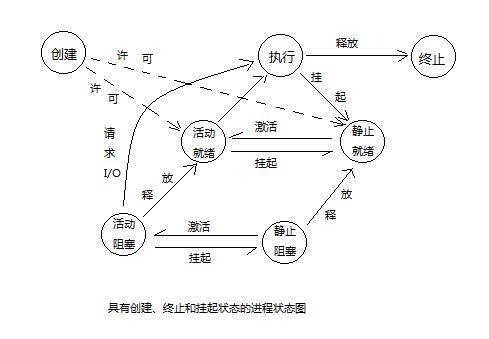

# 操作系统

## 操作系统的目标和作用

* 操作系统的目标:
  1. **方便性**:方便用户,使计算机易学易用
  2. **有效性**:提高系统的资源的利用率,合理地组织计算机的工作流程,加速程序的运行,缩短程序的运行周期,从而提高系统的吞吐量
  3. **可扩充性**:适应计算机硬件、体系结构和计算机应用发展的要求,OS必须方便地添加新的功能和模块,对原有的功能进行修改
  4. **开放性**:所谓开放性,是指系统能够遵循世界标准规范,特别是遵循开放系统相连OSI国际标准

---

* 操作系统的应用:
  1. **OS系统作为用户和计算机硬件系统之间的接口**:通过命令调用方式、系统调用和图标窗口方式来实现与操作系统的通信
  2. **OS作为计算机系统资源的管理者**:OS的主要功能就是对处理器,存储器,I/O设备及文件(数据和程序)管理
  3. **OS实现了对计算机资源的抽象**:对于无操作系统的裸机,它向用户提供的只是物理接口,用户需要对物理接口的实现有所了解,为了方便用户使用,人们在上面覆盖一层操作系统,由它来实现细节

---

* 推动操作系统发展的动力:
  * 不断提高计算机资源的利用率
  * 方便用户
  * 器件更新换代
  * 计算机体系结构的不断发展
  * 不断提出新的应用需求

## 操作系统发展过程

* 人工操作:最早的计算机操作是通过人工操作的方式进行的,用户独占主机,CPU需要等待人工操作,计算机资源利用率低,I/O设备的速度提升缓慢,CPU和I/O设备之间速度不匹配
* 脱机输入方式:为了解决CPU和I/O设备速度不匹配的矛盾,将程序通过外围机读入磁盘,当CPU需要时,再调入内存,减少了CPU等待输入的时间
* 单道批处理:为了实现连续处理,需要先把一批作业脱机输入到磁带上,并配上监督程序(Monitor),在它的作用下,使作用能够一个接一个地连续处理,这种执行方式里内存中始终保持一个作业,故称为单道批处理系统
  * 自动执行处理,顺序读取执行,只使用单道作业
  * 缺点:系统资源得不到充分运用,当发出I/O请求时,CPU处于等待状态
* 多道批处理:在单道批处理的基础上改进,用户提交的作业先放在外存上,并排成后备队列,然后作业调度程序根据算法一次选择若干个作业调入内存
  * 优点:资源利用率高,系统吞吐量大
  * 缺点:平均周转时间长,无交互能力
* 分时系统:推动分时系统发展的动力是人机交互的需求,分时系统是一台主机连接了多个终端设备,系统允许多个人操作终端,以交互的方式使用计算机,共享主机资源
  * 分时系统没有作业调度,程序直入内存,采用轮转运行方式,每个程序只能运行一个时间片的时间,然后暂停该作业,立即调度下一个作业执行
  * 分时系统的特征:多路性,独立性,及时性,交互性
* 实时系统:所谓实时是表示及时,实时任务的类型的一种分法为周期性实时任务和非周期性实时任务,周期性实时任务是指外部定期发送激励信号要求系统周期循环执行,以便周期性控制某外部设备;非周期性实时任务没有明显的周期性,但都联系着一个截止时间,要求在某一开始截止时间前开始或某一完成截止时间前结束

## 操作系统的基本特性和作用

* 操作系统的基本特性:并发,共享,虚拟,异步
  * 并发:程序并发执行,提高系统利用率
  * 共享:操作系统的资源可供多个并发执行的进程使用
  * 虚拟:通过时分复用和空分复用的方式使设备得到有效利用
  * 异步:由于资源等因素的限制,进程的执行通常停停走走,何时能够获取I/O设备,程序将如何推进都是不可预知的

* 操作系统的主要功能:处理机管理功能,存储器管理功能,设备管理功能,文件管理功能,操作系统与用户之间的接口

---

## 进程的控制

* 进程的定义:由程序段、相关数据段和PCB三部分构成了进程实体
  * 进程是一次执行过程,是程序及其数据在处理机上顺序执行所发生的活动
  * 可以把传统OS的进程定义为:进程是进程实体的运行过程,是系统进行资源分配和调度的基本单位
* 进程的特征:
  * 动态性:进程的本质是一次执行过程,动态性是进程最基本的特征
  * 并发性:是指多个进程实体同时处于内存中,且在一段时间内同时运行
  * 独立性:每个进程实体独立运行,独立获得资源和独立接受调度
  * 异步性:程序按照异步的方式向前运行
* 程序并发执行的特征:间断性,失去封闭性,不可再现性
* 程序顺序执行的特征:顺序性,封闭性,可再现性
* 进程的三个基本状态:就绪状态,执行状态,阻塞状态,三种状态互相转换图如下:
  
  * 在一些系统中，进程还有一种很重要的状态是：挂起状态(该进程暂时不接受调度),另外，在实际系统中，为管理需要，还存在着两种比较常见的状态：创建状态和终止状态
  
* 进程PCB:PCB已成为进程存在于系统中的唯一标志,操作系统总是根据PCB实施对进程的控制和管理

---

* 进程的创建
  * 导致进程创建的事件:用户登录,作业调度,提供服务,应用请求
  * 进程创建的事件:申请空白PCB,为新进程分配运行所需资源,初始化PCB,如果进程就绪队列能够接纳新进程，使进程插入就绪队列
* 进程的终止
  * 导致进程终止的事件：正常结束,进程执行完毕,退出运行;异常结束,进程执行过程中出现了某种异常事件;外界干预,进程应外界的请求而终止运行
  * 进程终止的事件:根据终止进程的标识符,从PCB集合中检索出该进程的PCB,读出该进程的状态,若处于执行状态,终止执行,并置调度标识为真,用于指示该进程终止后应重新调度,若进程有子孙进程,子孙进程也应当终止,将进程所拥有的全部资源归还给父进程或系统,将终止进程PCB移除,等待其他程序收集信息
* 进程的阻塞和唤醒
  * 如果发生以下情况会将进程阻塞或唤醒
    * 请求共享资源失败
    * 等待某种操作完成
    * 新数据尚未到达
    * 等待新任务到达
  * 进程阻塞过程:调用block原语将自身阻塞
  * 进程唤醒过程:由相关进程调用wakeup原语,将等待改事件的进程唤醒
  * 进程的挂起和激活同阻塞和唤醒

---

* 进程的同步:进程同步的主要任务是对多个相关进程在执行次序上进行协调,使并发执行的程序能够按照一定的规则或时序共享系统资源
* 临界资源:在一段时间内只允许一个进程访问的资源被称为临界资源
* 临界区:访问临界资源的代码块成为临界区
* 同步机制遵循的原则:空闲让进,忙则等待,有限等待,让权等待

---

* 信号量机制
  * 整型信号量:定义一个表示资源数目的信号量,同步信号量设置为0,互斥信号量设置为1,资源信号量设置为资源数目,如果信号量为0会不断检测,是否能够申请成功
  * 记录型信号量:与整型信号量的区别在于如果信号量为0会把自己阻塞,如果该信号量增加时,唤醒进程
  * AND型信号量:针对需要同时申请多个资源的情况,要先申请全部资源再执行后方任务
* 信号量步骤:
  * 先设置初始信号量(互斥信号量一般取名mutex)
  * 为信号量赋初值
  * 为pv操作安排位置
