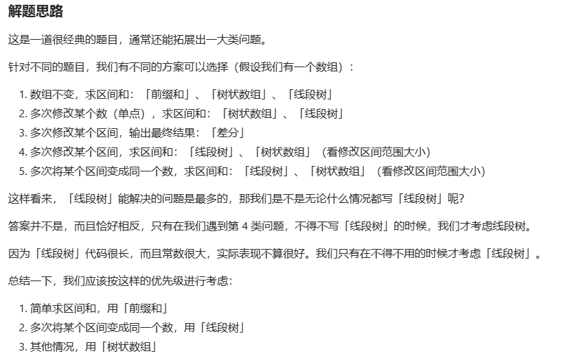
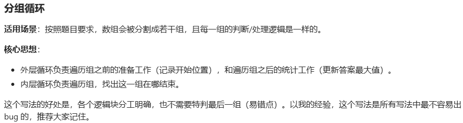

# TODO

* 结构
  * 哈希表和哈希集合(如果是数字索引,考虑数组优化,如果存储在表中的是长度为2或3的数组,考虑使用多个数组优化时间)
  * 字典树
  * 内向基环树
  * **dfs和bfs**
  * 栈和队列:[说明](https://blog.csdn.net/qq_53373885/article/details/128305313)
    * **单调栈和单调队列**
  * **大根堆和小根堆**
  * 红黑树
  * **滑动窗口和双指针**
  * 排序算法
  * 线段树
  * 树状数组
  * **前缀和**和[差分数组](https://leetcode.cn/problems/car-pooling/solutions/2550276/gong-shui-san-xie-tu-jie-chai-fen-ru-men-opii/)
  
  * **并查集**
  * 链表:快慢指针
  * 分组循环
  
  * 位运算优化
  * 博弈论
  * 数学
    * 获取包括数组某个树在内且该数作为最小值的连续子数组总数 [Leetcode 828. 统计子串中的唯一字符](https://leetcode.cn/problems/count-unique-characters-of-all-substrings-of-a-given-string/description/)
  * 图问题:最大流问题/最小费用网络流问题/二分图问题
* 方法:
  * 枚举
  * 递归分治
  * 动态规划, 记忆话搜索(正向,逆向)
  * 贪心
  * 回溯
  * 模拟
  * 图的操作:图的四个经典算法(prim算法等) [Leetcode 1334. 阈值距离内邻居最少的城市](https://leetcode.cn/problems/find-the-city-with-the-smallest-number-of-neighbors-at-a-threshold-distance/description/)
* 常用操作及相关优化
  * 字符串遍历[java优化](https://leetcode.cn/problems/determine-if-two-strings-are-close/solutions/2547579/li-jie-cao-zuo-ben-zhi-jian-ji-xie-fa-py-b18i/)
  * 获得比一个正数大一点的第一个$2^n$的值
  * x&(-x)获取二进制最低位
  * x&=x-1消去二进制最低位
  * 判断是否为素数
