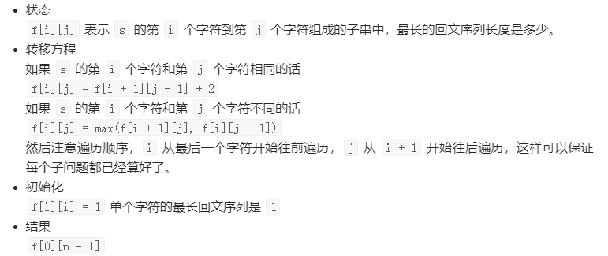
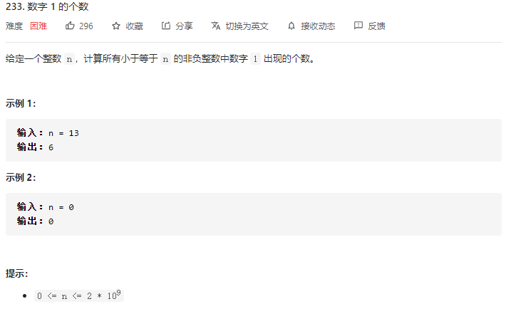
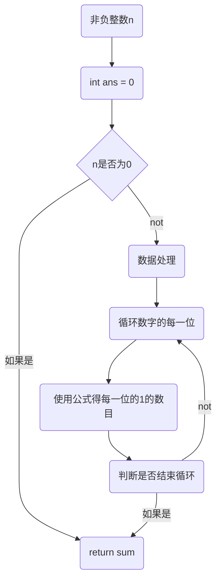
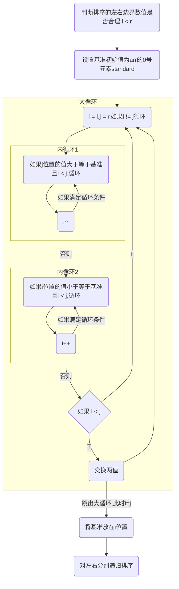

---
html:
  embed_local_images: true
  embed_svg: true
  offline: true
  toc: true

print_background: true
---

# 内容

## 动态规划

* 动态规划是一种递归的转化方式,能将递归的方法变成循环多次的方法,简化了回调函数结果的步骤,节约了时间。是通过提前定义存放递归结果的空间,利用边界状态,反推出其他状态,一步步推导到所求结果的过程
* 动态规划首先是如同递归一样,分析出边界条件,也就是已知的情况(一般情况下,边界条件都是当前要处理的大问题的小区间问题),然后得出后续的情况相比于前面的情况,存在的数学关系得出推导方向(类似递归体),再定义相应的空间存放结果集,通过初始化和后续填充结果集,完成从简入繁的过程,最后返回相应的结果
  * 通常这个过程被称为寻找状态(每次递归结果是什么),寻找转移方程(数学关系),状态已知部分的初始化(初始边界条件),题目需要的结果(通过数学关系需要得到什么)
  * 如果没有头绪,使用记忆化搜索(存储计算结果)优化递归也可以,记忆化搜索就类似动态规划,将递归参数作为区分的手段,将每次递归的结果存放在一个空间内,需要用到时,直接取出,避免重复计算

---
**例题**:



```java{.line-numbers}
class Solution {
    public int longestPalindromeSubseq(String s) {
        int n = s.length();
        int[][] f = new int[n][n];
        for (int i = n - 1; i >= 0; i--) {
            f[i][i] = 1;
            for (int j = i + 1; j < n; j++) {
                if (s.charAt(i) == s.charAt(j)) {
                    f[i][j] = f[i + 1][j - 1] + 2;
                } else {
                    f[i][j] = Math.max(f[i + 1][j], f[i][j - 1]);
                }
            }
        }
        return f[0][n - 1];
    }
}
```

## 二分法查找元素

* 二分法是$O(\log(n))$的时间复杂度算法,用于可识别结果会出现在那一边的情况
* 通过二分法可以对排好序的元素进行快速查找

```java{.line-numbers}
private static int binaryFind(int[] list, int i) {
        int l = 0,r = list.length - 1;
        while(l <= r){
            int n = l + (r -l)/2;//同int n = l + (r -l >> 1);
            if(list[n] == i){
                return n;
                break;
            }else if (list[n] > i){
                r = n - 1;
            }else if (list[n] < i){
                l = n + 1;
            }
        }
        return - 1;
    }
```

* **初级二分**:查找某一值。
  * 与上方例子一样,上方例子就是一种二分的方法,一般模板如下:

```java{.line-numbers}
int l = ···,r = ···;//初始搜索区间
        while(l ··· r){//搜索区间不为空,继续循环
            int n = l + (r -l)/2;//中间索引
            if(list[n] == i){//如果list[n]就是要找的值,返回索引结束
                return n;
            }else if (list[n] > i){//如果中间索引比要找的值大,收紧右侧区间
                r = ···;
            }else if (list[n] < i){//如果中间索引比要找的值小,收紧左侧区间
                l = ···;
            }
        }
        return - 1;
```

从中可以看出,二分法的写法和左右边界有关,**回到上方示例函数`binaryFind`**,使用的是闭区间$[l,r]$进行搜索,因此在使用的时候:
1️⃣ while循环要判断搜索区间是否为空,在闭区间搜索中，区间为空，即`l > r`结束
2️⃣ 在`list[n]`比结果小时,$[l,n]$就不用搜索了,肯定比结果小,因此接下来搜索区间就变成了$[n + 1,r]$,同理,在`list[n]`比结果大时,$[n,r]$就不用搜索了
3️⃣ 返回的是当前的(匹配的)结果的下标

当搜索区间为$`[l,r)`$即$[0,list.length - 1]$时,同样:
1️⃣ while循环条件为`l < r`,因为当`l = r`时,搜索区间已经为空了
2️⃣ 在`list[n]`比结果小时,,$[l,n]$就不用搜索了,肯定比结果小,因此接下来搜索区间变成了$[n + 1,r]$,同理,在`list[n]`比结果大时,$[n,r]$就不用搜索了,`r = n - 1`
3️⃣ 返回的是当前的(匹配的)结果的下标

---

* **高级二分**:查找序列中小于(大于)某一值的左(右)边界
  * 对于日常使用而言，不能只局限于搜索到某个元素，可能还要搜索元素的左（右）边界，同样也是上方的模板,基本结构不变

当要**搜索左边界时**：找出大于(大于等于)某一值的最小值
1️⃣ 首先，可设搜索边界为`l = 0,r = list.length`,也可以使用`l = 0,r = list[n].length - 1`的闭区间搜索(下面使用这种方法)
2️⃣ 在while循环中,同样判断搜索区间空间不为空,继续循环要`l <= r`
3️⃣ 当中间值`list[n] < i`时,在$[l,n]$区间内不存在比i大的值,因此,搜索区间变成$[n + 1,r]$
4️⃣ 当该值`list[n] == i`时,在$[n + 1,r]$内,只有可能出现大于等于`list[n]`的值,如果是寻找比i大的最小值左边界,搜索区间就变成了$[n + 1,r]$,如果是寻找大于等于i的最小值左边界,搜索区间就变成了$[l,n]$
5️⃣ 当该值`list[n] > i`时,在$[n + 1,r]$区间内不可能出现左边界,搜索区间就变成了$[l,n]$
6️⃣ 返回值是一方边界,这个值对应第一个满足条件的值
7️⃣ ==注意==:如果使用闭区间$[l,r]$搜索,会更加麻烦,由于当区间只有1,却是执行改变右边界$r$,使死循环发生,这时需要使用`if(l == r) { break; }`退出

```java{.line-numbers}
public static int binarySearch(){
    //搜索大于i的最小值左边界
    //若为搜索大于等于i的最小值左边界,第二个条件应为list[list.length - 1] < i
    if (list.length == 0||list[list.length - 1] <= i) return -1;
    int l = 0,r = list.length - 1;
    while(l <= r){
        int n = l + (r -l)/2;//同int n = l + (r -l >> 1);
        if(list[n] == i){
            l = n + 1;
            //r = n;    if(l == r) { break; }  //当搜索大于等于i的最小值左边界(一般不这么做)
        }else if (list[n] > i){
            r = n;
            if(l == r) { break; }
        }else if (list[n] < i){
            l = n + 1;
        }
    }
    //寻找左边界,返回左边界
    return l;
}
//---------------------------分割线-------------------------------
public static int binarySearch2(){
    //使用左闭右开区间搜索
    if (list.length == 0||list[list.length - 1] <= i) return -1;
    int l = 0,r = list.size();
    //搜索大于num的左边界
    while(l < r){
        int median = (l + r) >> 1;
        if(list.get(median) == num){
            l = median + 1;
            //r = n;    //当搜索大于等于i的最小值左边界
        }else if(list.get(median) < num){
            l = median + 1;
        }else{
            r = median;
        }
    }
    //寻找左边界,返回左边界
    return l;
}
```

当要搜索**右边界**时,方法与左边界类似

* 不要拘泥于这些模板这只是一种解决办法

---

## 枚举

1. 枚举:通过考虑所有可能情况种类,将所有情况罗列,得出结果
   * 通常用于统计某件事发生次数
   * 对于枚举而言实现优化可能十分困难
2. 使用:说起来简单,将题目中满足题目条件的情况事先考虑出来,找规律,并想好后续处理,返回。不同题目需要统计的内容也不尽相同
3. **例题**:

我们可以分析出,对每一位上而言,这个数字和后面的数字出现1有关联(设该数为`x`)

    1️⃣ 如果在个位上出现大于等于1的数,那么计数加1,否则不做处理`n = x mod 10`
    $$count(n) = \left\{
    \begin{array}{rcl}
    0 & & {n < 0}\\ 1 & & {n >= 1}
    \end{array} \right. $$
    2️⃣ 如果数字的个位与十位一起取出,当这个数小于10,则在十位上不可能出现1,如果该数大于20,则十位出现1的次数为10其余数字出现次数为个位数字加1`n = x mod 100`
    $$count(n) = \left\{
    \begin{array}{rcl}
    0 && {n < 10}\\ 10 && {n > 20}\\n\%10 + 1 &&{n\subseteq[10,20]}
    \end{array} \right. $$
    3️⃣ 如果数字的百位及以后一起取出,当这个数小于100,则在十位上不可能出现1,如果该数大于200,则十位出现1的次数为100其余数字出现次数为十位个位数字加1`n = x mod 1000`
    $$count(n) = \left\{
    \begin{array}{rcl}
    0 && {n < 100}\\ 100 && {n > 200}\\n\%100 + 1 &&{n\subseteq[100,200]}
    \end{array} \right. $$
    4️⃣ 可以继续得到所有的位上面可能出现的1的个数,以十位为例:`m = x\100,n = x mod 100`,因此我们可以知道有m组大于20的数,和剩下的数字n,因此结果为`10*m + count(n)`



```java{.line-numbers}
class Solution {
    public int countDigitOne(int n) {
        long mulk = 1;
        int ans = 0;
        for (int k = 0; n >= mulk; ++k) {
            ans += (n / (mulk * 10)) * mulk + Math.min(Math.max(n % (mulk * 10) - mulk + 1, 0), mulk);
            mulk *= 10;
        }
        return ans;
    }
}
```

## 快速排序

1. 作为冒泡排序的改进,不稳定(相等的值,顺序可能发生变化),平均时间复杂度为$O(nlog_2 n)$,空间复杂度$O(log_2 n)$
2. 基本思想(**分治法**):在数组中选取一个基准数据(一般选择最左侧的值),使用双指针,使用时,先移动右侧指针,寻找比基准数据小的数,再移动左侧指针,寻找比基准大的数,将二者互换,当两指针相遇时,结束寻找,最后将基准数据放至相遇处,这样就把大于基准数据的数放在了基准右侧,小于基准的数放在了左侧,再对左右同时再进行快速排序,就可以递归完成排序




```java{.line-numbers}
public Test{
    public static void fastSort(int[] arr,int l,int r){
        if(l >= r){
            return;
        }
        int standard = arr[l];
        int i = l,j = r;
        while(i != j){
            //必须先右指针移动，再左指针移动，这样在最终更改基准位置时，i一定比基准小
            while(arr[j] >= standard && i < j){
                j--;
            }
            while(arr[i] <= standard &&i < j){
                i++;
            }
            if(i < j){
                int temp = arr[i];
                arr[i] = arr[j];
                arr[j] = temp;
            }
        }
        arr[l] = arr[i];
        arr[i] = standard;
        fastSort(arr,l,i - 1);
        fastSort(arr,i + 1,r);
    }
}
```

## 位运算

1. 获得比一个正数大一点的第一个$2^n$的值
   * 使用位运算可以方便得出结果,通过将这个数二进制表示中从第一个1开始全部变成1,再对结果加一可以方便得出这个幂值
   * 由于我们已知,这个数是正数,所以,可以使用int或其他能存下取值范围的数据类型存下它,我们假设使用的是四个字节的`int`类型,也就是有31个非符号位,也可以得到能存放的二次幂最大值为$2^{31}$,因此,我们无法处理大于$2^{31}$的数字,出现大于该数的数或一个非正数字返回一个正常情况不可能返回的数字,作为警示
   * 接下来处理完特殊情况后,就进入位运算处理过程了,我们已经知道,这个正数必定有一个为1的最高非符号位,设这一位为第n位,对n位上使用`>>1`运算符,就会得到一个数至少在n位上为0,n - 1位上为1
   * 在将上述两个数合并后,就得到一个在n和n - 1位上都确定为1的数,即两个位上为1,再使用`>>2`后取或就可以得到四个位上为1的数...
   * 在经过与`>>1 >>2 >>4 >>8 >>16`的数字或运算后,就可以得到从n位开始都为1的数,加1,就得到了这个幂

    ```java{.line-numbers}[]
    public static int findBinary(int num){
        int max = 1 <<31; 
        if(num >= max||num <= 0){ return -1;}
        num |= num>>1;
        num |= num>>2;
        num |= num>>4;
        num |= num>>8;
        num |= num>>16;
        num += 1;
        return num;
    }
    ```

2. x&(-x)
3. x&=x-1
