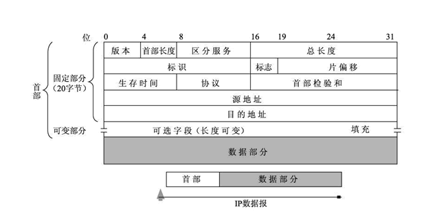

# 网络层

## 概念

1. 网络层的两种服务
   1. 虚电报服务:通过哨兵侦查,确定一条发送路径传输,是一种逻辑连接,路径可能共享
   2. 数据报服务:将信息分开发送,灵活,易出错,丢失重复,但造价低
2. 网际协议IP(为上层ICMP协议和IGMP协议服务,使用ARP协议和RARP协议)
   1. 分类的IP地址(32b标识符):由ICANN管理,1981年通过分类IP地址,使用网络号+主机号分配,IP地址唯一,分为A,B,C,D，E五类，前三个作为单播地址

        |类别|开头|网络号长度|说明|
        |---|---|---|---|
        |A|0|8|null|
        |B|10|16|null|
        |C|110|24|null|
        |D|1110|null|多播地址|
        |E|1111|null|供未来使用|

   2. 特殊的IP地址

        |网络号|主机号|源地址使用|目的地址使用|代表意思|
        |---|---|---|---|---|
        |0|0|可|不可|本主机|
        |0|X|可|不可|本网络上主机号为X的主机|
        |全1|全1|不可|可|在本网络转发|
        |Y|全1|不可|可|对网络号为Y的所有主机转发|
        |127|非全0也非全1|可|可|用于本地软件回环测试|

   3. IP地址特点:由ICANN分配网络号,是标识主机与一条链路的接口,所有IP地址被同等对待
   4. IP地址和硬件地址区别:
      1. 所处层次不同,硬件地址处于数据链路层,是物理地址,IP地址处于网络层,是逻辑地址
      2. 长度不同:IP地址是32位,硬件地址48位
      3. 人为表示不同:IP地址使用点分十进制,硬件地址使用`-`分16进制数表示
3. 地址产生协议ARP
   1. 产生原因:一个机器的ip地址需要找到对应的MAC地址才能通信
   2. 方法:广播ARP包,请求对应ip地址回复MAC地址,并且在高速缓存中建立映射表存放起来,这个映射表会及时更新(超时删除,新增)
   3. 网关:连接的上级路由器的IP地址,所有发送出该局域网的信息都要经过网关

      >ARP欺骗:冒充网关发送ARP请求,主机记录的是错误的网关地址,无法上网

   4. 作用范围:每个主机只能在局域网中发送ARP请求数据,如果没有找到则会移交给网关发送
4. IP数据报的格式:[详细信息](http://c.biancheng.net/view/6411.html)

   

5. IP层转发分组的算法
6. 子网划分,减少IP地址浪费:由于IP地址有限,且一般不需要在网络中使用全部的地址,1985年开始,从主机号中取出几位作为子网号固定
   1. 地址掩码:由一串连着的1和之后连着的0组成,1的个数就是网络前缀(网络号+子网号)的长度,也叫子网掩码
   2. 将二进制IP地址和子网掩码相与,可以得到对应IP地址的网络地址,通过这种方法,可以快速确定下一跳地址是否是该网络掩码对应记录的地址(它们被记录在转发表中)
   3. CIDR无分类偏址记法:在IP地址后面添加`/网络前缀长度`,即增加网络前缀声明
7. 合并网络,构成超网:将网络具有连贯性,且下一跳相同的网络和并成一个更大的超网,减少存储的转发表数量
   1. 需要的条件:网络前缀连续且网络前缀尾部的所有组合都已出现,可简短网络前缀数目;下一跳的端口相同,可构成同一个网络
   2. 下一跳的端口相同,可构成同一个网络最终合并为`第一个地址的网络前缀/位数减少`的网络
8. 网际控制协议ICMP
   1. 目的:更有效地转发IP数据报
   2. 报文格式:

      |8位|8位|16位|长度取决于类型|
      |---|---|---|---|---|
      |类型|代码|检验和|ICMP报文部分|

   3. 报文可分为差错报告报文和询问报文两种

      |ICMP报文种类|类型的值|ICMP报文类型|
      |---|---|---|
      |差错报告报文|3|终点不可达|
      |^|11|时间超过|
      |^|12|参数问题|
      |^|5|改变路由|
      |询问报文|8或0|回送请求或回答|
      |^|13或14|时间戳请求或回答|

   4. 使用ping命令可使用这种数据报测试两机连通性
9. 路由器
   1. 用于连接不同的网络,由路由选择器选择数据传输线路
   2. 定义:一种具有多个输入输出端口的专用计算机,目的是转发分组,工作在网络层
   3. 转发:路由器根据转发表,将用户的IP数据报从合适的端口发送出去,路由选择根据分布式算法,根据从各相邻路由器的网络拓扑变化情况,动态地改变选择的路由
10. IPV6
     1. 与IPV4不同:
        1. 使用了更大的地址空间:128b表示地址使地址空间增大了$2^{96}$倍
        2. 扩展的地址层次结构: IPV6由于地址空间大可划分更多层次
        3. 灵活的首部格式:IPV6可拓展的首部格式和IPV4不兼容
        4. 使用了改进的选项:允许数据报包含有选项的控制信息
        5. 允许协议继续扩充:在未来可以增加新的应用
        6. 支持资源的预分配:IPV6支持实时视像等功能需求,保证带宽的应用
     2. IPV6由基本的首部和有效载荷组成
     3. IPV6包含单播(点对点),多播(一点对多点)和任播地址(一点对一组中任意一点)三类,记法为冒号:分16进制记法(8个16进制数),允许将多个连续的0省略成::,例:`FF01:0:0:0:0:0:0:101`可记为`FF01::101`
11. IP多播:使用组播1对多通信,使用的IP地址为D类地址
12. 网络地址转换
    1. RFC1918建议指明专用地址(保留地址):该地址有大量设备使用,无法连上互联网,A类为10.0.0.0~10.255.255.255,B类为172.16.0.0~172.31.255.255,C类为192.168.0.0~192.168.255.255
    2. 这些地址如需上网,需转换IP地址
    3. NAT路由器用于转换地址用于上网:将转换记录到转换表中,发现原地址和目的地址出现在转发表中,将其转换,转换表的记录需要内部发起通信请求,保证了内网安全
13. VPN专用虚拟网
    1. 将不同地区的专用网通过互联网联系起来(隧道技术)
    2. 通过两个不同地区的专用网路由器相互转发内部数据报(先加密,收到后解密),收到后向内部发送该数据报
