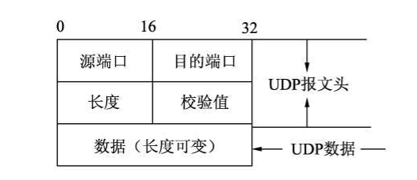
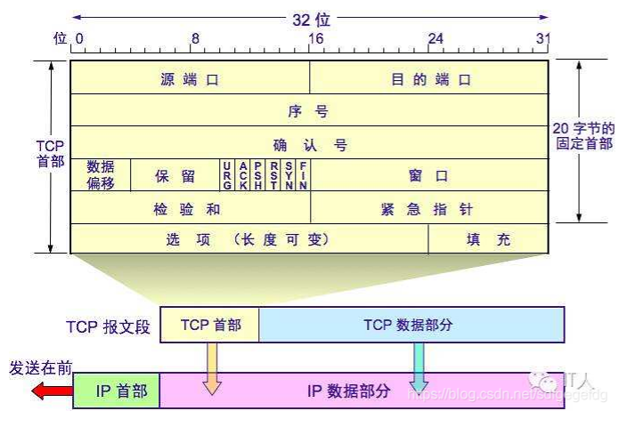

# 运输层

## 概念

1. 运输层:向它上面的应用层提供通讯服务,实现进程的通信,运输层要有复用分用功能,主要协议有面向连接的可靠TCP协议,和不面向连接的不可靠UDP协议
2. 端口:端口有硬件和软件上的端口,软件端口使用16位标识符标识,每个软件本地标识不同,只具有本地意义,不同主机同软件的端口号可能不同,端口号分为服务端口号和客户端端口号
   1. 服务端口号:熟知端口号0 ~ 1023分配给了重要进程,登记端口号1024 ~ 49151需要向IANA申请固定
   2. 客户端端口号:49152 ~ 65535动态选择,通信结束后回收
3. UDP协议 RFC768
   1. 无连接,不可靠的通信,但开销小,首部只有8B,特点用最大努力面向报文,无阻塞控制,支持1对1,多对1,多对多的交互通信
   2. UDP数据报[详细信息](http://c.biancheng.net/view/6440.html)
        
   3. UDP数据报检验和计算方式:在UDP首部增加12字节的伪首部,伪首部,首部和数据一起进行差错检测
4. TCP协议 RFC793
   1. TCP面向连接是可靠的通信,特点只能1对1通信,不支持广播多播,TCP面向字节流,是使用两个套接字(IP地址和端口)进行通信的方式
   2. TCP数据报[详细信息](http://c.biancheng.net/view/6441.html)
        
   3. TCP可靠的实现,滑动缓存窗口,保证发送的数据量不超过对方缓存窗口的大小,只有当对方回复确认接收时移动窗口,这可实现流量控制,通过不断减小接收窗口控制对方发送节奏
   4. TCP运输连接管理(建立连接->传送->释放连接过程)
      1. 建立连接:三次握手
      2. 释放连接:四次握手
      3. 都是明文
5. TCP与UDP比较

   |对比的方面|虚电路服务|数据报服务|
   |---|---|---|
   |思路|可靠通信应当由网络来保证|可靠通信应当由用户主机来保证|
   |连接的建立|必须有|不需要|
   |终点地址|仅在连接建立阶段使用，每个分组使用短的虚电路号|每个分组都有终点的完整地址|
   |分组的转发|属于同一条虚电路的分组均按照同一路由进行转发|每个分组独立选择路由进行转发|
   |当结点出故障时|所有通过出故障的结点的虚电路均不能工作|出故障的结点可能会丢失分组，一些路由可能会发生变化|
   |分组的顺序|总是按发送顺序到达终点|到达终点时不一定按发送顺序|
   |端到端的差错处理和流量控制|可以由网络负责，也可以由用户主机负责|由用户主机负责|
